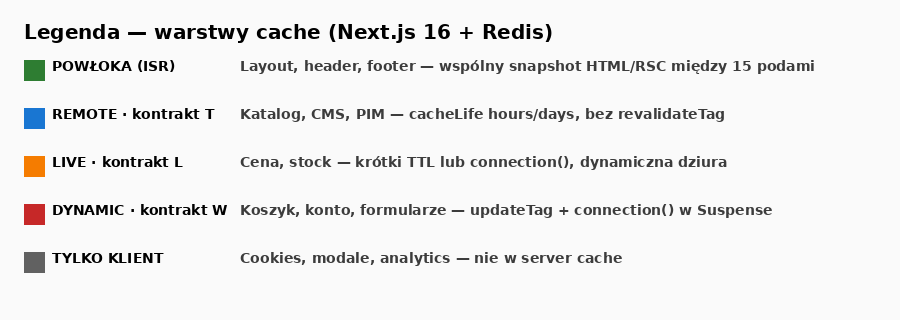
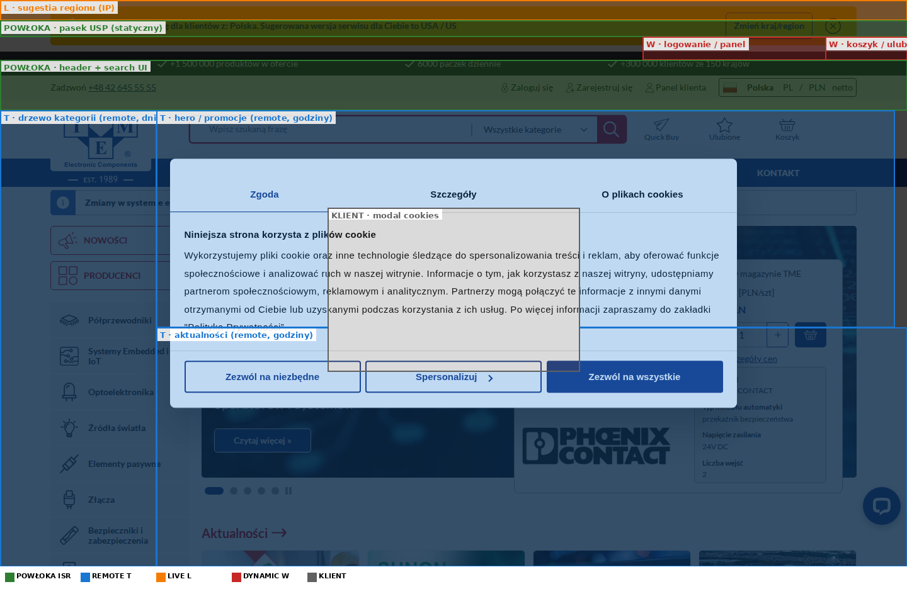
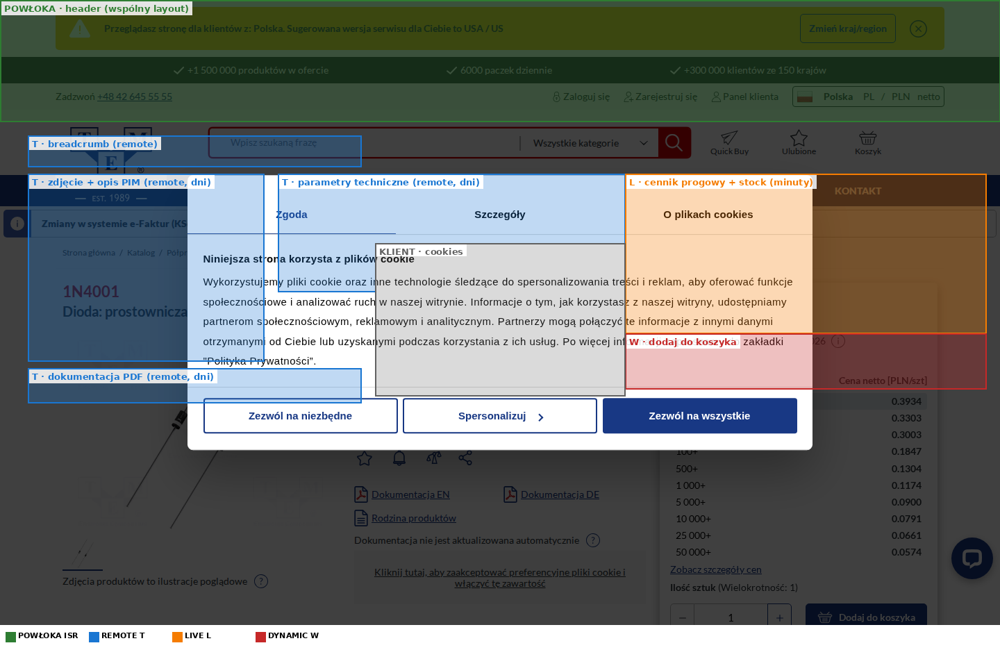
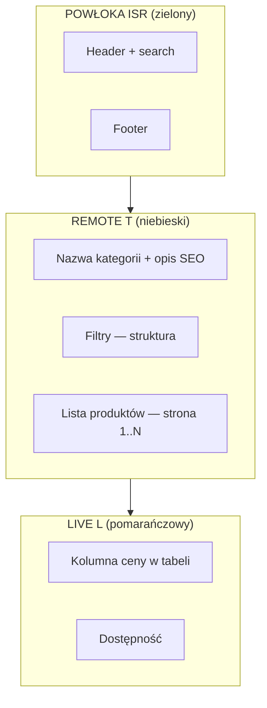

# Cache w Next.js 16 — argumentacja dla zespołu (na przykładzie tme.eu)

Dokument do review architektonicznego: **kiedy i po co wspólny Redis**, jak podzielić stronę e-commerce na warstwy cache, co jest statyczne a co dynamiczne.

Źródło screenów: **www.tme.eu** (stan z lipca 2026). Oznaczenia na obrazkach to **propozycja architektury docelowej**, nie opis obecnej implementacji PHP.

---

## Legenda oznaczeń na screenach



| Kolor | Warstwa | Kontrakt | Co to znaczy w praktyce |
|-------|---------|----------|-------------------------|
| **Zielony** | POWŁOKA (ISR) | — | Layout, header, footer — wspólny snapshot HTML/RSC między podami |
| **Niebieski** | REMOTE | **T** (czas) | Katalog, PIM, CMS — `cacheLife` hours/days, bez webhooków |
| **Pomarańczowy** | LIVE | **L** | Cena, stock — krótki TTL lub `connection()` w Suspense |
| **Czerwony** | DYNAMIC | **W** (zapis) | Koszyk, konto — `updateTag` + dynamiczna dziura |
| **Szary** | KLIENT | — | Cookies, modale — tylko przeglądarka, poza server cache |

---

## 1. Problem w jednym zdaniu (dla backendowców)

> Przy **15 stateless podach** cache w RAM jednego procesu **nie jest współdzielony**. Bez Redis każdy pod przy miss robi własny fetch do PIM/API i własny render — to jak **15 workerów bez wspólnego cache aside**.

Wspólny Redis to nie „frontendowy bajer” — to **cache dystrybucyjny na warstwie renderu**, ten sam wzorzec co znacie z API.

---

## 2. Strona główna tme.eu — co może być statyczne



| Obszar na screenie | Warstwa | Uzasadnienie |
|--------------------|---------|--------------|
| Pasek USP („1,5 mln produktów…”) | **POWŁOKA** | Tekst marketingowy, zmienia się rzadko, identyczny dla wszystkich |
| Header, logo, search (UI) | **POWŁOKA** | Szkielet strony — ISR między 15 podami |
| Drzewo kategorii (lewy panel) | **REMOTE T** | Duże, współdzielone, zmiana rzadka → `cacheLife("days")` |
| Hero / promocje producentów | **REMOTE T** | CMS, odświeżenie co godziny wystarczy |
| Aktualności (news) | **REMOTE T** | Artykuły redakcyjne, kontrakt czasowy |
| Logowanie, panel, koszyk (ikony) | **DYNAMIC W** | Stan sesji — dynamiczna dziura w headerze |
| Sugestia regionu (żółty pasek) | **LIVE L** | Zależne od IP / edge — krótki TTL lub osobny endpoint |
| Modal cookies | **KLIENT** | Nie renderować w RSC cache |

### Pełna strona (scroll)


Dalsze sekcje (usługi, producenci, „Poznaj nas”, footer) — wszystko **REMOTE T** lub **POWŁOKA**. Żadna z tych sekcji nie wymaga `revalidateTag` po każdej zmianie w CMS — wystarczy `cacheLife` + deploy przy większych zmianach.

**Szacunek:** ~**85–90%** HTML strony głównej może być w powłoce ISR + remote cache. Reszta to dziury dynamiczne (sesja, region, cookies).

---

## 3. Karta produktu — gdzie jest „żywo”, a gdzie cache



| Obszar | Warstwa | Uzasadnienie |
|--------|---------|--------------|
| Breadcrumb, nazwa, opis, zdjęcie | **REMOTE T** | Dane PIM — miliony SKU, identyczne dla wszystkich użytkowników anonimowych |
| Parametry techniczne, dokumentacja PDF | **REMOTE T** | Rzadka zmiana → `cacheLife("days")` |
| Tabela cen progowych (1+, 10+, 100+…) | **LIVE L** | Cena może zależeć od konta B2B — scope w kluczu; TTL **minuty** |
| Stan magazynowy | **LIVE L** | E-commerce — akceptujemy minuty opóźnienia albo osobna dziura |
| „Dodaj do koszyka” | **DYNAMIC W** | Mutacja — Server Action, `updateTag` na koszyk |
| Header (jak na home) | **POWŁOKA** | Współdzielony layout |

**Szacunek:** ~**70%** karty produktu (opis, media, parametry) = cache T. ~**20%** (cena, stock) = L. ~**10%** (koszyk, sesja) = W.

To jest typowy podział B2B/B2C — **nie cache'ujemy „całej strony na max”**, tylko to, co jest współdzielone.

---

## 4. Listing kategorii (schemat — brak screena z powodu Cloudflare)

Strona listingu (np. „Kondensatory”) ma ten sam schemat co większość e-commerce:



| Element listingu | Warstwa | cacheLife |
|------------------|---------|-----------|
| Nagłówek kategorii, opis | REMOTE T | `days` |
| Drzewo filtrów (metadane) | REMOTE T | `hours` |
| Lista SKU (bez cen) | REMOTE T | `hours` |
| Ceny w wierszach | LIVE L | `minutes` lub osobny komponent |
| Sortowanie / paginacja | REMOTE T | scope = `categoryId + page + sort` w kluczu |

Przy **15 podach** bez Redis: każdy pod przy wejściu w „Kondensatory” robi własny fetch listy. Z Redis: **jeden** fetch, reszta serwuje hit.

---

## 5. Koszyk i konto — inny kontrakt

Strony mutacji **nie idą w pełny ISR**. Wzorzec:

```
┌─ POWŁOKA (header, footer) ─────────────────┐
│  ┌─ Suspense ─────────────────────────────┐ │
│  │  connection() + dane koszyka / konta   │ │  ← DYNAMIC W
│  │  updateTag po zapisie                  │ │
│  └────────────────────────────────────────┘ │
└─────────────────────────────────────────────┘
```

| Strona | ISR powłoka | Remote | Po zapisie |
|--------|---------------|--------|------------|
| Koszyk | tak (header) | `cacheLife` + tag `cart:{userId}` | `updateTag` + `router.refresh()` |
| Konto B2B | tak (header) | tag `account:{userId}` | `updateTag` |
| Checkout | minimalna powłoka | LIVE na stock/cenę | W na każdym kroku |

---

## 6. Dlaczego przy 15 instancjach Redis jest praktycznie konieczny

### Bez wspólnego cache

```
Deploy → 15 pustych L1 → pierwszy szczyt ruchu
         ↓
15 × fetch PIM / search / listing
15 × render tej samej karty produktu
15 × różny snapshot ISR (bez wspólnego handlera)
```

### Z Redis (remote + ISR)

```
Deploy → warming (opcjonalnie) → Redis zapełniony
         ↓
Request na dowolny pod → hit Redis → brak fetcha
Miss → single-flight → 1 render → 14 podów czeka na wynik
updateTag → wszystkie pody widzą invalidację (Pub/Sub)
```

| Metryka | Bez Redis | Z Redis |
|---------|-----------|---------|
| Fetch PIM przy cold cache | ×15 | ×1 (single-flight) |
| Spójność snapshotu strony | różne per pod | identyczna |
| Invalidacja po zapisie | 1 pod | cały klaster |
| Koszt po deploy | wysoki peak | kontrolowany (warming) |

---

## 7. Co Redis **nie** zastępuje

| Obszar | Dlaczego nie |
|--------|--------------|
| Cache w PIM / ERP | Redis cache'uje **wynik renderu**, nie źródło prawdy |
| Search engine (Elasticsearch) | Własny cache query — osobna warstwa |
| Tłumaczenia w bundle (`i18n.ts`) | Deploy = nowy obraz; Redis nie potrzebny na same stringi w kodzie |
| Real-time stock dla VIP B2B | Wymaga kontraktu L lub bezpośredniego API — nie `cacheLife("days")` |
| CDN (Cloudflare) | CDN = HTTP na URL; RSC / cache komponentów = osobna warstwa |

---

## 8. Model świeżości — jedna tabela dla biznesu i dev

| Kontrakt | Kiedy (tme.eu) | Mechanizm | Przykład |
|----------|----------------|-----------|----------|
| **T** | Katalog, opisy, news, footer | `cacheLife` | Lista kondensatorów, opis 1N4001 |
| **W** | Koszyk, konto, formularze | `updateTag` + `connection()` w Suspense | Dodaj do koszyka |
| **L** | Cena, stock, region | krótki TTL / `connection()` | Tabela cen progowych |

**Świadomie nie używamy** w prod: `revalidateTag` / `revalidatePath` z webhooków CMS. Zmiana treści redakcyjnej wchodzi po czasie (`cacheLife`) lub po deployu.

---

## 9. Wymagania aplikacji (checklist)

### Infrastruktura
- [ ] ≥2 pody, ten sam obraz Docker, stateless
- [ ] Redis HA (prod), monitoring
- [ ] Load balancer bez sticky sessions
- [ ] Jedna wersja Node na wszystkich podach

### Kod
- [ ] `cacheComponents: true` + remote handler + ISR handler
- [ ] Locale / kraj / waluta jako **argumenty** funkcji cache, nie `cookies()` w `use cache`
- [ ] Tagi: `data:product:123`, `ui:category:pl:kondensatory`
- [ ] Strony W: `connection()` tylko w komponencie RYOW + `<Suspense>`

### Operacje
- [ ] Cache warming po deployu (znane URL-e katalogowe)
- [ ] Runbook awarii Redis (degradacja L1, bez 5xx)
- [ ] Test: zapis pod A → F5 na pod B → świeże dane

---

## 10. Plan wdrożenia (fazy logiczne, jeden config)

Config **stały** od stagingu (`remote` + ISR). Różnice tylko w kodzie route'ów.

| Krok | Zakres | Kryterium done |
|------|--------|----------------|
| 1 | Redis + remote na stagingu, 2+ pody | Hit w Redis na `data:*` |
| 2 | Katalog: home, kategoria, produkt (T) | Ten sam snapshot ISR na różnych podach |
| 3 | Cena/stock jako LIVE (osobna dziura) | Katalog cache'owany, cena świeża w minutach |
| 4 | Koszyk/konto (W) | `updateTag` + read-your-own-writes przez LB |
| 5 | Warming + prod | Cold start < akceptowalny próg |

---

## 11. FAQ na spotkanie

**„Mamy już Redis na sesje.”**  
To inny namespace. Sesja = stan użytkownika. Ten cache = współdzielone odczyty katalogu.

**„CDN to załatwi.”**  
CDN nie widzi cache komponentów React ani fetchy wewnątrz renderu. CDN + Redis się uzupełniają.

**„Sticky sessions?”**  
Nie skaluje, nie rozwiązuje cold deploy, nie rozwiązuje invalidacji między podami.

**„Build już renderuje — po co runtime?”**  
Build = artefakt `.next`. Runtime Redis = współdzielenie między 15 podami po starcie. To różne warstwy.

**„Tłumaczenia?”**  
W bundle → deploy. Z CMS → remote T z `cacheLife`. Oba modele bez `revalidateTag`.

---

## 12. Podsumowanie na slajd

```
tme.eu = 95% odczyt + wiele locale + 1,5M SKU + 15 podów

→ wspólny Redis na remote cache + ISR
→ katalog na czasie (T), koszyk na updateTag (W), cena na minutach (L)
→ bez revalidatePath na całą stronę

Koszt bez Redis: ×15 fetch/render przy każdym cold start
Koszt z Redis: 1 fetch + współdzielony wynik
```

---

## Załączniki

| Plik | Opis |
|------|------|
| [00-legend.png](./assets/tme-eu-cache/00-legend.png) | Legenda kolorów |
| [01-home-annotated.png](./assets/tme-eu-cache/01-home-annotated.png) | Strona główna (viewport) |
| [01-home-full-annotated.png](./assets/tme-eu-cache/01-home-full-annotated.png) | Strona główna (pełna) |
| [03-product-annotated.png](./assets/tme-eu-cache/03-product-annotated.png) | Karta produktu |
| [STRATEGIA-CACHE.md](./STRATEGIA-CACHE.md) | Skrót reguł dla devów (kontrakty T/W/L) |

*Screeny oryginalne (bez oznaczeń): `assets/tme-eu-cache/01-home.png`, `03-product.png`.*
