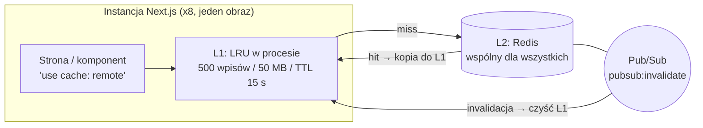
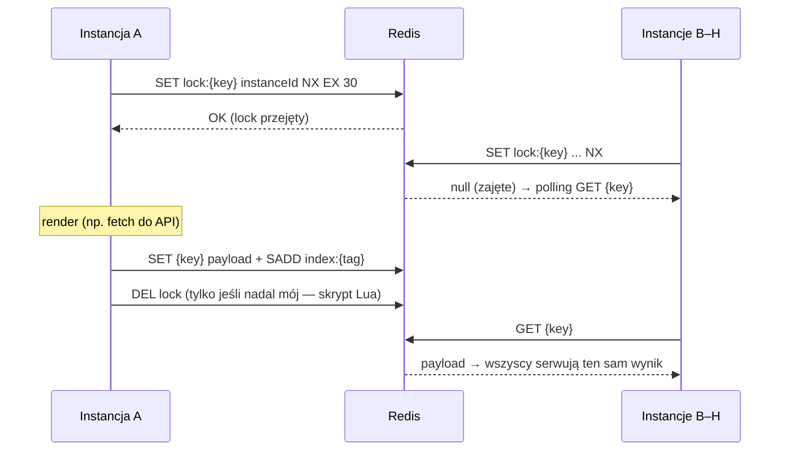
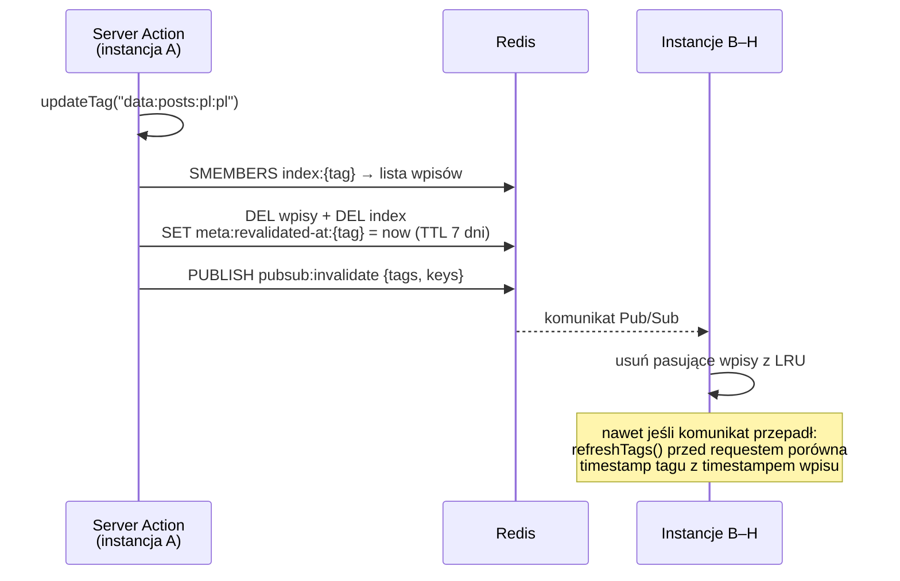
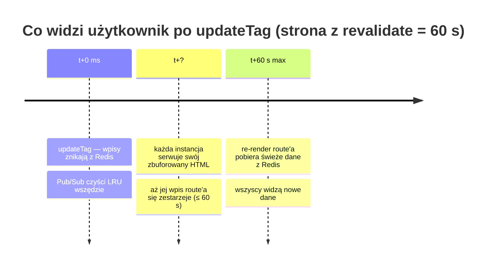
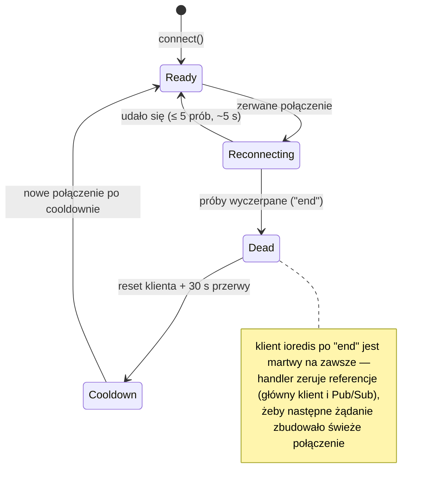
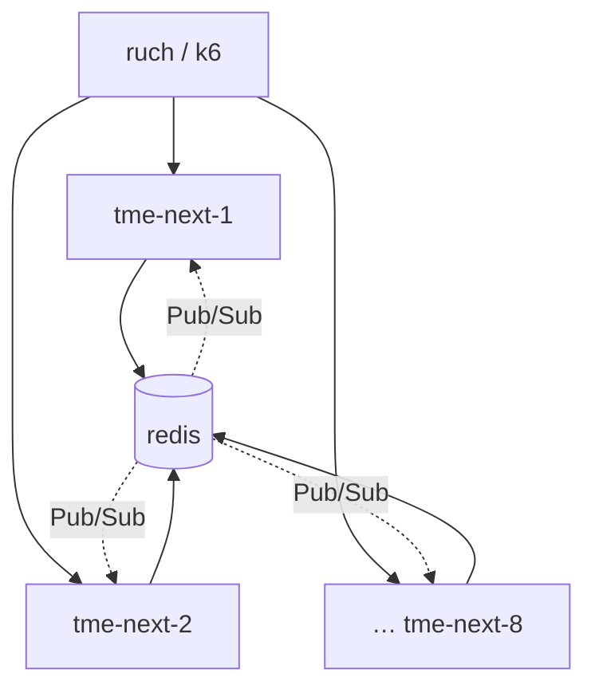

# Cachowanie w tmeNext — przewodnik

Next.js 16 z **Cache Components** + własny handler `use cache: remote`
(`cache-handlers/remote-handler.mjs`): LRU w procesie → wspólny Redis → Pub/Sub.
Zaprojektowane pod **wiele instancji z jednego artefaktu `.next`** (u nas: 8 kontenerów
z jednego obrazu).

---

## 1. Obraz całości



| Warstwa | Gdzie żyje | Po co | Po restarcie |
|---|---|---|---|
| L1 — LRU | pamięć procesu | zero round-tripów przy gorącym ruchu | ginie |
| L2 — Redis | osobny serwer | współdzielenie między instancjami | trwały |
| Pub/Sub | kanał w Redis | natychmiastowe czyszczenie L1 wszędzie | bezstanowy |

---

## 2. Jak cachować (przepis)

Dwie osobne warstwy = dwa osobne wpisy, każdy z **jednym tagiem 1:1**
(zawsze per locale, bez tagów globalnych). Pomocniki: `lib/cache-tags.ts`.

```ts
// DATA — wynik fetcha (lib/data/posts.ts)
export async function getPosts(country: string, lang: string) {
  "use cache: remote";
  cacheLife("hours");
  cacheTag(dataTag("posts", country, lang));   // → "data:posts:pl:pl"
  return fetch(...).then(r => r.json());
}

// UI — wyrenderowany komponent (components/cached-posts-list.tsx)
export async function CachedPostsList({ country, lang }) {
  "use cache: remote";
  cacheLife("hours");
  cacheTag(uiTag("posts", country, lang));     // → "ui:posts:pl:pl"
  const data = await getPosts(country, lang);
  return <ul>...</ul>;
}
```

Zasady:

- Wewnątrz `use cache` nie wolno czytać `cookies()` / `headers()` / `searchParams` —
  wszystko dynamiczne przekazuj **argumentami** (wchodzą do klucza cache).
- UI woła DATA w środku — przy hicie na UI funkcja DATA **nie wykona się** (dane są
  zamrożone we wpisie UI). Dlatego invaliduje się zwykle **oba tagi**.
- `cacheLife` steruje czasem życia; invalidacja tagami działa **niezależnie** od niego.

---

## 3. Odczyt — co robi `get()`


„Świeży" znaczy: nie minął `revalidate` wpisu **i** żaden z jego tagów (ani soft-tagów
ścieżki) nie był invalidowany po `entry.timestamp`.

### Single-flight w praktyce

Przy zimnym kluczu i nagłym ruchu (thundering herd) renderuje **jedna** instancja:



Wartość locka = `instanceId` (PID + losowe 48 bitów — PID-y w kontenerach się
powtarzają), a zwolnienie to atomowy compare-and-delete w Lua: render dłuższy niż
30 s nie skasuje locka przejętego już przez kogoś innego.

Zweryfikowane testem k6 (`apps/tmeNext-K6Test`): 240 żądań z 80 VU na zimny URL
przez 8 instancji → **1 render**.

---

## 4. Invalidacja

### Przepływ między instancjami



Podwójne zabezpieczenie: Pub/Sub (szybkie) + timestampy `meta:revalidated-at:*`
(trwałe, synchronizowane w `refreshTags()` przed każdym requestem).

### Które API kiedy

| API | Świeże dane | Typowy use case |
|---|---|---|
| `updateTag(tag)` | natychmiast (ten sam request) | Server Action po mutacji |
| `revalidateTag(tag, "max")` | następny request (SWR) | webhook, cron, route handler |
| `revalidatePath(path)` | następny request (soft tagi) | zmiana całej strony |

### Uwaga: dwie warstwy o różnej szybkości

Handler invaliduje wpisy **natychmiast i na wszystkich instancjach**. Ale strona ma
jeszcze **full route cache** (ISR, np. `s-maxage=60`), który jest per instancja —
zbuforowany HTML z osadzonymi starymi danymi żyje aż do upływu `revalidate` strony:



Pomiar k6: propagacja end-to-end od ~40 ms (wpis route'a już nieświeży) do ~56 s
(świeży). Jeśli potrzebna natychmiastowa spójność HTML — krótszy `revalidate` strony
albo współdzielony `cacheHandler` ISR.

---

## 5. Klucze w Redis

| Klucz | Typ | Co to jest |
|---|---|---|
| `{cacheKey z ";" zamiast ":"}` | STRING (binarny v8) | wpis cache (payload + `_meta`), TTL = `max(expire, 60)` s |
| `lock:{cacheKey}` | STRING | lock single-flight, TTL 30 s |
| `index:{tag}` | SET | klucze wpisów z danym tagiem, TTL = TTL wpisu + 60 s |
| `meta:revalidated-at:{tag}` | STRING | timestamp ostatniej invalidacji, TTL 7 dni |
| `meta:revalidated-tags` | SET | rejestr invalidowanych tagów (przycinany w `refreshTags`) |

Czemu `;` zamiast `:` w kluczach wpisów? `cacheKey` Next.js to JSON ze `:` w środku,
a Redis Insight buduje drzewo po `:` — surowy klucz rozpadałby się na śmieciowe
gałęzie. Tagi (`index:…`, `meta:…`) celowo zostają ze `:`, żeby drzewo grupowało się
w `index:data` / `index:ui`. Member w `index:{tag}` = dokładnie nazwa klucza wpisu (1:1).

Drzewo w Redis Insight (http://localhost:5540):

```
index:
  data:cache-lab:pl:pl        ← SET; members = klucze wpisów
  ui:cache-lab:pl:pl
meta:
  revalidated-at:data:…       ← timestampy (liczba, nie cache!)
  revalidated-tags
lock:…                        ← chwilowe locki renderu
["abc…","hash…",[{"country";"pl"…}]]   ← wpis; w polu _meta: layer/resource/locale/createdAt
```

---

## 6. Odporność na awarię Redis

Handler **nigdy nie blokuje aplikacji** — bez Redisa działa na samym LRU
(mniej wydajnie, ale poprawnie).



Zachowanie w czasie awarii (zweryfikowane na stacku docker-compose):

- requesty dostają 200 — L1 + render na żywo, błędy tylko w logach,
- invalidacje wykonane **podczas** awarii obowiązują tylko lokalnie (znana granica —
  nie ma ich gdzie trwale zapisać),
- po powrocie Redisa: nowe połączenie po cooldownie ≤ 30 s, zapisy wracają,
  subskrypcje Pub/Sub odtwarzają się przy pierwszym żądaniu z `use cache: remote`.

Ważne dla prod: format `v8.serialize` jest związany z wersją Node — wszystkie
instancje muszą mieć tę samą wersję runtime (jeden obraz Docker to gwarantuje).

---

## 7. Wiele instancji (docker-compose)



- Jeden obraz `tme-next:local` = jeden artefakt `.next` dla wszystkich instancji.
- Sticky sessions **nie są potrzebne** — spójność zapewnia Redis + Pub/Sub + timestampy.
- Build obrazu działa bez Redisa: handler wykrywa `NEXT_PHASE=phase-production-build`
  i używa wyłącznie LRU procesu builda.

Testy obciążeniowe (scenariusze, wyniki, jak uruchomić): `apps/tmeNext-K6Test/README.md`.

---

## 8. Jak dodać nowy zasób (checklist)

1. Dodaj nazwę do `CacheResource` w `lib/cache-tags.ts`.
2. Funkcja DATA: `"use cache: remote"` + `cacheLife(...)` + `cacheTag(dataTag("orders", country, lang))`.
3. Komponent UI: jak wyżej, z `uiTag(...)`.
4. Server Action po mutacji: `updateTag(dataTag(...))` + `updateTag(uiTag(...))`.
5. Sprawdź w Redis Insight, że pojawiły się `index:data:orders:…` i `index:ui:orders:…`.

Wzorce: `lib/data/posts.ts`, `components/cached-posts-list.tsx`, `app/actions/revalidate.ts`.
Interaktywne demo wszystkich API: strona `/{country}/{lang}/cache-lab`.

---

## 9. Uruchomienie

```bash
# pełny stack: redis + redisinsight + 8x tmeNext (porty 3000-3007)
docker compose up -d --build

# dev na hoście (wymaga redis na localhost:6379 i wolnego portu 3000)
npx nx dev tmeNext
```

| Serwis | URL |
|---|---|
| Aplikacja | http://localhost:3000 … :3007 (każdy port = inna instancja) |
| Redis Insight | http://localhost:5540 |
| Redis | `redis://localhost:6379` (w kontenerach: `redis://redis:6379`) |

Konfiguracja (`apps/tmeNext/next.config.ts`):

```ts
const nextConfig: NextConfig = {
  output: "standalone",                // wymagane dla obrazu Docker
  cacheComponents: true,
  cacheHandlers: {
    remote: require.resolve("./cache-handlers/remote-handler.mjs"),
  },
};
```

---

## Ściągawka

```
Cache:            "use cache: remote" + cacheLife() + cacheTag(dataTag/uiTag(...))
Invalidacja:      updateTag(tag) — natychmiast | revalidateTag(tag, "max") — SWR
Pamiętaj:         UI zamraża DATA → invaliduj oba tagi
HTML konwerguje:  ≤ revalidate strony (full route cache jest per instancja)
Redis padł?       Aplikacja działa na LRU; reconnect ≤ 30 s po powrocie
Czytanie Redis:   index:* = indeksy | meta:* = timestampy | reszta = wpisy (v8)
```
