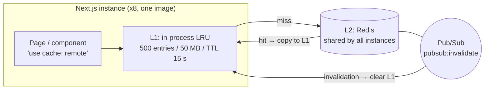
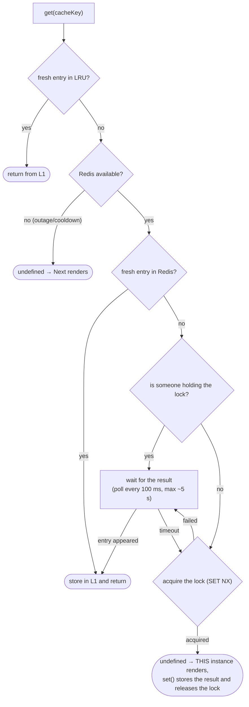
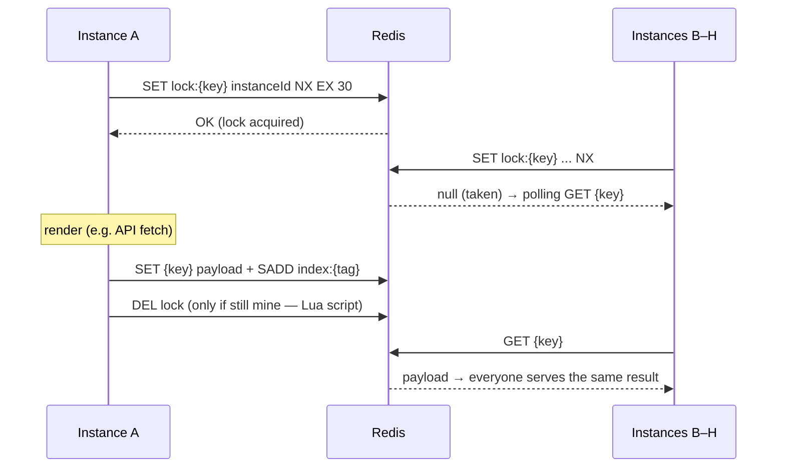
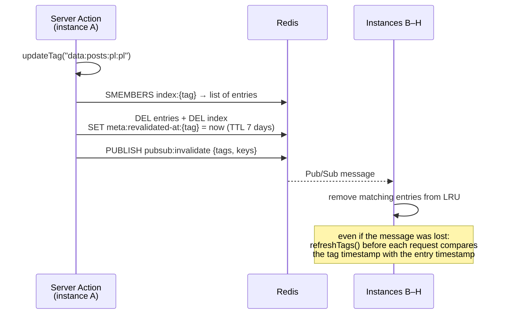
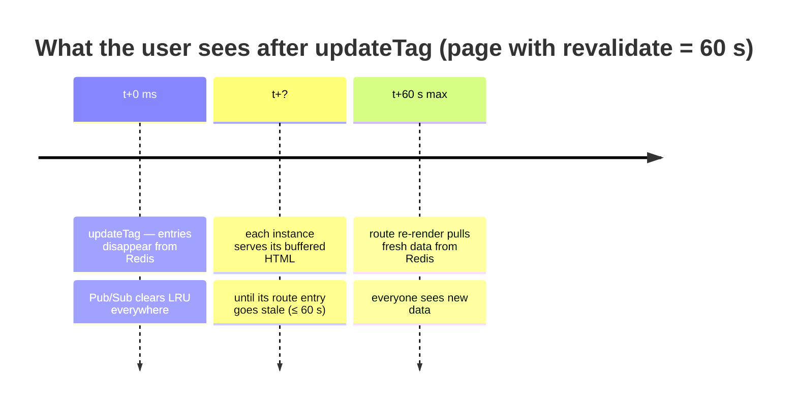
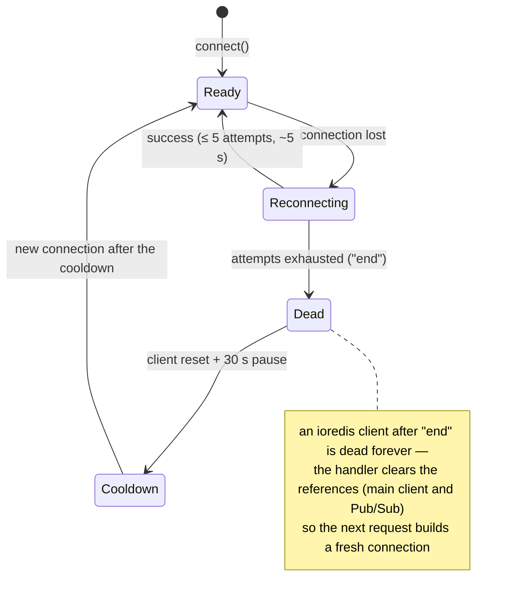
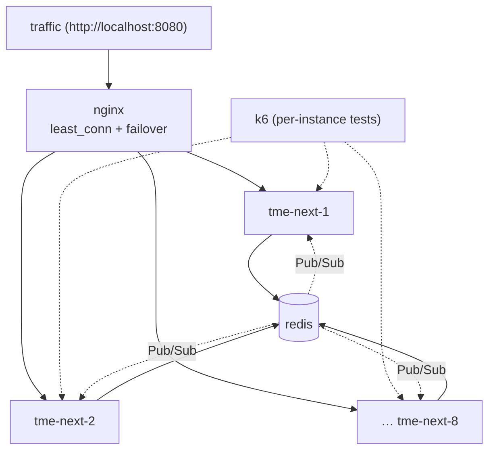

# Caching in tmeNext — a guide

Next.js 16 with **Cache Components** + a custom `use cache: remote` handler
(`cache-handlers/remote-handler.mjs`): in-process LRU → shared Redis → Pub/Sub.
Designed for **multiple instances running from a single `.next` artifact** (in our case:
8 containers built from one image). Rationale and considered alternatives:
[ADR-0001](./adr/0001-zdalny-cache-redis.md). Redis/ioredis gotchas behind the
implementation details: [REDIS-NUANCES.md](./REDIS-NUANCES.md). Deep dive on tag
invalidation timestamps (backstop, examples, TTL): [INVALIDATION-TIMESTAMPS.md](./INVALIDATION-TIMESTAMPS.md).

---

## 1. The big picture



| Layer | Where it lives | Purpose | After a restart |
|---|---|---|---|
| L1 — LRU | process memory | zero round-trips for hot traffic | lost |
| L2 — Redis | separate server | sharing between instances | persistent |
| Pub/Sub | Redis channel | instant L1 cleanup everywhere | stateless |

---

## 2. How to cache (the recipe)

Two separate layers = two separate entries, each with **a single 1:1 tag**.
Tag format: `{layer}:{resource}[:{scope...}]` — scope is **optional** and arbitrary
(locale, entity id, variant… or nothing when the resource is global). Helpers: `lib/cache-tags.ts`.

```ts
dataTag("config")                  // "data:config"        — global resource
dataTag("posts", country, lang)    // "data:posts:pl:pl"   — scope = locale
uiTag("products", productId)       // "ui:products:42"     — scope = entity id
```

```ts
// DATA — fetch result (lib/data/posts.ts)
export async function getPosts(country: string, lang: string) {
  "use cache: remote";
  cacheLife("hours");
  cacheTag(dataTag("posts", country, lang));   // → "data:posts:pl:pl"
  return fetch(...).then(r => r.json());
}

// UI — rendered component (components/cached-posts-list.tsx)
export async function CachedPostsList({ country, lang }) {
  "use cache: remote";
  cacheLife("hours");
  cacheTag(uiTag("posts", country, lang));     // → "ui:posts:pl:pl"
  const data = await getPosts(country, lang);
  return <ul>...</ul>;
}
```

Rules:

- Inside `use cache` you must not read `cookies()` / `headers()` / `searchParams` —
  pass everything dynamic as **arguments** (they become part of the cache key).
- UI calls DATA inside — on a UI cache hit the DATA function **does not run** (the data
  is frozen inside the UI entry). That's why you usually invalidate **both tags**.
- `cacheLife` controls the entry's lifetime; tag invalidation works **independently** of it.

---

## 3. Reads — what `get()` does



"Fresh" means: the entry's `revalidate` window has not elapsed **and** none of its tags
(nor the path's soft tags) were invalidated after `entry.timestamp`.

### Single-flight in practice

On a cold key under sudden traffic (thundering herd), **one** instance renders:



The lock value is `instanceId` (PID + 48 random bits — PIDs repeat across containers),
and the release is an atomic compare-and-delete in Lua: a render taking longer than
30 s won't delete a lock already taken over by someone else.

Verified with a k6 test (`apps/tmeNext-K6Test`): 240 requests from 80 VUs against
a cold URL across 8 instances → **1 render**.

---

## 4. Invalidation

### Flow between instances



Double protection: Pub/Sub (fast) + `meta:revalidated-at:*` timestamps
(durable, synced in `refreshTags()` before each request).

### Which API when

| API | Fresh data | Typical use case |
|---|---|---|
| `updateTag(tag)` | immediately (same request) | Server Action after a mutation |
| `revalidateTag(tag, "max")` | next request (SWR) | webhook, cron, route handler |
| `revalidatePath(path)` | next request (soft tags) | whole-page change |

### Caveat: two layers with different speeds

The handler invalidates entries **immediately and across all instances**. But the page
also has the **full route cache** (ISR, e.g. `s-maxage=60`), which is per instance —
buffered HTML with old data embedded lives until the page's `revalidate` elapses:



k6 measurement: end-to-end propagation from ~40 ms (route entry already stale) up to
~56 s (fresh). If you need immediate HTML consistency — use a shorter page `revalidate`
or a shared ISR `cacheHandler`.

---

## 5. Redis keys

| Key | Type | What it is |
|---|---|---|
| `{cacheKey with ";" instead of ":"}` | STRING (binary v8) | cache entry (payload + `_meta`), TTL = `max(expire, 60)` s |
| `lock:{cacheKey}` | STRING | single-flight lock, TTL 30 s |
| `index:{tag}` | SET | keys of entries carrying the tag, TTL = entry TTL + 60 s |
| `meta:revalidated-at:{tag}` | STRING | timestamp of the last invalidation, TTL 7 days |
| `meta:revalidated-tags` | SET | registry of invalidated tags (pruned in `refreshTags`) |

Why `;` instead of `:` in entry keys? The Next.js `cacheKey` is JSON with `:` inside,
and Redis Insight builds its tree by splitting on `:` — a raw key would shatter into
junk branches. Tags (`index:…`, `meta:…`) deliberately keep `:` so the tree groups
into `index:data` / `index:ui`. A member of `index:{tag}` = exactly the entry key name (1:1).

Tree in Redis Insight (http://localhost:5540):

```
index:
  data:cache-lab:pl:pl        ← SET; members = entry keys
  ui:cache-lab:pl:pl
meta:
  revalidated-at:data:…       ← timestamps (a number, not cache!)
  revalidated-tags
lock:…                        ← short-lived render locks
["abc…","hash…",[{"country";"pl"…}]]   ← entry; _meta holds layer/resource/scope/createdAt
```

---

## 6. Resilience to Redis outages

The handler **never blocks the app** — without Redis it runs on the LRU alone
(less efficient, but correct).



Behavior during an outage (verified on the docker-compose stack):

- requests get 200 — L1 + live rendering, errors only in logs,
- invalidations performed **during** the outage apply locally only (a known limit —
  there is nowhere to persist them),
- after Redis comes back: a new connection within the ≤ 30 s cooldown, writes resume,
  Pub/Sub subscriptions are restored on the first request that touches `use cache: remote`.

Important for prod: the `v8.serialize` format is tied to the Node version — all
instances must run the same runtime (a single Docker image guarantees that).

---

## 7. Multiple instances (docker-compose)



- User entry point: **nginx on :8080** (`nginx/default.conf`) — `least_conn`,
  `proxy_next_upstream` (a dead instance is skipped), `X-Upstream` header
  for debugging. Ports 3000–3007 remain as direct per-instance access.
- One `tme-next:local` image = one `.next` artifact for all instances.
- Sticky sessions are **not needed** — consistency comes from Redis + Pub/Sub + timestamps.
- The image builds without Redis: the handler detects `NEXT_PHASE=phase-production-build`
  and uses only the build process's LRU.

Load tests (scenarios, results, how to run): `apps/tmeNext-K6Test/README.md`.

---

## 8. Adding a new resource (checklist)

1. Add the name to `CacheResource` in `lib/cache-tags.ts`.
2. DATA function: `"use cache: remote"` + `cacheLife(...)` + `cacheTag(dataTag("orders", country, lang))`.
3. UI component: same as above, with `uiTag(...)`.
4. Server Action after a mutation: `updateTag(dataTag(...))` + `updateTag(uiTag(...))`.
5. Check in Redis Insight that `index:data:orders:…` and `index:ui:orders:…` showed up.

Patterns: `lib/data/posts.ts`, `components/cached-posts-list.tsx`, `app/actions/revalidate.ts`.
Interactive demo of all the APIs: the `/{country}/{lang}/cache-lab` page.

---

## 9. Running it

```bash
# full stack: redis + redisinsight + 8x tmeNext (ports 3000-3007)
docker compose up -d --build

# dev on the host (requires Redis on localhost:6379 and apps/tmeNext/.env with REDIS_HOST)
npx nx dev tmeNext
```

Copy `apps/tmeNext/.env.example` → `.env` — handler reads `REDIS_HOST`, `REDIS_PORT`, `REDIS_DB`
(and optional tuning vars for LRU, single-flight, tag meta TTL).

| Service | URL |
|---|---|
| Application | http://localhost:3000 … :3007 (each port = a different instance) |
| Redis Insight | http://localhost:5540 |
| Redis | `redis://localhost:6379` (inside containers: `redis://redis:6379`) |

Configuration (`apps/tmeNext/next.config.ts`):

```ts
const nextConfig: NextConfig = {
  output: "standalone",                // required for the Docker image
  cacheComponents: true,
  cacheHandlers: {
    remote: require.resolve("./cache-handlers/remote-handler.mjs"),
  },
};
```

---

## 10. Glossary

### Next.js concepts

| Term | What it means |
|---|---|
| **Cache Components** | Next.js 16 mode (`cacheComponents: true`) where caching is explicit: only what you mark with the `use cache` directive gets cached. Also enables PPR. |
| **PPR (Partial Prerendering)** | A page = a static shell (prerendered) + dynamic fragments streamed at runtime. Marked `◐` in the build output. |
| **`use cache: remote`** | Directive: "cache this function/component result through the `remote` handler" — i.e. our LRU + Redis. Plain `use cache` uses the built-in in-process handler. |
| **cacheKey** | The entry key generated by Next.js from the function id + its arguments (which is why everything dynamic is passed as arguments). To the handler it's an opaque string. |
| **Tag (`cacheTag`)** | An entry label assigned by us, for targeted invalidation. Our format: `{layer}:{resource}[:{scope...}]`, one 1:1 tag per entry. |
| **Scope** | The optional part of a tag narrowing the entry down: locale (`pl:pl`), entity id (`42`), variant… No scope = a global resource. |
| **Soft tag** | A tag generated automatically by Next.js from the routing path (`_N_T_/pl/pl/posts`). Used by `revalidatePath` — the handler receives them in `get()` as `softTags`. |
| **`cacheLife`** | The entry's lifetime profile: `stale` (how long the client avoids asking the server), `revalidate` (when to refresh), `expire` (when the entry becomes useless). |
| **`updateTag`** | Immediate invalidation (Server Actions only) — the same request already sees fresh data. |
| **`revalidateTag(tag, profile)`** | SWR invalidation — the current request may get the old version, fresh on the next one. Also works in route handlers. |
| **`revalidatePath`** | Invalidates everything tied to a URL path (via soft tags). |
| **SWR (stale-while-revalidate)** | Strategy: serve the old version right away, refresh in the background. Lower latency at the cost of brief staleness. |
| **Full route cache (ISR)** | Cache of the whole rendered page HTML (`s-maxage=60` header). **A separate layer above our handler**, per instance — hence the convergence window after invalidation (section 4). |
| **Cache handler** | Our implementation of the Next.js interface: `get` / `set` / `refreshTags` / `getExpiration` / `updateTags`. Next calls these methods; we decide where and how to keep the data. |

### Handler concepts (remote-handler.mjs + Redis)

| Term | What it means |
|---|---|
| **L1 / LRU** | In-process memory cache (500 entries / 50 MB / TTL 15 s). The fastest, but private to the instance and lost with the process. |
| **L2 / Redis** | The cache shared by all instances. An entry lands here on `set()`, and a hit gets copied into L1. |
| **DATA / UI layer** | Two independent entries: DATA = fetch result (tag `data:*`), UI = rendered component (tag `ui:*`). UI "freezes" the data inside itself, which is why you usually invalidate both. |
| **Entry** | Payload + metadata (`tags`, `timestamp`, `revalidate`, `expire`, `stale`), serialized with `v8.serialize` into a binary STRING in Redis. |
| **`v8.serialize`** | Node's native serialization — fast and Buffer-friendly, but the format depends on the Node version: all instances must run the same runtime. |
| **Key encoding (`:` → `;`)** | The cacheKey contains JSON with `:`, and Redis Insight builds its tree by `:` — swapping to `;` keeps the whole entry as a single node. Tags keep `:` (they group into a tree). |
| **`index:{tag}`** | A Redis SET: tag → keys of the entries carrying it. This is how `updateTags` knows what to delete. Member = exactly the entry key name (1:1). |
| **`meta:revalidated-at:{tag}`** | Timestamp of the tag's last invalidation (TTL 7 days). This is the **backstop**: an entry older than this timestamp is rejected on read, even if its deletion was missed. |
| **`meta:revalidated-tags`** | A registry (SET) of tags ever invalidated — `refreshTags()` knows which timestamps to query; expired ones get pruned. |
| **Backstop** | The second consistency mechanism next to Pub/Sub: timestamp comparison works even when an instance missed a message (restart, brief disconnect). |
| **Pub/Sub** | The `pubsub:invalidate` channel in Redis. After an invalidation every instance gets the message and clears its L1 — without waiting for TTLs. |
| **Single-flight** | The guarantee that on a cache miss **one** instance renders while the rest wait for its result (polling every 100 ms, max ~5 s). Protects the API/DB from an avalanche of identical renders. |
| **Thundering herd** | The problem single-flight solves: sudden traffic on a cold key → without the lock every instance would render the same thing in parallel. |
| **Lock (`lock:{cacheKey}`)** | A Redis key acquired with `SET NX` and a 30 s TTL — "I'm rendering". Released after `set()`. |
| **`instanceId`** | The lock value: `pid-{pid}-{48 random bits}`. The random suffix is essential — PIDs repeat across containers. |
| **Compare-and-delete** | An atomic Lua script releasing the lock **only if it still belongs to us**. Without it, a render longer than the lock TTL would delete a lock already taken over by another instance. |
| **Cooldown** | After a failed Redis connection the handler stops retrying for 30 s and runs on L1 alone — instead of hammering a dead server on every request. |
| **LRU-only fallback** | Emergency mode without Redis: everything works, but the cache is per instance and invalidations don't propagate between instances. |
| **`_meta`** | A field attached to the payload in Redis (layer/resource/scope/tags/createdAt) — purely for debugging in Redis Insight; Next.js never sees it. |
| **Instance** | A single Next.js process. In our case: 8 containers from the same image (= one `.next` artifact), each with its own L1 and `instanceId`, sharing one Redis. |

---

## Cheat sheet

```
Cache:            "use cache: remote" + cacheLife() + cacheTag(dataTag/uiTag(...))
Invalidation:     updateTag(tag) — immediate | revalidateTag(tag, "max") — SWR
Remember:         UI freezes DATA → invalidate both tags
HTML converges:   ≤ the page's revalidate (full route cache is per instance)
Redis down?       The app runs on LRU; reconnect ≤ 30 s after recovery
Reading Redis:    index:* = indexes | meta:* = timestamps | the rest = entries (v8)
```
