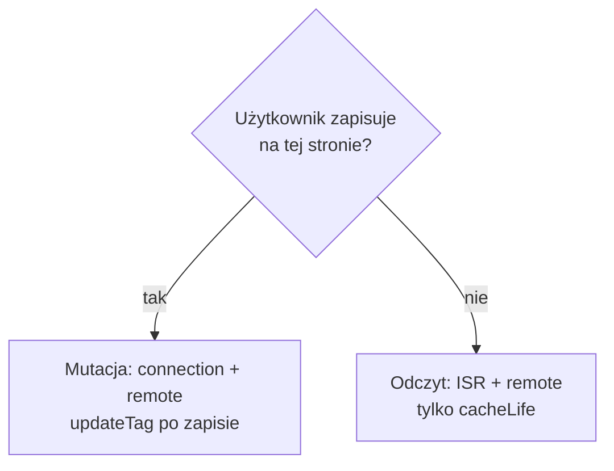

# Strategia cache — Faza 2 (remote + ISR)

**Cel:** dodać **współdzielony cache stron odczytu** w Redis — ten sam snapshot RSC na wszystkich podach. Strony mutacji bez zmian względem fazy 1.

**Środowisko:** produkcja wieloinstancyjna (po spełnieniu kryteriów fazy 1).

Powrót: [STRATEGIA-CACHE.md](./STRATEGIA-CACHE.md) · Wymagana wcześniej: [Faza 1](./STRATEGIA-CACHE-FAZA-1.md)

---

## Config (rozszerzenie fazy 1)

```ts
// next.config.ts
cacheComponents: true,
cacheHandlers: {
  remote: require.resolve("@tme/cache-handler"),
},
cacheHandler: require.resolve("@tme/cache-handler/isr"),
cacheMaxMemorySize: 0, // ISR tylko z Redis — spójność między podami
```

---

## Dane (remote)

**Bez zmian względem fazy 1.** Ten sam model: DATA + UI, `cacheLife`, `updateTag` po zapisie.

---

## Strony — ISR + remote

| Typ strony | ISR | `connection()` | Dane | Po zapisie |
|------------|-----|----------------|------|------------|
| **Odczyt** | Włączony | Nie | `cacheLife` | — |
| **Mutacja** | Wyłączony | **Tak** | `cacheLife` + `updateTag` | `router.refresh()` |

### Strona odczytu (katalog)

- **Bez** `connection()` — ISR zapisuje snapshot do Redis.
- Świeżość z `cacheLife` na danych, nie z `updateTag`.
- Powłoka ISR może być krótko starsza niż remote — OK przy modelu czasowym.

### Strona mutacji

- `connection()` **zostaje** (jak w fazie 1).
- Po zapisie: `updateTag` (DATA + UI) + `router.refresh()`.
- **Nie** używaj `revalidatePath` — route nie jest w ISR.

### Dlaczego mutacja wymaga `connection()`

1. `updateTag` → remote świeży.
2. Snapshot ISR → **stary** do wygaśnięcia czasowego.
3. F5 na innym podzie → stara powłoka mimo świeżych danych.

---

## Migracja z fazy 1

1. Dodać `cacheHandler` + `cacheMaxMemorySize: 0`.
2. Wdrożyć na staging (≥ 2 instancje).
3. Route **odczytu** z listy z fazy 1: usunąć `connection()` (jeśli było).
4. Route **mutacji**: bez zmian.
5. Kryteria akceptacji poniżej.

---

## Kryteria akceptacji → produkcja

**Config**

- [ ] ISR + `cacheMaxMemorySize: 0` na stagingu i prod.
- [ ] Redis współdzielony między wszystkimi instancjami.

**Klasyfikacja route’ów**

- [ ] Wszystkie odczyty **bez** `connection()`.
- [ ] Wszystkie mutacje **z** `connection()`.
- [ ] Audyt: brak mutacji bez `connection()`.

**Strony odczytu (ISR)**

- [ ] Ten sam URL na różnych podach → **identyczny** snapshot (np. ten sam timestamp powłoki).
- [ ] Wpis `isr:entry:*` w Redis po pierwszym hitcie.
- [ ] Po wygaśnięciu `cacheLife` danych — remote odświeża się; ISR po swoim cyklu.

**Strony mutacji**

- [ ] Zapis → `router.refresh()` → świeże dane.
- [ ] F5 przez LB na innym podzie → nadal świeże.
- [ ] Brak wpisu ISR dla route’ów z `connection()`.

**Regresja fazy 1**

- [ ] Wszystkie kryteria danych z fazy 1 nadal spełnione.
- [ ] `updateTag` na wszystkich podach (Pub/Sub).

**Prod**

- [ ] Smoke / k6 na stagingu bez regresji.
- [ ] Runbook awarii Redis przetestowany.

---

## Antywzorce (faza 2)

| Nie rób | Skutek |
|---------|--------|
| `connection()` na wszystkich stronach | ISR bez korzyści |
| Brak `connection()` na mutacji | Stara powłoka ISR po zapisie |
| Produkcja multi-instance bez fazy 1 | ISR maskuje błędy w danych |
| `revalidateTag` / `revalidatePath` | Poza modelem aplikacji |

---

## Diagram wyboru route’a



---

## Checklist — nowa funkcja (faza 2)

**Dane** — jak faza 1 (DATA + UI, tagi, `updateTag` przy mutacji).

**Strona:**

| | Odczyt | Mutacja |
|--|--------|---------|
| `connection()` | Nie | Tak |
| ISR | Redis | wyłączony |
| Po zapisie | — | `updateTag` + `router.refresh()` |
