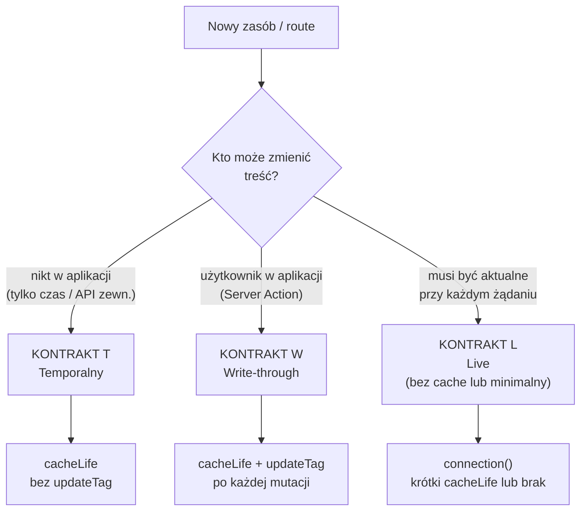
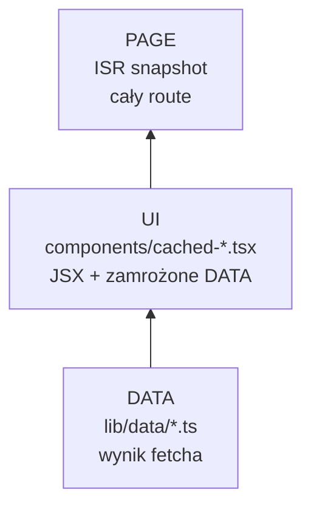
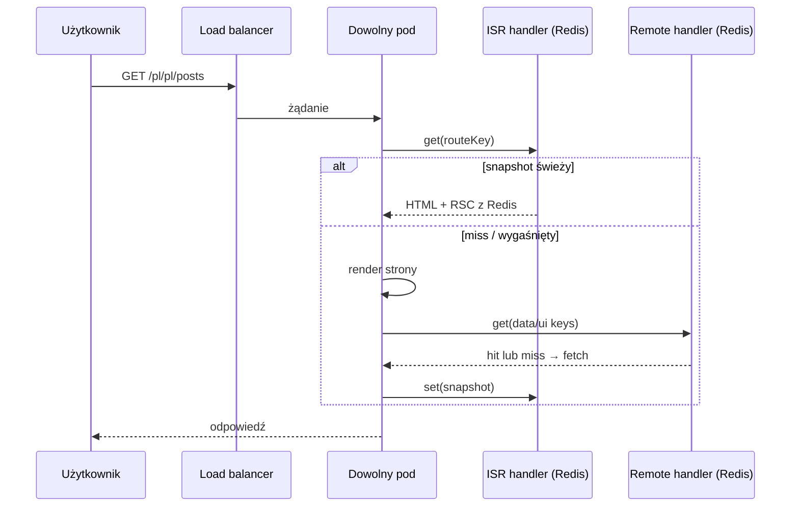
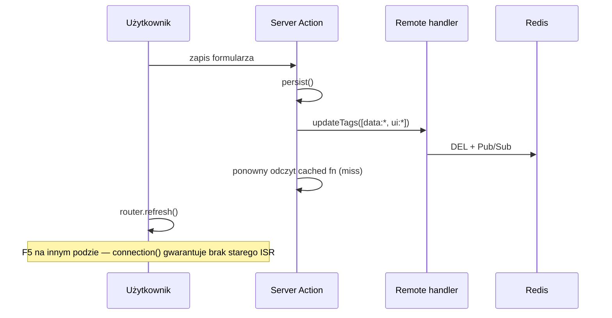
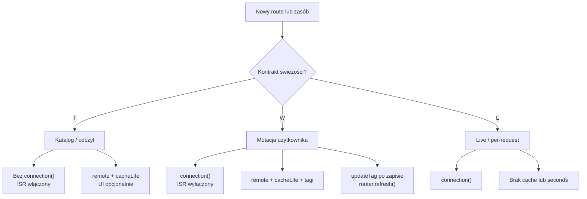

# Strategia cache V2 — kontrakt świeżości (moje podejście)

Produkcyjny przewodnik cache w aplikacji wieloinstancyjnej: wiele podów, jeden artefakt
`.next`, load balancer bez sticky sessions, wspólny Redis.

Ten dokument **nie opisuje faz wdrożenia** (najpierw remote, potem ISR). Zamiast tego
proponuje jeden spójny model: **najpierw definiujesz kontrakt świeżości treści, potem
dobierasz minimalną warstwę cache i wzorzec kodu**. Konfiguracja handlerów jest stała;
różnice między stronami wynikają wyłącznie z kodu route’a.

Szczegóły techniczne handlera: [CACHING.md](./CACHING.md), `packages/cache-handler/docsV2/`.
Konwencja tagów: `lib/cache-tags.ts`.

---

## 1. Punkt wyjścia — co naprawdę musisz rozwiązać

W środowisku wieloinstancyjnym masz trzy niezależne problemy:

| Problem | Skąd się bierze | Co go rozwiązuje |
|---------|------------------|------------------|
| **A. Kosztowne pobieranie danych** | Ten sam fetch/render na każdym podzie | `use cache: remote` → Redis (L1 + L2) |
| **B. Spójność danych po zapisie** | Użytkownik zmienił coś i musi to od razu widzieć | `updateTag` + `router.refresh()` |
| **C. Spójność powłoki strony między podami** | Każdy pod trzyma własny route cache | `cacheHandler` (ISR w Redis) + brak `connection()` na stronach katalogowych |

Nie wszystkie strony mają wszystkie trzy problemy. **Błąd, którego unikam:** wdrażanie
jednego „trybu produkcyjnego” na całą aplikację albo odwrotnie — wyłączanie ISR globalnie,
bo jedna strona wymaga mutacji.

---

## 2. Kontrakt świeżości — pierwsza decyzja przy każdym zasobie

Zanim dodasz `"use cache: remote"`, przypisz zasobowi **jeden** kontrakt:



### Kontrakt T — Temporalny (czas decyduje)

**Gwarancja:** treść może być nieaktualna do wygaśnięcia profilu `cacheLife`; nikt nie
oczekuje natychmiastowej zmiany po zapisie w aplikacji.

**Kiedy:** katalogi, listy z API/CMS, statystyki, treści redakcyjne bez edycji w UI.

**Mechanizm:** tylko `cacheLife` — **bez** `updateTag`, **bez** `revalidateTag` z aplikacji.

### Kontrakt W — Write-through (zapis użytkownika)

**Gwarancja:** po udanym zapisie ten sam użytkownik (i każdy inny po odświeżeniu) widzi
nowe dane — read-your-own-writes, także gdy load balancer trafi na inny pod.

**Kiedy:** formularze, ustawienia konta, edycja własnych zasobów.

**Mechanizm:** `cacheLife` (normalny TTL) + `updateTag` na **wszystkich** tagach wpisów
zależnych od tej mutacji + `router.refresh()` na kliencie.

### Kontrakt L — Live (bez opóźnienia)

**Gwarancja:** dane z bieżącego żądania, bez polegania na współdzielonym wpisie cache.

**Kiedy:** dashboardy operacyjne, podgląd „tu i teraz”, dane zależne od sesji/cookies
(nieprzekazywalne jako argumenty cache key).

**Mechanizm:** `await connection()` na fragmencie strony; opcjonalnie bardzo krótki
`cacheLife("seconds")` albo brak `use cache` w ogóle.

---

## 3. Stała konfiguracja produkcyjna

Od pierwszego deployu na staging z ≥ 2 instancjami **nie przełączam** handlerów między
„fazami”. Używam pełnego zestawu; selekcja odbywa się w kodzie route’a, nie w
`next.config.ts`.

```ts
// next.config.ts — docelowa konfiguracja (staging + produkcja)
const nextConfig = {
  cacheComponents: true,
  cacheHandlers: {
    remote: require.resolve("@tme/cache-handler"),
  },
  cacheHandler: require.resolve("@tme/cache-handler/isr"),
  cacheMaxMemorySize: 0, // ISR wyłącznie z Redis — spójność między podami
};
```

| Handler | Co cache’uje | Kiedy go „wyłączasz” |
|---------|--------------|----------------------|
| `cacheHandlers.remote` | Wyniki `"use cache: remote"` (DATA, UI) | Nie wyłączasz — to fundament multi-instance |
| `cacheHandler` (ISR) | Snapshot route’a (HTML + RSC) | Per route: `await connection()` w treści strony |

**Dlaczego nie zaczynam od „tylko remote”:** ISR i remote są ortogonalne. Wyłączenie ISR
w configu nie uczy zespołu wzorców mutacji — tylko odkłada problem C. Lepiej od razu
mieć prod config i **świadomie** decydować per route, czy strona wchodzi w ISR
(brak `connection()`), czy nie (`connection()` na stronach z kontraktem W/L).

---

## 4. Drabina granulacji — cache’uj na najniższej warstwie, która wystarcza

Nie każdy zasób potrzebuje trzech warstw. Idę od dołu:



| Warstwa | Koszt miss | Invalidacja | Kiedy dodaję |
|---------|------------|-------------|--------------|
| **DATA** | fetch do API/DB | tag `data:*` | Zawsze, gdy fetch jest drogi lub współdzielony |
| **UI** | render komponentu + ewentualnie DATA | tag `ui:*` | Gdy render JSX jest drogi **albo** chcę osobny profil `cacheLife` niż DATA |
| **PAGE (ISR)** | pełny render route’a | wygaśnięcie czasowe route’a | Gdy kontrakt T na stronie katalogowej **i** potrzebuję identycznej powłoki RSC na wszystkich podach |

### Kiedy wystarczy sam DATA (bez osobnego UI)

- Komponent to cienka lista wołająca jedną funkcję DATA — invalidacja jednego tagu
  `data:*` wystarczy.
- Nie ma sensu dublować wpisu: przy hit w UI i tak zamrażasz DATA wewnątrz UI.

**Przykład wystarczający na produkcję:**

```tsx
// page.tsx — kontrakt T, ISR włączony (brak connection())
<Suspense fallback={<Skeleton />}>
  <PostsList country={country} lang={lang} />
</Suspense>

// components/posts-list.tsx — tylko DATA, bez osobnego cached UI
async function PostsList({ country, lang }) {
  const data = await getPosts(country, lang); // "use cache: remote" wewnątrz
  return <ul>{/* ... */}</ul>;
}
```

### Kiedy dodaję warstwę UI

- Osobny, ciężki fragment (mapowanie, sortowanie, i18n etykiet) — chcę cache’ować
  **wynik renderu**, nie tylko JSON.
- Ten sam DATA służy wielu komponentom z różnym `cacheLife`.
- Demonstracja / laboratorium (np. cache-lab) — świadome rozdzielenie warstw.

Wtedy obowiązuje reguła: **przy kontrakcie W invalidujesz DATA i UI** — inaczej hit w
UI poda zamrożone stare DATA.

---

## 5. Mapowanie kontraktu → kod

### 5.1 Kontrakt T — strona katalogowa (odczyt)

| Element | Wartość |
|---------|---------|
| ISR | **Włączony** — brak `connection()` w `page.tsx` |
| DATA | `"use cache: remote"` + `cacheLife("hours" \| "days")` + `cacheTag(dataTag(...))` |
| UI | Opcjonalnie — patrz §4 |
| Po zapisie użytkownika | — (brak zapisu na tej stronie) |
| Zewnętrzna zmiana treści | Poza zakresem tej strategii — akceptujesz SWR do `expire` |

```tsx
// app/[country]/[lang]/posts/page.tsx
export default async function PostsPage({ params }: Props) {
  const { country, lang } = await params;
  // BEZ connection() — ISR cache’uje snapshot w Redis
  return (
    <Suspense fallback={<PostsSkeleton />}>
      <CachedPostsList country={country} lang={lang} />
    </Suspense>
  );
}
```

### 5.2 Kontrakt W — strona z mutacją użytkownika

| Element | Wartość |
|---------|---------|
| ISR | **Wyłączony** — `await connection()` w treści strony |
| DATA + UI | `"use cache: remote"` + `cacheLife` + tagi |
| Server Action | `updateTag(dataTag(...))` + `updateTag(uiTag(...))` jeśli UI istnieje |
| Klient | `router.refresh()` po udanej akcji |

```tsx
import { connection } from "next/server";

async function AccountContent({ params }: { params: Promise<{ country: string; lang: string }> }) {
  await connection(); // wyłącza ISR dla tego route’a — render per-request

  const { country, lang } = await params;
  const profile = await getProfile(country, lang);
  return <AccountForm initial={profile} />;
}
```

```ts
"use server";
import { updateTag } from "next/cache";

export async function saveProfile(country: string, lang: string, formData: FormData) {
  await persistProfile(formData);
  updateTag(dataTag("profile", country, lang));
  updateTag(uiTag("profile", country, lang)); // tylko jeśli masz warstwę UI
}
```

**Dlaczego `connection()` na mutacji przy włączonym ISR:** `updateTag` czyści remote
(DATA/UI), ale **nie** kasuje snapshotu ISR. Bez `connection()` użytkownik po F5 na innym
podzie mógłby zobaczyć starą powłokę RSC mimo świeżych danych w Redis.

### 5.3 Kontrakt L — dane „na żywo”

```tsx
async function LiveMetrics() {
  await connection();
  const metrics = await fetchMetrics(); // bez "use cache: remote"
  return <MetricsPanel data={metrics} />;
}
```

Albo krótki cache: `cacheLife("seconds")` + `connection()` gdy akceptujesz kilkusekundowe
opóźnienie.

---

## 6. Model świeżości — jedna tabela zamiast wielu mechanizmów

Świadomie **nie używam** w aplikacji produkcyjnej:

- `revalidateTag` / `revalidatePath` z Server Actions (demo w `/news` to laboratorium, nie wzorzec prod),
- webhooków CMS do invalidacji,
- `cacheLife("max")` na danych, które użytkownik może zmienić.

| Sytuacja | API / mechanizm | Efekt |
|----------|-----------------|-------|
| Katalog, brak zapisu w app | `cacheLife` | SWR między `revalidate` a `expire`; po `expire` pełny miss |
| Użytkownik zapisał | `updateTag` w Server Action | Wpis znika z Redis + L1 na wszystkich podach — natychmiast |
| Odświeżenie widoku po zapisie | `router.refresh()` | RSC renderuje ponownie z już świeżym remote cache |
| Strona mutacji | `connection()` | Brak wpisu ISR — każdy request świeża powłoka |
| Strona katalogowa | brak `connection()` | Wspólny snapshot ISR w Redis dla wszystkich podów |

### Trzy zegary `cacheLife` (skrót)

| Czas | Kto egzekwuje | Znaczenie praktyczne |
|------|---------------|----------------------|
| `stale` | Klient (router) | Jak długo przeglądarka nie pyta serwera |
| `revalidate` | Next.js | SWR — serwuj stary wynik, odśwież w tle |
| `expire` | Handler Redis | Twardy koniec — wpis usunięty, pełny render |

Dobór profilu:

| Profil | Zastosowanie |
|--------|--------------|
| `minutes` | Demo, cache-lab, często zmieniane listy |
| `hours` | Katalogi produktów, postów, użytkowników |
| `days` | Artykuły, treści redakcyjne |
| `max` | **Unikaj** na kontrakcie W; tylko treści praktycznie statyczne (T) |

---

## 7. Tagi — minimalna konwencja

Format: `{warstwa}:{zasób}[:{scope...}]` — helpery w `lib/cache-tags.ts`.

```
data:posts:pl:pl     → wynik fetcha postów dla locale
ui:posts:pl:pl       → wyrenderowana lista (jeśli warstwa UI istnieje)
```

Zasady:

1. **Jeden tag na jeden wpis cache** — prosta invalidacja 1:1.
2. **Scope w argumentach funkcji**, nie w `cookies()` / `headers()` wewnątrz `use cache`.
3. **Kontrakt W:** po mutacji invaliduj każdy tag, od którego zależy widok (DATA + UI).
4. Tagi to te same stringi co `cacheTag()` — handler traktuje je jako nieprzezroczyste.

---

## 8. Przepływ żądania — jak to się składa

### Odczyt katalogu (kontrakt T, ISR włączony)



### Mutacja (kontrakt W, ISR wyłączony przez connection)



---

## 9. Macierz decyzyjna — szybki wybór wzorca

| Kontrakt | Przykład route | `connection()` | ISR | Remote DATA | Remote UI | Po zapisie |
|----------|----------------|----------------|-----|-------------|-----------|------------|
| **T** | `/posts`, `/products` | Nie | Tak | `cacheLife` | Opcjonalnie | — |
| **W** | `/account`, formularze | **Tak** | Nie | `cacheLife` + `updateTag` | jeśli jest + `updateTag` | `router.refresh()` |
| **L** | dashboard live | **Tak** | Nie | brak lub `seconds` | — | — |

---

## 10. Wdrożenie krok po kroku (bez faz configu)

Kolejność prac, którą bym zastosował w nowym projekcie:

1. **Redis + remote handler** na stagingu, ≥ 2 instancje za LB.
2. **Pełna konfiguracja** z §3 (remote + ISR) — od razu, nie „na później”.
3. **Inwentaryzacja route’ów** — każdemu route przypisz kontrakt T / W / L (tabela w wiki lub komentarz w PR).
4. **Warstwa DATA** dla wszystkich zasobów z kontraktem T lub W.
5. **Warstwa UI** tylko tam, gdzie §4 to uzasadnia — nie kopiuj wzorca „zawsze DATA+UI”.
6. **`connection()`** na wszystkich route’ach W i L — audyt przed produkcją.
7. **Server Actions** — `updateTag` na wszystkich tagach dotkniętych mutacją.
8. **Testy akceptacyjne** z §11 na stagingu.
9. **Produkcja** — ten sam config i te same wzorce.

---

## 11. Kryteria akceptacji (jedna lista, bez „fazy 1 / faza 2”)

### Infrastruktura

- [ ] Redis dostępny; awaria → degradacja L1, aplikacja działa (bez 5xx z powodu cache).
- [ ] ≥ 2 instancje za load balancerem na stagingu.
- [ ] `cacheHandlers.remote` + `cacheHandler` (ISR) + `cacheMaxMemorySize: 0`.
- [ ] Wszystkie instancje: ten sam obraz / ten sam Node (wymóg `v8.serialize`).

### Kontrakty i kod

- [ ] Każdy route ma przypisany kontrakt T, W lub L (udokumentowany).
- [ ] Kontrakt T: brak `connection()` na stronach katalogowych.
- [ ] Kontrakt W: `connection()` + `updateTag` w każdej Server Action z mutacją.
- [ ] Brak `revalidateTag` / `revalidatePath` w kodzie produkcyjnym (poza świadomymi wyjątkami poza app).
- [ ] Brak `cacheLife("max")` na danych z kontraktem W.
- [ ] Każdy wpis remote ma `cacheTag` z `lib/cache-tags.ts`.

### Weryfikacja funkcjonalna

**Dane (remote):**

- [ ] Cache hit w Redis po drugim żądaniu na ten sam klucz (remote, nie tylko L1).
- [ ] `updateTag` czyści wpis na wszystkich instancjach (Pub/Sub — test z `/cache-lab` lub k6 invalidation).

**Read-your-own-writes (kontrakt W):**

- [ ] Zapis → natychmiast świeże dane w odpowiedzi Server Action.
- [ ] Zapis na podzie A → `router.refresh()` → świeże dane.
- [ ] Zapis na podzie A → F5 trafia na pod B → **świeże dane** (krytyczny test multi-instance).

**ISR (kontrakt T):**

- [ ] Ten sam URL przez LB, różne wartości `X-Upstream` → **identyczny** timestamp powłoki (np. `page rendered at` jeśli jest w UI).
- [ ] Wpis `isr:entry:*` w Redis po pierwszym hitcie na route katalogowy.
- [ ] Route z `connection()` → **brak** wpisu ISR dla tego URL.

**Regresja obciążeniowa:**

- [ ] Scenariusz single-flight (k6): zimny klucz → jeden render, reszta czeka.
- [ ] Smoke load bez wzrostu błędów 5xx.

---

## 12. Antywzorce

| Antywzorzec | Skutek | Zamiast tego |
|-------------|--------|--------------|
| Wdrożenie prod multi-instance bez remote | N× koszt API, brak wspólnej invalidacji | Remote od początku |
| `updateTag` tylko na UI, nie na DATA | Stary JSON wewnątrz świeżego UI | Oba tagi przy kontrakcie W |
| `router.refresh()` bez `updateTag` | Stary remote cache | Najpierw `updateTag`, potem refresh |
| `connection()` na wszystkich stronach | ISR martwy — płacisz za Redis bez korzyści | Tylko W i L |
| Brak `connection()` na stronie z mutacją | Stara powłoka ISR po zapisie | Kontrakt W wymaga `connection()` |
| Zawsze DATA + UI „bo tak w demo” | Podwójna pamięć Redis, podwójna invalidacja | §4 — minimalna granulacja |
| `cacheLife("max")` + kontrakt W | Użytkownik nie widzi zmian godzinami | Krótszy profil + `updateTag` |
| Przełączanie configu ISR między środowiskami | Niespodzianki na prod | Ten sam config; różnice w kodzie route |

---

## 13. Checklist — nowa funkcja

Przed merge PR:

1. [ ] Przypisany kontrakt **T / W / L**.
2. [ ] DATA: `"use cache: remote"` + `cacheLife` + `cacheTag(dataTag(...))` (jeśli nie L).
3. [ ] UI: tylko jeśli uzasadnione (§4) + `cacheTag(uiTag(...))`.
4. [ ] Route W/L: `await connection()` w treści strony.
5. [ ] Route T katalogowy: **bez** `connection()`.
6. [ ] Server Action z mutacją: `updateTag` na wszystkich dotkniętych tagach.
7. [ ] Komponent kliencki po mutacji: `router.refresh()`.
8. [ ] Brak `cookies()` / `headers()` wewnątrz `use cache: remote`.

---

## 14. Diagram wyboru (jeden, na całą aplikację)



---

## 15. Podsumowanie — czym V2 różni się od podejścia „fazowego”

| Aspekt | Podejście fazowe (V1) | To podejście (V2) |
|--------|----------------------|-------------------|
| Oś decyzji | Etap wdrożenia (najpierw remote, potem ISR) | **Kontrakt świeżości** (T / W / L) |
| Config | Zmiana między fazami | **Stały** prod config od stagingu |
| DATA / UI | Zawsze obie warstwy | **Minimalna** wystarczająca granulacja |
| ISR | Dodawany w „fazie 2” | Włączony w config; **wyłączany per route** przez `connection()` |
| Gate na prod | Osobne checklisty faz | **Jedna** lista akceptacji (§11) |
| Mutacje | Wzorzec w fazie 1, ISR w fazie 2 | Ten sam wzorzec od początku; ISR nie zmienia logiki mutacji |

**Reguła jednym zdaniem:** ustal kontrakt świeżości, cache’uj na najniższej wystarczającej
warstwie, trzymaj pełny config handlerów od stagingu, a ISR włączaj lub wyłączaj wyłącznie
przez obecność `connection()` na danym route — nie przez przełączanie infrastruktury.

---

## Powiązane dokumenty

| Dokument | Zawartość |
|----------|-----------|
| [CACHING.md](./CACHING.md) | Przepływy `get`/`set`, single-flight, Redis |
| [INVALIDATION-TIMESTAMPS.md](./INVALIDATION-TIMESTAMPS.md) | Backstop timestampów tagów |
| [adr/0001-zdalny-cache-redis.md](./adr/0001-zdalny-cache-redis.md) | Dlaczego własny handler |
| `packages/cache-handler/docsV2/` | Szczegóły handlera remote i ISR |
| `apps/tmeNext-K6Test/` | Testy obciążeniowe multi-instance |
