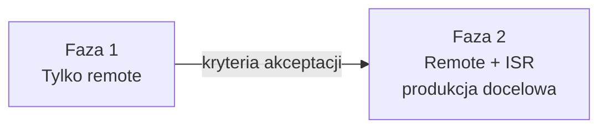
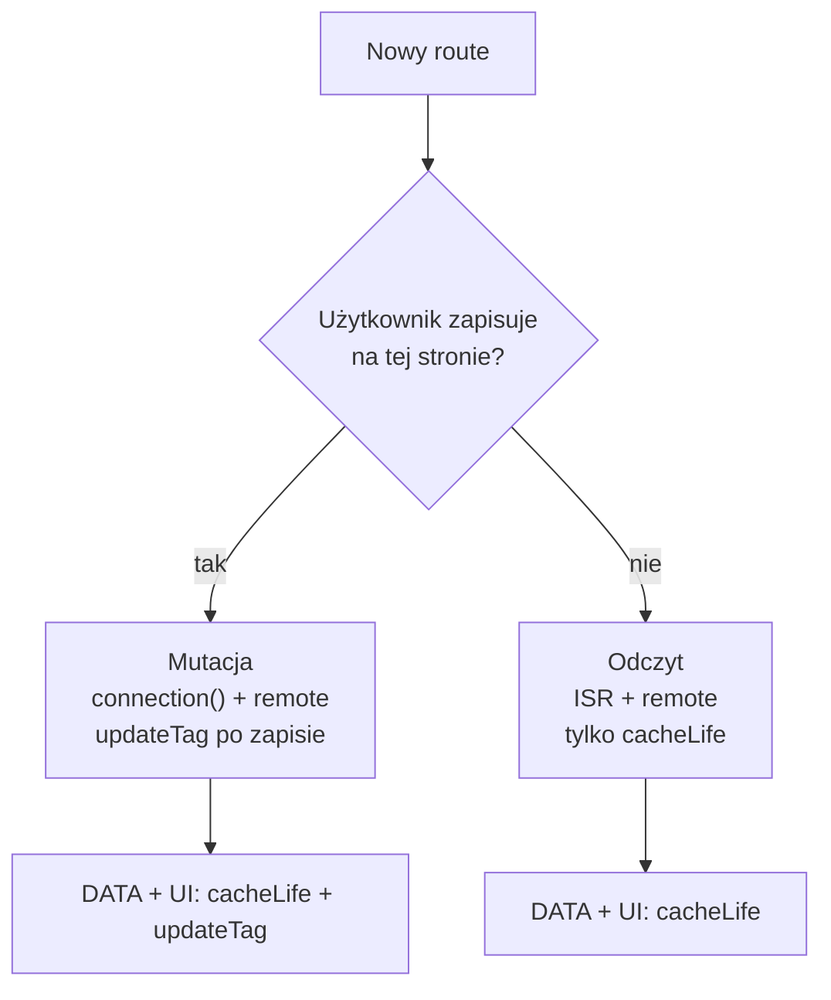

# Strategia cache — fazy wdrożenia (remote → remote + ISR)

Produkcyjny przewodnik wdrożenia cache w aplikacji wieloinstancyjnej (wiele podów, jeden `.next`, load balancer, Redis).

Dokument opisuje **dwie fazy wdrożenia** — w każdej: podejście do cache’owania **danych** i **stron**, oraz **kryteria akceptacji** wymagane do przejścia dalej.

Bez schematu kluczy Redis — szczegóły w [CACHING.md](./CACHING.md) i `lib/cache-tags.ts`.

---

## Przegląd faz



| Faza | Handlery | Środowisko | Cel |
|------|----------|------------|-----|
| **1** | `cacheHandlers.remote` | Staging, dev, wczesna produkcja | Udowodnić model danych + read-your-own-writes |
| **2** | remote + `cacheHandler` (ISR) | Produkcja wieloinstancyjna | Spójny snapshot stron odczytu między podami |

---

## Wspólne założenia (obie fazy)

### Środowisko

- Wiele instancji za load balancerem, bez sticky sessions.
- Jeden build / obraz Docker, wspólny Redis.
- `cacheComponents: true`.
- Locale jako argumenty funkcji i komponentów — nie `cookies()` / `headers()` w `use cache`.
- Mutacje wyłącznie przez Server Actions.

### Model świeżości

Brak invalidacji z zewnątrz (CMS, webhooki, `revalidateTag`, `revalidatePath`).

| Mechanizm | Warstwa | Kiedy |
|-----------|---------|-------|
| `cacheLife` | Dane (remote) | Domyślnie |
| `updateTag` | Dane (remote) | Po zapisie użytkownika — read-your-own-writes |
| `router.refresh()` | Widok klienta | Po Server Action |

### Dwie warstwy cache

| Warstwa | Handler | Co cache’uje | Gdzie w kodzie |
|---------|---------|--------------|----------------|
| **Dane — DATA** | remote | Wynik fetcha | `lib/data/*.ts` |
| **Dane — UI** | remote | Fragment JSX + zamrożone DATA | `components/cached-*.tsx` |
| **Strona** | ISR (faza 2) | Snapshot route’a (HTML + RSC) | `page.tsx` — domyślnie Next.js |

Dane cache’ujesz jawnie (`"use cache: remote"`). Stronę w fazie 2 cache’uje ISR — chyba że wyłączysz przez `connection()`.

---

## Faza 1 — tylko remote handler

### Cel fazy

Wdrożyć i ustabilizować **cache danych** w Redis (cluster-wide) oraz **read-your-own-writes** na stronach z mutacją — zanim dołożysz warstwę ISR.

### Konfiguracja

```ts
// next.config.ts
cacheComponents: true,
cacheHandlers: {
  remote: require.resolve("@tme/cache-handler"),
},
// brak cacheHandler (ISR)
```

### Podejście — dane (remote)

Obowiązuje także w fazie 2 — tu budujesz fundament.

| Element | Gdzie | Zasady |
|---------|-------|--------|
| **DATA** | `lib/data/*.ts` | `"use cache: remote"` + `cacheLife` + tag |
| **UI** | `components/cached-*.tsx` | `"use cache: remote"` + `cacheLife` + tag, woła DATA |

**Świeżość:**

| Sytuacja | Mechanizm |
|----------|-----------|
| Odczyt, brak zapisu | `cacheLife` na DATA i UI |
| Użytkownik zapisał | `updateTag` (DATA **i** UI, ten sam scope) → `router.refresh()` |

**Profile `cacheLife`:** `hours` / `days` dla katalogów; `minutes` dla demo; unikaj `max`.

```ts
"use server";
import { updateTag } from "next/cache";

export async function saveResource(country: string, lang: string, data: FormData) {
  await persist(data);
  updateTag(/* DATA */);
  updateTag(/* UI */);
}
```

### Podejście — strony (bez współdzielonego ISR)

W fazie 1 Next trzyma route cache **lokalnie per pod** — nie ma współdzielonego snapshotu strony w Redis.

| Typ strony | Przykład | `connection()` | Cache danych | Cache strony |
|------------|----------|----------------|--------------|--------------|
| **Odczyt** | `/posts`, `/products` | Nie | `cacheLife` | Lokalny per pod — rozjazd między instancjami możliwy |
| **Mutacja** | `/account`, formularze | **Tak** | `cacheLife` + `updateTag` | Render per-request — spójność przez remote |

**Strona mutacji** — wzorzec obowiązkowy:

```tsx
async function AccountContent({ params }: { params: Promise<{ country: string; lang: string }> }) {
  await connection();
  const { country, lang } = await params;
  return <AccountForm country={country} lang={lang} />;
}
```

**Strona odczytu** — bez `connection()`, świeżość danych z `cacheLife`:

```tsx
async function PostsContent({ params }) {
  const { country, lang } = await params;
  return <CachedPostsList country={country} lang={lang} />;
}
```

### Ograniczenia fazy 1

- Strony odczytu mogą **różnić się między podami** (lokalny route cache).
- Faza 1 **nie jest** docelową produkcją wieloinstancyjną dla stron katalogowych.
- Wzorzec danych i mutacji musi działać poprawnie — to warunek wejścia w fazę 2.

### Kryteria akceptacji → przejście do fazy 2

Wszystkie punkty **muszą** być spełnione:

**Konfiguracja i infrastruktura**

- [ ] `cacheHandlers.remote` działa na stagingu z Redis (L1 + L2).
- [ ] ≥ 2 instancje za load balancerem na stagingu.
- [ ] Redis dostępny i monitorowany (awaria → degradacja L1, bez padu aplikacji).

**Dane (remote)**

- [ ] Każdy zasób produkcyjny ma warstwę DATA i UI z `"use cache: remote"`.
- [ ] Każdy wpis ma `cacheLife` i tag aplikacyjny (helper z `lib/cache-tags.ts`).
- [ ] Brak `cacheLife("max")` na danych, które użytkownik może zmienić.
- [ ] Po zapisie: `updateTag` na DATA **i** UI — we wszystkich Server Actions z mutacją.

**Strony**

- [ ] Każdy route z mutacją użytkownika ma `connection()` w treści strony.
- [ ] Route’y odczytu zidentyfikowane i udokumentowane (lista podstron do ISR w fazie 2).
- [ ] Po mutacji na stronie z `connection()`: `router.refresh()` na kliencie.

**Weryfikacja funkcjonalna**

- [ ] Read-your-own-writes: zapis → natychmiast świeże dane u tego samego użytkownika.
- [ ] Read-your-own-writes przez LB: zapis na podzie A → F5 trafia na pod B → **świeże dane** (strona mutacji ma `connection()`).
- [ ] Odczyt katalogu: cache hit w Redis (remote) potwierdzony na co najmniej jednej instancji.
- [ ] Brak `revalidateTag` / `revalidatePath` w kodzie produkcyjnym aplikacji.

**Gotowość zespołu**

- [ ] Zespół rozumie podział DATA / UI i konieczność invalidacji obu warstw danych.
- [ ] Checklist nowej funkcji (§ na końcu dokumentu) stosowany w code review.

---

## Faza 2 — remote + ISR (produkcja docelowa)

### Cel fazy

Dodać **współdzielony cache stron odczytu** w Redis — spójny snapshot RSC między wszystkimi podami. Strony mutacji bez zmian (nadal `connection()` + remote).

### Konfiguracja

```ts
// next.config.ts — rozszerzenie fazy 1
cacheComponents: true,
cacheHandlers: {
  remote: require.resolve("@tme/cache-handler"),
},
cacheHandler: require.resolve("@tme/cache-handler/isr"),
cacheMaxMemorySize: 0, // wymagane — Redis jako jedyne źródło ISR
```

### Podejście — dane (remote)

**Bez zmian względem fazy 1.** Remote handler, `cacheLife`, `updateTag` po zapisie — ten sam model.

### Podejście — strony (ISR + remote)

| Typ strony | ISR | `connection()` | Dane (remote) | Świeżość strony |
|------------|-----|----------------|---------------|-----------------|
| **Odczyt** | Włączony | Nie | `cacheLife` | Wygaśnięcie czasowe route’a |
| **Mutacja** | Wyłączony | **Tak** | `cacheLife` + `updateTag` | Zawsze render per-request |

#### Strona odczytu — ISR włączony

- Usuń `connection()` (jeśli było dodane w fazie 1 „na wszelki wypadek”).
- Next zapisuje snapshot do Redis — wszystkie instancje serwują ten sam wpis.
- Nie wołasz `updateTag` na stronie bez mutacji — wystarczy `cacheLife` na danych.
- Powłoka ISR może być krótko starsza niż remote — akceptowalne przy braku ręcznej invalidacji ISR.

#### Strona mutacji — ISR wyłączony

- `connection()` **zostaje** — bez zmian względem fazy 1.
- Po zapisie: `updateTag` (DATA + UI) + `router.refresh()`.
- **Nie dodawaj** `revalidatePath` — strona nie jest w ISR.

#### Dlaczego mutacja wymaga `connection()` w fazie 2

Bez ręcznej invalidacji ISR, gdyby strona z zapisem była w ISR:

1. `updateTag` → remote świeży.
2. Powłoka RSC z ISR → stara do wygaśnięcia czasowego.
3. F5 na innym podzie → stary snapshot mimo świeżych danych.

### Macierz fazy 2

| Typ strony | Przykład | ISR | DATA | UI | Po zapisie |
|------------|----------|-----|------|----|------------|
| Odczyt | `/posts` | tak | `cacheLife` | `cacheLife` | — |
| Mutacja | `/account` | nie | `cacheLife` + `updateTag` | `cacheLife` + `updateTag` | `router.refresh()` |

### Kroki migracji z fazy 1

1. Dodać `cacheHandler` + `cacheMaxMemorySize: 0`.
2. Wdrożyć na staging z ≥ 2 instancjami.
3. Route’y **odczytu** z listy z fazy 1: usunąć `connection()`.
4. Route’y **mutacji**: bez zmian (`connection()` zostaje).
5. Uruchomić weryfikację z kryteriów akceptacji poniżej.

### Kryteria akceptacji → produkcja (faza 2 ukończona)

**Konfiguracja**

- [ ] `cacheHandler` (ISR) + `cacheMaxMemorySize: 0` na stagingu i produkcji.
- [ ] Redis współdzielony między wszystkimi instancjami.

**Klasyfikacja route’ów**

- [ ] Wszystkie route’y odczytu **bez** `connection()`.
- [ ] Wszystkie route’y mutacji **z** `connection()`.
- [ ] Brak route’u mutacji bez `connection()` (audyt).

**Weryfikacja — strony odczytu (ISR)**

- [ ] Ten sam URL przez LB na różnych podach (`X-Upstream`) → **identyczny** snapshot strony (np. ten sam timestamp „page rendered at”).
- [ ] Wpis `isr:entry:*` w Redis po pierwszym hitcie na route odczytu.
- [ ] Po wygaśnięciu `cacheLife` danych — remote odświeża się; ISR odświeża się po swoim cyklu czasowym.

**Weryfikacja — strony mutacji**

- [ ] Zapis na podzie A → `router.refresh()` → świeże dane.
- [ ] F5 przez LB na pod B → nadal świeże dane (brak ISR na tej stronie).
- [ ] Brak wpisu ISR dla route’ów z `connection()`.

**Weryfikacja — dane (regresja fazy 1)**

- [ ] Wszystkie kryteria danych z fazy 1 nadal spełnione.
- [ ] `updateTag` invaliduje wpisy remote na wszystkich instancjach (Pub/Sub + Redis).

**Produkcja**

- [ ] Obciążenie smoke / k6 na stagingu bez regresji błędów.
- [ ] Runbook awarii Redis przetestowany (aplikacja działa, cache degraduje się gracefully).

---

## Antywzorce (obie fazy)

| Antywzorzec | Faza | Skutek |
|-------------|------|--------|
| Produkcja multi-instance bez przejścia przez fazę 1 | 2 | ISR maskuje niedopracowany model danych |
| `updateTag` bez mutacji | 1–2 | Zbędne |
| Tylko `updateTag` na UI | 1–2 | Stary DATA wewnątrz UI |
| Brak `connection()` na mutacji | 2 | Stara powłoka ISR po zapisie |
| `connection()` na wszystkich stronach w fazie 2 | 2 | ISR bez korzyści — zbędny koszt Redis |
| `router.refresh()` bez `updateTag` | 1–2 | Stary remote cache |
| `revalidateTag` / `revalidatePath` | 1–2 | Poza modelem aplikacji |

---

## Checklist — nowa funkcja

**Dane (faza 1+, bez zmian w fazie 2)**

- [ ] DATA: `"use cache: remote"` + `cacheLife` + tag.
- [ ] UI: `"use cache: remote"` + `cacheLife` + tag, woła DATA.
- [ ] Server Action z mutacją: `updateTag` (DATA + UI).

**Strona — zależnie od fazy i typu**

| | Faza 1 odczyt | Faza 1 mutacja | Faza 2 odczyt | Faza 2 mutacja |
|--|---------------|----------------|---------------|----------------|
| `connection()` | Nie | Tak | Nie | Tak |
| ISR | lokalny per pod | wyłączony | Redis | wyłączony |
| Po zapisie | — | `updateTag` + `router.refresh()` | — | `updateTag` + `router.refresh()` |

---

## Diagram wyboru (faza 2)



---

## Podsumowanie

| | Faza 1 | Faza 2 |
|--|--------|--------|
| **Handlery** | remote | remote + ISR |
| **Dane** | `cacheLife` + `updateTag` | bez zmian |
| **Strony odczytu** | lokalny route cache | ISR w Redis |
| **Strony mutacji** | `connection()` + remote | bez zmian |
| **Gate** | Kryteria akceptacji § Faza 1 | Kryteria akceptacji § Faza 2 |

**Reguła:** najpierw ustabilizuj dane i mutacje (faza 1), potem dołóż ISR tylko na route’y odczytu (faza 2). Politykę definiujesz w kodzie route’a — nie w handlerze.
