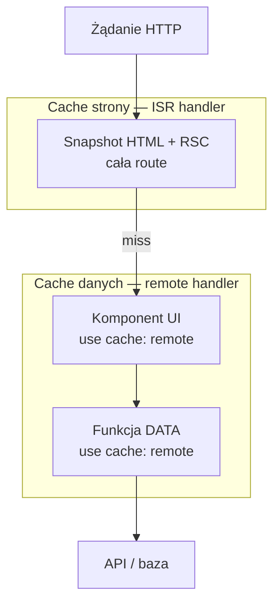
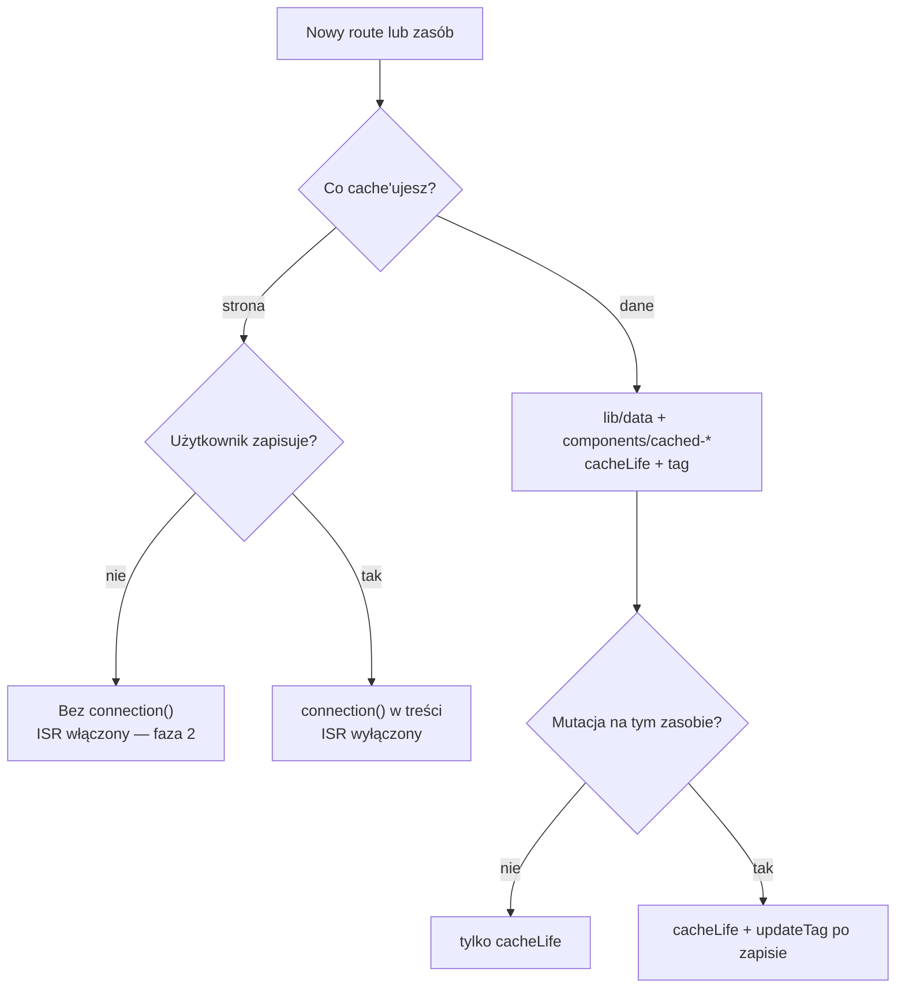

# Strategia cache — remote + ISR

Produkcyjny przewodnik po cache w aplikacji wieloinstancyjnej (wiele podów, jeden `.next`, load balancer, Redis).

Opisuje **konkretne podejścia** do cache’owania **danych** i **stron** — bez schematu kluczy Redis (szczegóły: [CACHING.md](./CACHING.md), `lib/cache-tags.ts`).

---

## 1. Kontekst

### Środowisko

- Wiele instancji Next.js za load balancerem, bez sticky sessions.
- Jeden build / jeden obraz Docker, wspólny Redis.
- `cacheComponents: true`.
- Locale (`country`, `lang`) przekazywane jako **argumenty** do funkcji i komponentów — nie przez `cookies()` / `headers()` w `use cache`.
- Mutacje wyłącznie przez Server Actions (użytkownik w aplikacji).

### Czego nie ma w aplikacji

Brak invalidacji z zewnątrz: CMS, webhooki, crony, `revalidateTag`, `revalidatePath`.

Świeżość opiera się tylko na:

| Mechanizm | Warstwa | Kiedy |
|-----------|---------|-------|
| `cacheLife` | Dane (remote) | Domyślnie — wpis wygasa według profilu |
| `updateTag` | Dane (remote) | Użytkownik zapisał — read-your-own-writes |
| `router.refresh()` | Widok klienta | Po Server Action zmieniającej ekran |

---

## 2. Dwie warstwy cache



| Warstwa | Handler | Co trzymasz | Gdzie w kodzie |
|---------|---------|-------------|----------------|
| **Dane — DATA** | `cacheHandlers.remote` | Wynik fetcha (JSON, rekordy) | `lib/data/*.ts` |
| **Dane — UI** | `cacheHandlers.remote` | Wyrenderowany fragment + zamrożone DATA | `components/cached-*.tsx` |
| **Strona** | `cacheHandler` (ISR) | Cały snapshot route’a (powłoka RSC) | `page.tsx` — domyślne zachowanie Next.js |

**Zasada:** dane cache’ujesz jawnie (`"use cache: remote"`). Stronę cache’uje Next.js przez ISR, chyba że jawnie ją wyłączysz (`connection()`).

---

## 3. Podejście do cache’owania danych (remote)

Dotyczy funkcji DATA i komponentów UI. Niezależne od tego, czy strona ma włączony ISR.

### 3.1 Podział DATA / UI

| Element | Rola | `"use cache: remote"` |
|---------|------|------------------------|
| **DATA** | Fetch, mapowanie, logika pobierania | Tak — w `lib/data/` |
| **UI** | JSX, layout fragmentu; woła DATA wewnątrz | Tak — w `components/cached-*.tsx` |

Przy hit na UI funkcja DATA **nie wykonuje się** — dane są zamrożone w wpisie UI. Stąd przy `updateTag` invalidujesz **zawsze oba** (DATA + UI), ten sam scope (zasób + locale).

### 3.2 Świeżość danych — `cacheLife`

| Profil | Zastosowanie |
|--------|--------------|
| `hours` / `days` | Katalogi, listy, dane rzadko zmieniane |
| `minutes` | Demo, dane szybciej „starejące” |
| Unikaj `max` | Wpis praktycznie nie wygasa — bez zewnętrznej invalidacji to ryzyko |

`cacheLife` to **jedyny** mechanizm świeżości na stronach bez mutacji użytkownika.

### 3.3 Świeżość po zapisie — `updateTag`

Tylko w Server Action, po udanym zapisie:

```ts
"use server";
import { updateTag } from "next/cache";

export async function saveResource(country: string, lang: string, formData: FormData) {
  await persist(formData);

  updateTag(/* tag DATA */);
  updateTag(/* tag UI */);
}
```

```ts
// Klient
router.refresh();
```

Opcjonalnie w tej samej akcji ponów odczyt cached funkcji DATA — read-your-own-writes w jednym żądaniu.

### 3.4 Podsumowanie — dane

| Sytuacja | Co robisz |
|----------|-----------|
| Strona tylko do odczytu | `cacheLife` na DATA i UI |
| Użytkownik zapisał | `updateTag` (DATA + UI) → `router.refresh()` |
| Zewnętrzna invalidacja | **Nie stosujemy** |

---

## 4. Podejście do cache’owania stron (ISR)

Dotyczy powłoki route’a (HTML + RSC). Włączone dopiero w fazie 2 (patrz §6).

### 4.1 Kiedy strona **jest** w ISR

- Route **tylko do odczytu** — użytkownik nie zapisuje na tej stronie.
- Brak `connection()` w treści strony.
- Next zapisuje snapshot do Redis (`cacheHandler` + `cacheMaxMemorySize: 0`).
- Wszystkie instancje serwują **ten sam** snapshot — spójność za load balancerem.

Świeżość powłoki: **wyłącznie czasowa** (domyślne `revalidate` route’a). Nie invalidujemy ISR ręcznie.

### 4.2 Kiedy strona **omija** ISR

- Route z **mutacją** — formularz, zapis konta, checkout.
- `await connection()` w komponencie treści (w `Suspense`):

```tsx
async function AccountContent({ params }: { params: Promise<{ country: string; lang: string }> }) {
  await connection();
  const { country, lang } = await params;
  return <AccountForm country={country} lang={lang} />;
}
```

- ISR handler **nie dostaje** `set` — każdy request renderuje powłokę na nowo.
- Po zapisie wystarczy `updateTag` na danych + `router.refresh()` — nie ma warstwy ISR do zsynchronizowania.

### 4.3 Interakcja ISR ↔ remote na stronie odczytu

Na stronie katalogowej (np. `/posts`) mogą być **trzy** niezależne „zegary”:

| Warstwa | Co może być stare | Jak odświeżasz |
|---------|-------------------|----------------|
| ISR (powłoka) | Snapshot RSC do wygaśnięcia route’a | Czas — brak ręcznej invalidacji |
| UI (remote) | Fragment do `cacheLife` UI | `cacheLife` |
| DATA (remote) | Fetch do `cacheLife` DATA | `cacheLife` |

To akceptowalne: użytkownik nie zapisuje na tej stronie, więc nie wołasz `updateTag`. Ewentualny rozjazd między powłoką a danymi znika po wygaśnięciu profili.

### 4.4 Dlaczego strona z mutacją **musi** omijać ISR

Bez `revalidatePath` nie invalidujesz powłoki ISR ręcznie. Gdyby strona z zapisem była w ISR:

1. `updateTag` → remote świeży.
2. Powłoka RSC z ISR → **stara** do wygaśnięcia czasowego.
3. Użytkownik po F5 na innym podzie → stary snapshot mimo świeżych danych w Redis.

`connection()` na stronach z mutacją to **wymóg** modelu, nie opcja.

### 4.5 Podsumowanie — strony

| Typ strony | ISR | `connection()` | Po zapisie użytkownika |
|------------|-----|----------------|------------------------|
| Odczyt (katalog, lista) | Włączony | Nie | — (brak zapisu) |
| Mutacja (formularz) | Wyłączony | **Tak** | `updateTag` + `router.refresh()` |

---

## 5. Macierz podejść (główna ściągawka)

### Produkcja — remote + ISR (faza 2)

| Typ strony | Przykład | ISR | DATA | UI | Świeżość danych | Świeżość strony |
|------------|----------|-----|------|----|-----------------|-----------------|
| **Odczyt** | `/posts`, `/products` | tak | `cacheLife` | `cacheLife` | `cacheLife` | wygaśnięcie route’a |
| **Mutacja** | `/account`, formularze | nie | `cacheLife` + `updateTag` | `cacheLife` + `updateTag` | po zapisie | zawsze render |

### Faza przejściowa — tylko remote (faza 1)

| Typ strony | ISR | DATA / UI | Uwaga |
|------------|-----|-----------|-------|
| Odczyt | lokalny per pod | `cacheLife` | Możliwy rozjazd powłoki między instancjami |
| Mutacja | — | `connection()` + `updateTag` | Spójność przez remote w Redis |

---

## 6. Wdrożenie — dwie fazy

### Faza 1 — tylko remote (staging / przejściowo)

```ts
cacheComponents: true,
cacheHandlers: {
  remote: require.resolve("@tme/cache-handler"),
},
```

Wieloinstancyjna produkcja **bez** ISR → faza przejściowa.

### Faza 2 — remote + ISR (produkcja docelowa)

```ts
cacheComponents: true,
cacheHandlers: {
  remote: require.resolve("@tme/cache-handler"),
},
cacheHandler: require.resolve("@tme/cache-handler/isr"),
cacheMaxMemorySize: 0, // wymagane — Redis jako jedyne źródło ISR
```

### Migracja 1 → 2

1. Dodać `cacheHandler` + `cacheMaxMemorySize: 0`.
2. Strony **odczytu**: usunąć `connection()` → włącz ISR.
3. Strony **mutacji**: zostawić `connection()` → ISR nadal wyłączony.
4. Test przez LB: odczyt na różnych podach (spójny ISR); zapis + F5 na innym podzie (świeże dane).

---

## 7. Wzorce implementacji

### 7.1 Strona odczytu (katalog)

```tsx
// page.tsx — bez connection()
export default function PostsPage({ params }) {
  return (
    <Suspense fallback={<Skeleton />}>
      <PostsContent params={params} />
    </Suspense>
  );
}

async function PostsContent({ params }) {
  const { country, lang } = await params;
  return <CachedPostsList country={country} lang={lang} />;
}
```

- ISR: włączony (faza 2).
- DATA/UI: `cacheLife`, bez `updateTag`.

### 7.2 Strona mutacji (formularz)

```tsx
// page.tsx
export default function AccountPage({ params }) {
  return (
    <Suspense fallback={<Skeleton />}>
      <AccountContent params={params} />
    </Suspense>
  );
}

async function AccountContent({ params }) {
  await connection(); // wyłącza ISR
  const { country, lang } = await params;
  return <AccountForm country={country} lang={lang} />;
}
```

- ISR: wyłączony.
- Server Action: `updateTag` (DATA + UI) → klient: `router.refresh()`.

---

## 8. Wybór podejścia — diagram



---

## 9. Checklist — nowa funkcja

**Dane**

- [ ] Funkcja DATA: `"use cache: remote"` + `cacheLife` + tag.
- [ ] Komponent UI: `"use cache: remote"` + `cacheLife` + tag, woła DATA.
- [ ] Po mutacji: `updateTag` na DATA **i** UI (ten sam scope).

**Strona**

- [ ] Użytkownik zapisuje? → `connection()` w treści.
- [ ] Tylko odczyt + faza 2? → bez `connection()`, ISR działa.
- [ ] Po Server Action: `router.refresh()` na kliencie.

---

## 10. Antywzorce

| Antywzorzec | Dotyczy | Skutek |
|-------------|---------|--------|
| `updateTag` bez mutacji użytkownika | dane | Zbędne — wystarczy `cacheLife` |
| Tylko `updateTag` na UI | dane | Stary snapshot DATA wewnątrz UI |
| Brak `connection()` na stronie z zapisem | strona | Stara powłoka ISR po `updateTag` |
| `router.refresh()` bez `updateTag` | dane | Widok ze starym remote cache |
| `cacheLife("max")` na danych użytkownika | dane | Brak wygaśnięcia przy bugu w `updateTag` |
| `revalidateTag` / `revalidatePath` | obie | Poza modelem aplikacji |

---

## 11. Podsumowanie

| Pytanie | Odpowiedź |
|---------|-----------|
| Gdzie cache’uję dane? | Remote — DATA + UI, `cacheLife`, opcjonalnie `updateTag` |
| Gdzie cache’uję stronę? | ISR (faza 2) — tylko route’y odczytu |
| Jak wyłączam cache strony? | `connection()` na route’ach z mutacją |
| Skąd świeżość bez zapisu? | `cacheLife` |
| Skąd świeżość po zapisie? | `updateTag` + `router.refresh()` |
| Gdzie definiuję politykę? | Kod route’a (`connection()`) + warstwa danych (`cacheLife`, `updateTag`) — nie w handlerze |

**Reguła:** dane i strony to osobne decyzje. Remote zawsze; ISR tylko na odczycie; mutacja = `connection()` + `updateTag` na danych.
