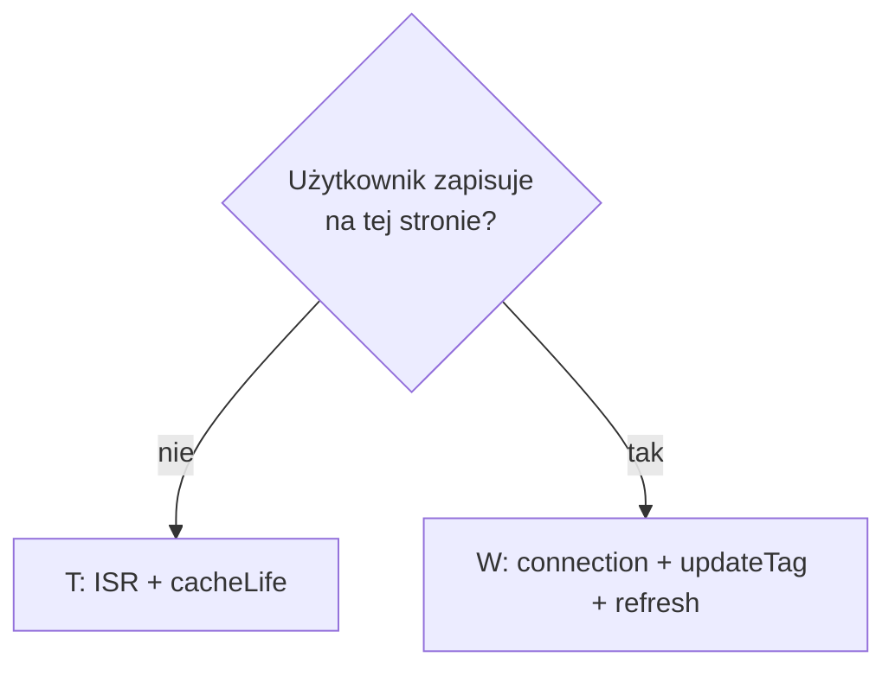

# Strategia cache — dla zespołu

> Prezentacja z screenami tme.eu i argumentacją dla backendu: [CACHE-DLA-ZESPOLU.md](./CACHE-DLA-ZESPOLU.md)

Aplikacja: wiele podów Next.js, jeden build, load balancer, wspólny Redis.

**Dwa handlery** (config stały na staging i prod):

| Handler | Co cache'uje |
|---------|--------------|
| `cacheHandlers.remote` | `"use cache: remote"` — fetchy i komponenty (Redis + LRU w podzie) |
| `cacheHandler` (ISR) | Snapshot całego route'a (HTML + RSC) w Redis |

`updateTag` czyści **remote**, nie snapshot ISR. Fragment z danymi po mutacji musi być
**dynamiczny** (`connection()` w komponencie wewnątrz `<Suspense>`) — nie na całej stronie.

---

## Krok 1 — przypisz kontrakt świeżości

| Kontrakt | Kiedy | Co robisz |
|----------|-------|-----------|
| **T** — czas decyduje | Katalog, lista, treść z API — lekka nieaktualność OK | `cacheLife`, bez `updateTag` |
| **W** — zapis użytkownika | Formularz, edycja konta — po zapisie od razu widać zmianę | `cacheLife` + `updateTag` + `router.refresh()` + `connection()` **tylko w komponencie RYOW** |
| **L** — live | Musi być świeże przy każdym żądaniu | `connection()` w wąskim komponencie (Suspense), fetch bez cache |

---

## Krok 2 — wybierz warstwę cache

Idź od najniższej wystarczającej — nie duplikuj bez powodu.

| Warstwa | Gdzie | Kiedy |
|---------|-------|-------|
| **DATA** | `lib/data/*.ts` | Zawsze, gdy fetch jest drogi |
| **UI** | `components/cached-*.tsx` | Tylko gdy render JSX jest drogi albo inny `cacheLife` niż DATA |
| **ISR** | powłoka route (poza Suspense) | Kontrakt T: cała strona statyczna. Kontrakt W: shell może być w ISR, dziura dynamiczna w Suspense |

Przy kontrakcie **W** invaliduj **DATA i UI** (hit w UI ma zamrożone dane wewnątrz).

---

## Reguły kodu

### DATA

```ts
"use cache: remote";
cacheLife("hours"); // lub days / minutes
cacheTag(dataTag("posts", country, lang));
```

### UI (opcjonalnie)

```tsx
"use cache: remote";
cacheLife("hours");
cacheTag(uiTag("posts", country, lang));
const data = await getPosts(country, lang);
```

### Strona katalogowa (T)

- **Bez** `connection()` → ISR włączony, ten sam snapshot na wszystkich podach.
- Świeżość danych z `cacheLife`, nie z `updateTag`.

### Strona z mutacją (W)

`connection()` **tylko** w komponencie, który musi być świeży — owiniętym w `<Suspense>`.
Nagłówek, layout, statyczna otoczka zostają w powłoce ISR.

```tsx
// page.tsx — BEZ connection() tutaj
export default function AccountPage({ params }: Props) {
  return (
    <>
      <PageHeader />
      <Suspense fallback={<FormSkeleton />}>
        <AccountContent params={params} />
      </Suspense>
    </>
  );
}

async function AccountContent({ params }: { params: Promise<...> }) {
  await connection(); // tylko ten segment jest dynamiczny
  const { country, lang } = await params;
  const profile = await getProfile(country, lang);
  return <AccountForm initial={profile} />;
}
```

```ts
// Server Action — updateTag + ponowny odczyt w tej samej akcji jeśli potrzebny
updateTag(dataTag(...));
updateTag(uiTag(...));
```

```tsx
router.refresh(); // klient — odświeża dynamiczną dziurę
```

**HTTP 200 zamiast 304:** przy dynamicznej dziurze odpowiedź to zwykle 200 + stream
(oczekiwane w PPR). To **nie** kasuje remote cache ani powłoki ISR — kasuje tylko
pełny cache całego route'a, gdy `connection()` wstawisz na poziomie `page.tsx`.

---

## Tagi (`lib/cache-tags.ts`)

Format: `{warstwa}:{zasób}[:{scope...}]` — np. `data:posts:pl:pl`, `ui:posts:pl:pl`.

- Jeden tag na jeden wpis cache.
- Scope w argumentach funkcji — **nie** `cookies()` / `headers()` w `use cache`.

---

## cacheLife — skrót

| Profil | Kiedy |
|--------|-------|
| `hours` | Katalogi (posts, users, products) |
| `days` | Artykuły, treści redakcyjne |
| `minutes` | Demo, cache-lab |
| `max` | **Nie** na danych, które użytkownik może zmienić (kontrakt W) |

`cacheLife` = wygaśnięcie czasowe. `updateTag` = natychmiastowe skasowanie wpisu (tylko kontrakt W).

---

## Macierz — szybki wybór

| | `connection()` | ISR (powłoka) | Remote | Po zapisie |
|--|----------------|---------------|--------|------------|
| **T** katalog | Nie | Cały route | `cacheLife` | — |
| **W** mutacja | Tylko komponent RYOW w Suspense | Shell tak, dziura dynamiczna | `cacheLife` + `updateTag` | `router.refresh()` |
| **L** live | Wąski komponent w Suspense | Shell opcjonalnie | brak / `seconds` | — |



---

## Czego nie robimy w prod

- `revalidateTag` / `revalidatePath` z Server Actions (SWR, nie read-your-own-writes)
- `updateTag` bez mutacji
- `updateTag` tylko na UI, bez DATA
- `connection()` w `page.tsx` na całej stronie (zabija ISR całego route + zbędny 200)
- Brak `connection()` w komponencie RYOW (stary snapshot ISR w dynamicznej dziurze po zapisie)
- `cacheLife("max")` na danych edytowalnych przez użytkownika

---

## Checklist — nowa funkcja

1. [ ] Kontrakt T / W / L przypisany.
2. [ ] DATA: `"use cache: remote"` + `cacheLife` + `cacheTag`.
3. [ ] UI tylko jeśli potrzebne + ten sam scope tagów.
4. [ ] W: `connection()` w komponencie RYOW + `<Suspense>`, nie w `page.tsx`.
5. [ ] T: brak `connection()` — cały route w ISR.

---

## Test przed prod (skrót)

- [ ] ≥ 2 pody + Redis na stagingu.
- [ ] Zapis na podzie A → F5 na pod B → świeże dane (kontrakt W).
- [ ] Ten sam URL katalogu na różnych podach → identyczna powłoka (kontrakt T + ISR).
- [ ] `updateTag` widoczny na wszystkich podach (remote cache).
