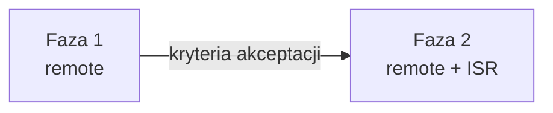

# Strategia cache — dla zespołu

Wdrożenie cache w aplikacji wieloinstancyjnej (wiele podów, jeden build, load balancer, Redis) w **dwóch fazach**.

| Dokument | Kiedy |
|----------|-------|
| [Faza 1 — tylko remote](./STRATEGIA-CACHE-FAZA-1.md) | Staging, dev, fundament danych + mutacje |
| [Faza 2 — remote + ISR](./STRATEGIA-CACHE-FAZA-2.md) | Produkcja docelowa — spójny snapshot stron odczytu |

## Wspólne założenia (obie fazy)

- Wiele instancji za load balancerem, bez sticky sessions.
- Jeden obraz Docker, wspólny Redis, `cacheComponents: true`.
- Parametry dynamiczne (locale itd.) jako **argumenty** funkcji — nie `cookies()` / `headers()` w `use cache`.
- Mutacje tylko przez Server Actions.
- Brak `revalidateTag` / `revalidatePath` z aplikacji — świeżość z `cacheLife` lub `updateTag` po zapisie użytkownika.

## Warstwy cache

| Warstwa | Handler | Gdzie w kodzie |
|---------|---------|----------------|
| **DATA** | remote | `lib/data/*.ts` |
| **UI** | remote | `components/cached-*.tsx` |
| **Strona** | ISR (od fazy 2) | `page.tsx` — domyślnie Next.js |

Tagi: `lib/cache-tags.ts` — format `{warstwa}:{zasób}[:{scope...}]`.
