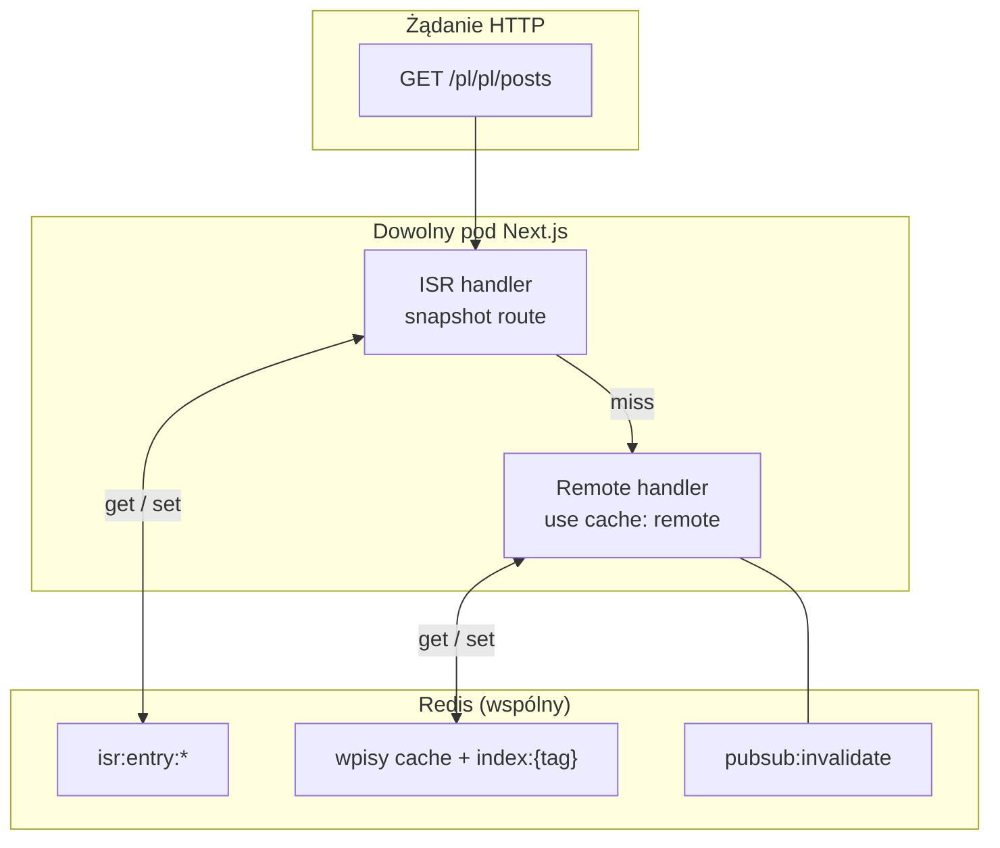
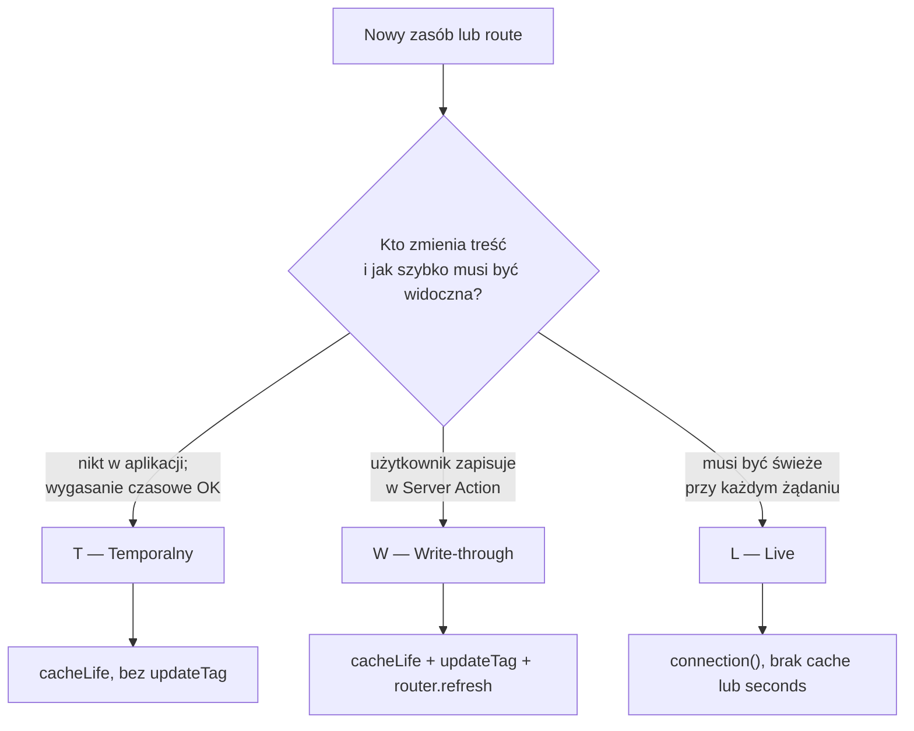
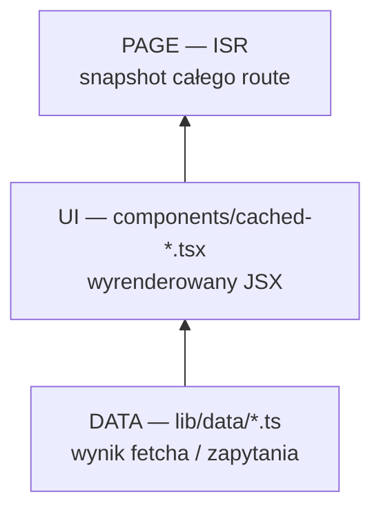
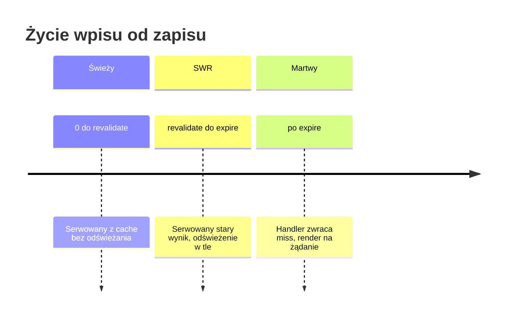
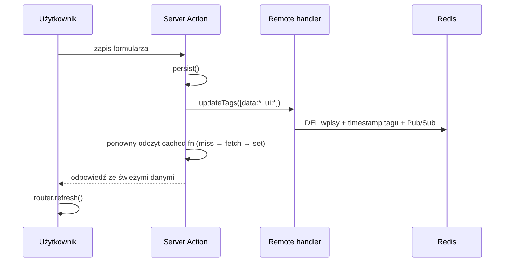
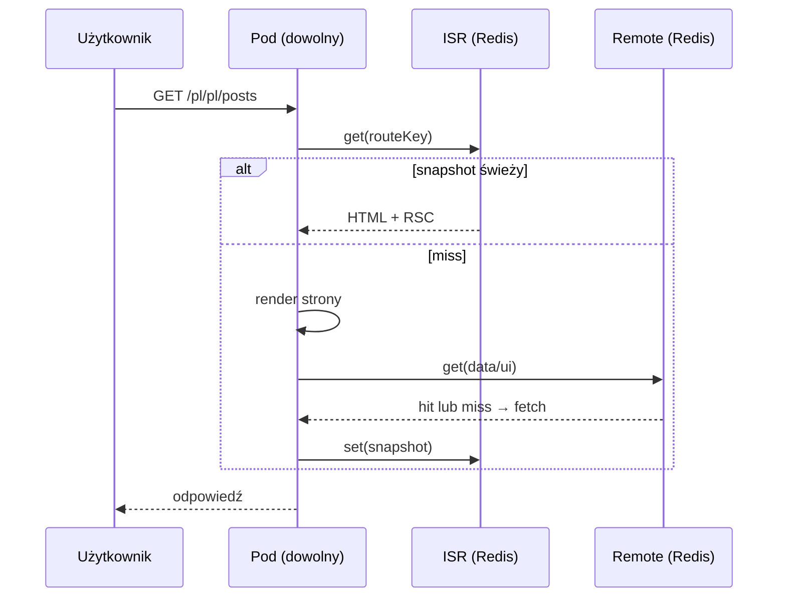
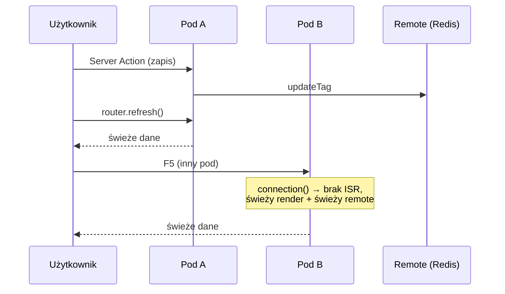
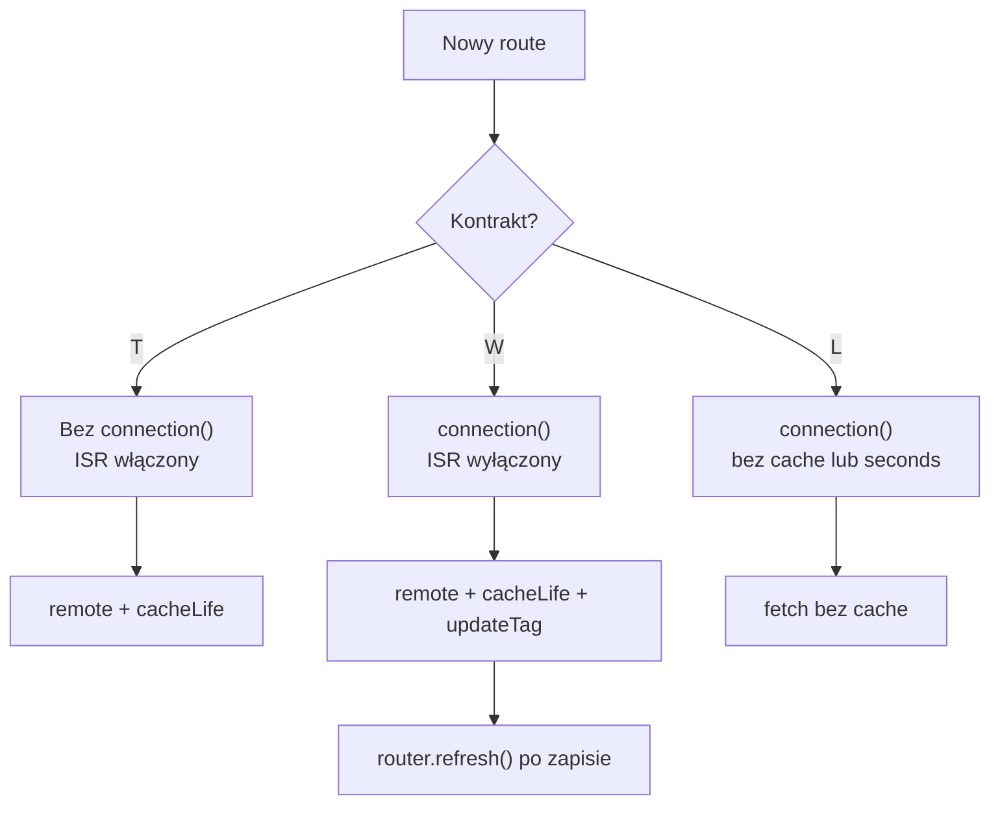

# Strategia cache — przewodnik wdrożeniowy

Jak cache'ować aplikację Next.js 16 uruchomioną na **wielu instancjach** (wiele podów,
jeden artefakt buildu, load balancer bez sticky sessions, wspólny Redis).

Dokument jest samowystarczalny: opisuje problem, decyzje, wzorce kodu i kryteria
akceptacji. Nie zakłada czytania innych plików w repozytorium.

---

## Spis treści

1. [Problem](#1-problem)
2. [Architektura — dwa handlery](#2-architektura--dwa-handlery)
3. [Kontrakt świeżości](#3-kontrakt-świeżości)
4. [Konfiguracja](#4-konfiguracja)
5. [Warstwy cache w kodzie](#5-warstwy-cache-w-kodzie)
6. [Tagi](#6-tagi)
7. [Wzorce kodu](#7-wzorce-kodu)
8. [cacheLife — trzy zegary](#8-cachelife--trzy-zegary)
9. [Invalidacja](#9-invalidation)
10. [Przepływy żądań](#10-przepływy-żądań)
11. [Macierz decyzyjna](#11-macierz-decyzyjna)
12. [Wdrożenie krok po kroku](#12-wdrożenie-krok-po-kroku)
13. [Kryteria akceptacji](#13-kryteria-akceptacji)
14. [Antywzorce](#14-antywzorce)
15. [Checklist nowej funkcji](#15-checklist-nowej-funkcji)

---

## 1. Problem

Przy N instancjach Next.js za load balancerem wbudowany cache in-process oznacza:

- ten sam fetch/render wykonuje się N razy,
- invalidacja na jednym podzie nie widzi pozostałych,
- restart poda kasuje cały cache.

Potrzebujesz **współdzielonego cache w Redis** i jasnych reguł: kiedy treść może być
stara, kiedy musi być świeża po zapisie użytkownika, kiedy w ogóle nie cache'ujesz.

W tym projekcie rozwiązują to dwa handlery z paczki `@tme/cache-handler`:

| Warstwa | Config | Co trzyma |
|---------|--------|-----------|
| **Remote** | `cacheHandlers.remote` | Wyniki `"use cache: remote"` — funkcje i komponenty |
| **ISR** | `cacheHandler` | Snapshot całego route'a (HTML + RSC payload) |

Remote ma wewnętrznie L1 (LRU w procesie, ~15 s) i L2 (Redis). Po invalidacji tagu
wszystkie instancje dostają Pub/Sub i czyszczą L1. Przy cache miss jedna instancja
renderuje (single-flight), reszta czeka na wynik w Redis.

---

## 2. Architektura — dwa handlery



**Remote** — fundament. Bez niego każdy pod osobno pobiera dane.

**ISR** — optymalizacja spójności **powłoki strony** między podami. Bez wspólnego ISR
dwa użytkownicy trafiający na różne pody mogą dostać różny timestamp „page rendered at",
mimo że dane w Redis są identyczne.

**Ważne:** `updateTag` czyści remote cache, ale **nie kasuje** snapshotu ISR. Dlatego
strony z mutacją użytkownika muszą wyłączać ISR przez `connection()` — patrz §7.

---

## 3. Kontrakt świeżości

Zanim napiszesz `"use cache: remote"`, przypisz zasobowi **jeden** kontrakt.
To pierwsza i najważniejsza decyzja — ważniejsza niż wybór handlera.



### T — Temporalny

Treść może być nieaktualna do końca profilu `cacheLife`. Nikt nie oczekuje
natychmiastowej zmiany po akcji w aplikacji.

**Przykłady:** katalog produktów, lista postów, treści z zewnętrznego API.

**Mechanizm:** `cacheLife` + `"use cache: remote"`. Bez `updateTag`.

### W — Write-through

Po udanym zapisie użytkownik **od razu** widzi nowe dane. Dotyczy też F5 na innym
podzie za load balancerem.

**Przykłady:** formularz konta, edycja własnego profilu, ustawienia.

**Mechanizm:** `cacheLife` + `updateTag` na wszystkich tagach zależnych od mutacji +
`router.refresh()` na kliencie + `connection()` na stronie (wyłącza ISR).

### L — Live

Dane z bieżącego żądania, bez polegania na współdzielonym wpisie.

**Przykłady:** dashboard operacyjny, dane zależne od sesji/cookies.

**Mechanizm:** `await connection()`, fetch bez cache lub `cacheLife("seconds")`.

---

## 4. Konfiguracja

Jedna stała konfiguracja na staging i produkcję. **Nie przełączam** handlerów między
„etapami wdrożenia”. Różnice między stronami wynikają z kodu route'a.

```ts
// next.config.ts
import type { NextConfig } from "next";

const nextConfig: NextConfig = {
  output: "standalone",
  cacheComponents: true,

  cacheHandlers: {
    remote: require.resolve("@tme/cache-handler"),
  },

  cacheHandler: require.resolve("@tme/cache-handler/isr"),
  cacheMaxMemorySize: 0,
};

export default nextConfig;
```

| Ustawienie | Znaczenie |
|------------|-----------|
| `cacheComponents: true` | Włącza Cache Components (Next.js 16) |
| `cacheHandlers.remote` | Remote cache dla `"use cache: remote"` |
| `cacheHandler` | Współdzielony ISR w Redis |
| `cacheMaxMemorySize: 0` | Brak lokalnego ISR w pamięci poda — każdy hit idzie do Redis |

**Redis** — zmienne środowiskowe: `REDIS_HOST`, `REDIS_PORT`, opcjonalnie
`REDIS_PASSWORD`, `REDIS_DB`.

**Zasady środowiska:**

- Wiele instancji, jeden obraz / jedna wersja Node (serializacja `v8` jest związana
  z wersją runtime).
- Locale i inne parametry dynamiczne jako **argumenty funkcji**, nie `cookies()` /
  `headers()` wewnątrz `use cache`.
- Mutacje wyłącznie przez Server Actions.

---

## 5. Warstwy cache w kodzie

Nie każdy zasób potrzebuje trzech warstw. Idź od najniższej wystarczającej:



| Warstwa | Kiedy dodajesz | Invalidacja |
|---------|----------------|-------------|
| **DATA** | Fetch do API/DB jest drogi lub współdzielony | tag `data:*` |
| **UI** | Render JSX jest drogi, albo inny `cacheLife` niż DATA, albo ten sam DATA w wielu widokach | tag `ui:*` |
| **PAGE (ISR)** | Kontrakt T, strona katalogowa, potrzebujesz identycznej powłoki RSC na wszystkich podach | wygaśnięcie czasowe route + brak `connection()` |

### Kiedy wystarczy sam DATA

Komponent to cienka otoczka wołająca jedną funkcję DATA — nie twórz osobnego
`cached-*` komponentu. Jeden tag `data:*` wystarczy do invalidacji.

### Kiedy dodajesz UI

- Ciężki render (mapowanie, sortowanie, wiele źródeł danych).
- Ten sam DATA, różne komponenty z różnym `cacheLife`.
- Laboratorium / demonstracja rozdzielenia warstw.

**Reguła przy kontrakcie W:** invaliduj **DATA i UI**. Hit w UI zwraca zamrożone
dane wewnątrz wpisu — sam `updateTag` na UI nie odświeży JSON-a z DATA.

### Kiedy ISR działa

Strona katalogowa (kontrakt T) **bez** `await connection()` w treści. ISR zapisuje
snapshot do Redis — wszystkie pody serwują ten sam wpis.

Strona z mutacją (kontrakt W) **z** `connection()` — ISR wyłączony dla tego URL,
render per-request.

---

## 6. Tagi

Konwencja w `lib/cache-tags.ts`:

```
{warstwa}:{zasób}[:{scope...}]
```

| Segment | Wartości | Przykład |
|---------|----------|----------|
| warstwa | `data` \| `ui` | `data`, `ui` |
| zasób | nazwa zasobu | `posts`, `users`, `products` |
| scope | opcjonalnie: locale, id encji… | `pl`, `pl` |

Przykłady:

```
data:posts:pl:pl
ui:posts:pl:pl
data:config
```

Zasady:

1. **Jeden tag na jeden wpis cache** — prosta invalidacja 1:1.
2. Scope w **argumentach** funkcji/komponentu (budują cache key).
3. Wewnątrz `use cache: remote` nie wołaj `cookies()`, `headers()`, `searchParams`.
4. Tagi to nieprzezroczyste stringi — handler dopasowuje je dokładnie (exact match).

Helpery:

```ts
import { dataTag, uiTag } from "@/lib/cache-tags";

dataTag("posts", country, lang);  // "data:posts:pl:pl"
uiTag("posts", country, lang);    // "ui:posts:pl:pl"
```

---

## 7. Wzorce kodu

### 7.1 DATA — funkcja fetcha

```ts
// lib/data/posts.ts
import { cacheLife, cacheTag } from "next/cache";
import { dataTag } from "@/lib/cache-tags";

export async function getPosts(country: string, lang: string) {
  "use cache: remote";
  cacheLife("hours");
  cacheTag(dataTag("posts", country, lang));

  const res = await fetch("https://api.example.com/posts");
  if (!res.ok) throw new Error(`Fetch failed: ${res.status}`);
  return res.json();
}
```

### 7.2 UI — opcjonalna warstwa

```tsx
// components/cached-posts-list.tsx
import { cacheLife, cacheTag } from "next/cache";
import { uiTag } from "@/lib/cache-tags";
import { getPosts } from "@/lib/data/posts";

export async function CachedPostsList({ country, lang }: Props) {
  "use cache: remote";
  cacheLife("hours");
  cacheTag(uiTag("posts", country, lang));

  const data = await getPosts(country, lang);
  return (
    <ul>
      {data.posts.map((post) => (
        <li key={post.id}>{post.title}</li>
      ))}
    </ul>
  );
}
```

Przy trafieniu w cache UI funkcja `getPosts` **nie jest wywoływana** — dane są
zamrożone w wpisie UI.

### 7.3 Strona katalogowa — kontrakt T

```tsx
// app/[country]/[lang]/posts/page.tsx
import { Suspense } from "react";
import { CachedPostsList } from "@/components/cached-posts-list";

export default async function PostsPage({ params }: Props) {
  const { country, lang } = await params;

  // BEZ connection() — ISR cache'uje snapshot w Redis
  return (
    <section>
      <h2>Posty</h2>
      <Suspense fallback={<Skeleton />}>
        <CachedPostsList country={country} lang={lang} />
      </Suspense>
    </section>
  );
}
```

### 7.4 Strona z mutacją — kontrakt W

```tsx
// app/[country]/[lang]/account/page.tsx
import { Suspense } from "react";
import { connection } from "next/server";
import { getProfile } from "@/lib/data/profile";
import { AccountForm } from "@/components/account-form";

export default function AccountPage({ params }: Props) {
  return (
    <Suspense fallback={<p>Ładowanie…</p>}>
      <AccountContent params={params} />
    </Suspense>
  );
}

async function AccountContent({ params }: { params: Promise<{ country: string; lang: string }> }) {
  await connection(); // wyłącza ISR — render per-request

  const { country, lang } = await params;
  const profile = await getProfile(country, lang);
  return <AccountForm initial={profile} country={country} lang={lang} />;
}
```

```ts
// app/actions/account.ts
"use server";

import { updateTag } from "next/cache";
import { dataTag, uiTag } from "@/lib/cache-tags";

export async function saveProfile(country: string, lang: string, formData: FormData) {
  await persistProfile(formData);

  updateTag(dataTag("profile", country, lang));
  updateTag(uiTag("profile", country, lang)); // tylko jeśli masz warstwę UI
}
```

```tsx
// components/account-form.tsx (klient)
"use client";

import { useRouter } from "next/navigation";
import { saveProfile } from "@/app/actions/account";

export function AccountForm({ initial, country, lang }: Props) {
  const router = useRouter();

  async function handleSubmit(formData: FormData) {
    await saveProfile(country, lang, formData);
    router.refresh(); // ponowny render RSC ze świeżym remote cache
  }

  return <form action={handleSubmit}>{/* … */}</form>;
}
```

### 7.5 Live — kontrakt L

```tsx
async function LivePanel() {
  await connection();
  const data = await fetchLiveMetrics(); // bez "use cache: remote"
  return <Metrics data={data} />;
}
```

---

## 8. cacheLife — trzy zegary

Profil `cacheLife` ustawia trzy czasy (w sekundach):

| Czas | Kto egzekwuje | Znaczenie |
|------|---------------|-----------|
| `stale` | Klient (router przeglądarki) | Jak długo klient nie pyta serwera o nowszą wersję |
| `revalidate` | Next.js (serwer) | Po tym czasie wpis jest „przeterminowany, ale użyteczny" — serwowany od razu, odświeżenie w tle (SWR) |
| `expire` | Handler Redis | Twardy koniec życia — handler odrzuca wpis, pełny render |



Wbudowane profile (skrót):

| Profil | `stale` | `revalidate` | `expire` | Kiedy używać |
|--------|---------|--------------|----------|--------------|
| `seconds` | 30 s | 1 s | 1 min | Quasi real-time |
| `minutes` | 5 min | 1 min | 1 h | Demo, częste zmiany |
| `hours` | 5 min | 1 h | 1 dzień | Katalogi (posts, users) |
| `days` | 5 min | 1 dzień | 1 tydzień | Artykuły, blog |
| `max` | 5 min | 30 dni | 1 rok | Prawie statyczne — **unikaj** na kontrakcie W |

Własny profil:

```ts
cacheLife({
  stale: 300,
  revalidate: 3600,
  expire: 86400, // musi być > revalidate
});
```

Handler zapisuje wpis w Redis z TTL = `max(expire, 60)` sekund.

---

## 9. Invalidacja

### Co używasz w produkcji

| Sytuacja | API | Efekt |
|----------|-----|-------|
| Katalog, brak zapisu (kontrakt T) | — (tylko `cacheLife`) | Wpis wygasa czasowo; SWR między `revalidate` a `expire` |
| Użytkownik zapisał (kontrakt W) | `updateTag(tag)` w Server Action | Wpis znika z Redis + L1 na **wszystkich** podach — natychmiast |
| Odświeżenie widoku po zapisie | `router.refresh()` | RSC renderuje ponownie z już świeżym remote cache |

### Czego nie używasz w produkcji

- `revalidateTag` / `revalidatePath` z Server Actions — SWR, nie natychmiastowa świeżość
  w tym samym żądaniu. Zostaw to do laboratoriów (np. `/cache-lab`, `/news`).
- Webhooki CMS do invalidacji — poza modelem tej aplikacji.
- `cacheLife("max")` na danych, które użytkownik może zmienić (kontrakt W).

### Różnica updateTag vs revalidateTag

| API | Kiedy świeże dane | Gdzie |
|-----|-------------------|-------|
| `updateTag(tag)` | **Natychmiast** — to samo żądanie po invalidacji | Tylko Server Actions |
| `revalidateTag(tag, profile)` | Następne żądanie (SWR) | Server Actions, route handlers |

### Sekwencja read-your-own-writes



### Dlaczego connection() na mutacji

Przy włączonym ISR:

1. `updateTag` → remote (DATA/UI) świeży.
2. Snapshot ISR → **stary** do wygaśnięcia czasowego.
3. F5 na innym podzie → stara powłoka RSC mimo świeżych danych.

`connection()` wyłącza ISR dla route'a — każde żądanie renderuje świeżą powłokę,
a dane biorą się ze świeżego remote cache.

---

## 10. Przepływy żądań

### Odczyt katalogu (kontrakt T)



### Mutacja (kontrakt W)



---

## 11. Macierz decyzyjna

| Kontrakt | Przykład | `connection()` | ISR | Remote DATA | Remote UI | Po zapisie |
|----------|----------|----------------|-----|-------------|-----------|------------|
| **T** | `/posts`, `/products` | Nie | Tak | `cacheLife` | opcjonalnie | — |
| **W** | `/account`, formularze | **Tak** | Nie | `cacheLife` + `updateTag` | jeśli jest + `updateTag` | `router.refresh()` |
| **L** | dashboard live | **Tak** | Nie | brak lub `seconds` | — | — |



---

## 12. Wdrożenie krok po kroku

1. Postaw Redis i ≥ 2 instancje Next.js za load balancerem na stagingu.
2. Włącz konfigurację z §4 (remote + ISR) — od razu, nie „na później".
3. Dla każdego route przypisz kontrakt T, W lub L (tabela w wiki / komentarz w PR).
4. Dodaj warstwę DATA dla zasobów z kontraktem T lub W.
5. Dodaj warstwę UI tylko tam, gdzie §5 to uzasadnia.
6. Na route'ach W i L dodaj `connection()`.
7. W Server Actions z mutacją: `updateTag` na wszystkich dotkniętych tagach.
8. Na kliencie po mutacji: `router.refresh()`.
9. Przejdź checklistę z §13 na stagingu.
10. Wdróż na produkcję z tą samą konfiguracją i wzorcami.

---

## 13. Kryteria akceptacji

### Infrastruktura

- [ ] Redis dostępny; przy awarii aplikacja działa (degradacja do L1, bez 5xx z powodu cache).
- [ ] ≥ 2 instancje za load balancerem na stagingu.
- [ ] `cacheHandlers.remote` + `cacheHandler` + `cacheMaxMemorySize: 0`.
- [ ] Wszystkie instancje: ten sam obraz Docker, ta sama wersja Node.

### Kontrakty i kod

- [ ] Każdy route ma przypisany kontrakt T, W lub L.
- [ ] Kontrakt T: brak `connection()` na stronach katalogowych.
- [ ] Kontrakt W: `connection()` + `updateTag` w każdej Server Action z mutacją.
- [ ] Brak `revalidateTag` / `revalidatePath` w kodzie produkcyjnym.
- [ ] Brak `cacheLife("max")` na danych z kontraktem W.
- [ ] Każdy wpis remote ma `cacheTag` z `lib/cache-tags.ts`.

### Weryfikacja funkcjonalna

**Remote cache:**

- [ ] Drugie żądanie na ten sam klucz → hit w Redis (nie tylko L1).
- [ ] `updateTag` czyści wpis na wszystkich instancjach (test z dwóch podów).

**Read-your-own-writes (kontrakt W):**

- [ ] Zapis → natychmiast świeże dane w odpowiedzi Server Action.
- [ ] Zapis na podzie A → `router.refresh()` → świeże dane.
- [ ] Zapis na podzie A → F5 trafia na pod B → świeże dane.

**ISR (kontrakt T):**

- [ ] Ten sam URL przez LB, różne pody → identyczna powłoka strony.
- [ ] Wpis `isr:entry:*` w Redis po pierwszym hitcie na route katalogowy.
- [ ] Route z `connection()` → brak wpisu ISR dla tego URL.

**Obciążenie:**

- [ ] Zimny klucz + wiele równoległych żądań → jeden render (single-flight).
- [ ] Smoke load bez wzrostu błędów 5xx.

---

## 14. Antywzorce

| Antywzorzec | Skutek | Zamiast tego |
|-------------|--------|--------------|
| Multi-instance bez remote handler | N× koszt API, brak wspólnej invalidacji | Remote od początku |
| `updateTag` tylko na UI, nie na DATA | Stary JSON w świeżnym UI | Oba tagi przy kontrakcie W |
| `router.refresh()` bez `updateTag` | Stary remote cache | Najpierw `updateTag`, potem refresh |
| `connection()` na wszystkich stronach | ISR martwy — Redis bez korzyści | Tylko W i L |
| Brak `connection()` na stronie z mutacją | Stara powłoka ISR po zapisie | Kontrakt W wymaga `connection()` |
| Zawsze DATA + UI „bo tak w demo" | Podwójna pamięć, podwójna invalidacja | Minimalna granulacja z §5 |
| `cacheLife("max")` + kontrakt W | Użytkownik nie widzi zmian godzinami | Krótszy profil + `updateTag` |
| Przełączanie configu ISR między środowiskami | Niespodzianki na prod | Ten sam config; różnice w kodzie route |

---

## 15. Checklist nowej funkcji

Przed merge PR:

1. [ ] Przypisany kontrakt **T / W / L**.
2. [ ] DATA: `"use cache: remote"` + `cacheLife` + `cacheTag(dataTag(...))` — jeśli nie L.
3. [ ] UI: tylko jeśli uzasadnione (§5) + `cacheTag(uiTag(...))`.
4. [ ] Route W/L: `await connection()` w treści strony.
5. [ ] Route T katalogowy: **bez** `connection()`.
6. [ ] Server Action z mutacją: `updateTag` na wszystkich dotkniętych tagach.
7. [ ] Komponent kliencki po mutacji: `router.refresh()`.
8. [ ] Brak `cookies()` / `headers()` wewnątrz `use cache: remote`.

---

## Podsumowanie

**Reguła jednym zdaniem:** ustal kontrakt świeżości (T / W / L), cache'uj na
najniższej wystarczającej warstwie (DATA → opcjonalnie UI → ISR na katalogach),
trzymaj pełny config handlerów od stagingu, a ISR włączaj lub wyłączaj wyłącznie
przez `connection()` na danym route — nie przez przełączanie infrastruktury.
