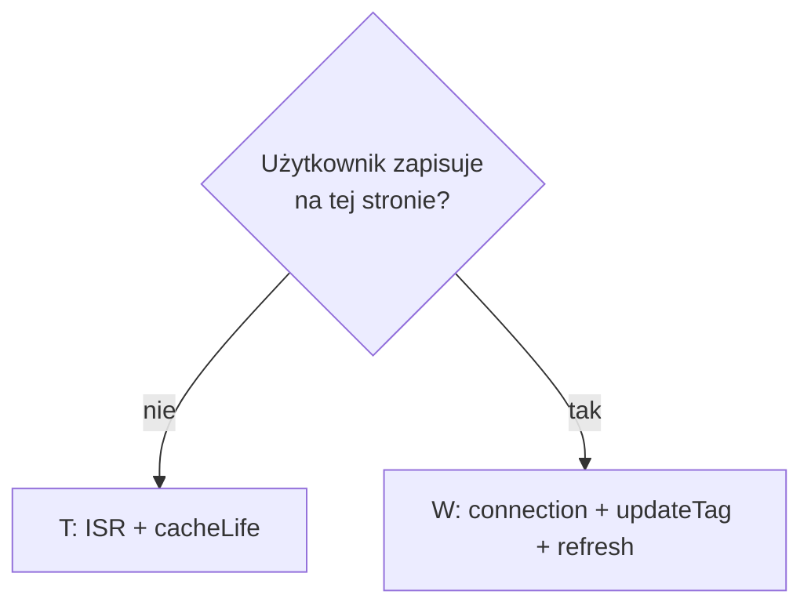

# Strategia cache — dla zespołu

Aplikacja: wiele podów Next.js, jeden build, load balancer, wspólny Redis.

**Dwa handlery** (config stały na staging i prod):

| Handler | Co cache'uje |
|---------|--------------|
| `cacheHandlers.remote` | `"use cache: remote"` — fetchy i komponenty (Redis + LRU w podzie) |
| `cacheHandler` (ISR) | Snapshot całego route'a (HTML + RSC) w Redis |

`updateTag` czyści **remote**, nie snapshot ISR. Stąd reguła: strony z mutacją → `connection()`.

---

## Krok 1 — przypisz kontrakt świeżości

| Kontrakt | Kiedy | Co robisz |
|----------|-------|-----------|
| **T** — czas decyduje | Katalog, lista, treść z API — lekka nieaktualność OK | `cacheLife`, bez `updateTag` |
| **W** — zapis użytkownika | Formularz, edycja konta — po zapisie od razu widać zmianę | `cacheLife` + `updateTag` + `router.refresh()` + `connection()` na stronie |
| **L** — live | Musi być świeże przy każdym żądaniu | `connection()`, fetch bez cache (lub `cacheLife("seconds")`) |

---

## Krok 2 — wybierz warstwę cache

Idź od najniższej wystarczającej — nie duplikuj bez powodu.

| Warstwa | Gdzie | Kiedy |
|---------|-------|-------|
| **DATA** | `lib/data/*.ts` | Zawsze, gdy fetch jest drogi |
| **UI** | `components/cached-*.tsx` | Tylko gdy render JSX jest drogi albo inny `cacheLife` niż DATA |
| **ISR** | automatycznie na route | Kontrakt T, strona katalogowa, **bez** `connection()` |

Przy kontrakcie **W** invaliduj **DATA i UI** (hit w UI ma zamrożone dane wewnątrz).

---

## Reguły kodu

### DATA

```ts
"use cache: remote";
cacheLife("hours"); // lub days / minutes
cacheTag(dataTag("posts", country, lang));
```

### UI (opcjonalnie)

```tsx
"use cache: remote";
cacheLife("hours");
cacheTag(uiTag("posts", country, lang));
const data = await getPosts(country, lang);
```

### Strona katalogowa (T)

- **Bez** `connection()` → ISR włączony, ten sam snapshot na wszystkich podach.
- Świeżość danych z `cacheLife`, nie z `updateTag`.

### Strona z mutacją (W)

```tsx
await connection(); // wyłącza ISR na tym route
```

```ts
// Server Action
updateTag(dataTag(...));
updateTag(uiTag(...)); // jeśli jest warstwa UI
```

```tsx
// klient po akcji
router.refresh();
```

---

## Tagi (`lib/cache-tags.ts`)

Format: `{warstwa}:{zasób}[:{scope...}]` — np. `data:posts:pl:pl`, `ui:posts:pl:pl`.

- Jeden tag na jeden wpis cache.
- Scope w argumentach funkcji — **nie** `cookies()` / `headers()` w `use cache`.

---

## cacheLife — skrót

| Profil | Kiedy |
|--------|-------|
| `hours` | Katalogi (posts, users, products) |
| `days` | Artykuły, treści redakcyjne |
| `minutes` | Demo, cache-lab |
| `max` | **Nie** na danych, które użytkownik może zmienić (kontrakt W) |

`cacheLife` = wygaśnięcie czasowe. `updateTag` = natychmiastowe skasowanie wpisu (tylko kontrakt W).

---

## Macierz — szybki wybór

| | `connection()` | ISR | Remote | Po zapisie |
|--|----------------|-----|--------|------------|
| **T** katalog | Nie | Tak | `cacheLife` | — |
| **W** mutacja | Tak | Nie | `cacheLife` + `updateTag` | `router.refresh()` |
| **L** live | Tak | Nie | brak / `seconds` | — |



---

## Czego nie robimy w prod

- `revalidateTag` / `revalidatePath` z Server Actions (SWR, nie read-your-own-writes)
- `updateTag` bez mutacji
- `updateTag` tylko na UI, bez DATA
- `connection()` na wszystkich stronach (zabija ISR bez powodu)
- Brak `connection()` na stronie z mutacją (stara powłoka ISR po zapisie)
- `cacheLife("max")` na danych edytowalnych przez użytkownika

---

## Checklist — nowa funkcja

1. [ ] Kontrakt T / W / L przypisany.
2. [ ] DATA: `"use cache: remote"` + `cacheLife` + `cacheTag`.
3. [ ] UI tylko jeśli potrzebne + ten sam scope tagów.
4. [ ] W: `connection()` na stronie, `updateTag` (DATA + UI) w Server Action, `router.refresh()` na kliencie.
5. [ ] T: brak `connection()` na katalogu.

---

## Test przed prod (skrót)

- [ ] ≥ 2 pody + Redis na stagingu.
- [ ] Zapis na podzie A → F5 na pod B → świeże dane (kontrakt W).
- [ ] Ten sam URL katalogu na różnych podach → identyczna powłoka (kontrakt T + ISR).
- [ ] `updateTag` widoczny na wszystkich podach (remote cache).
