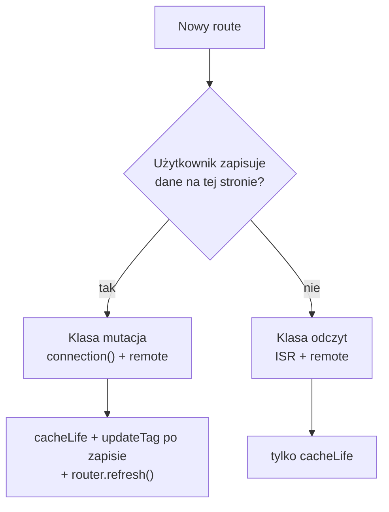

# Strategia cache — remote only → remote + ISR

Dokument opisuje **jak budować i utrzymywać aplikację** przy dwóch etapach wdrożenia cache w środowisku wieloinstancyjnym (wiele podów, jeden artefakt `.next`, load balancer, wspólny Redis).

Nie opisuje schematu kluczy w Redis ani formatu tagów — to jest w [CACHING.md](./CACHING.md) i `lib/cache-tags.ts`.

**Powiązane:** [ADR-0001](./adr/0001-zdalny-cache-redis.md) (dlaczego remote handler), dokumentacja ISR handlera w `packages/cache-handler/docsV2/07-isr-cache-handler.md`.

---

## Model invalidacji w tej aplikacji

Aplikacja **nie** invaliduje cache z zewnątrz — brak CMS, webhooków, cronów ani `revalidateTag` / `revalidatePath` w kodzie produkcyjnym.

Świeżość danych opiera się wyłącznie na:

| Mechanizm | Kiedy | Gdzie |
|-----------|-------|-------|
| **`cacheLife`** | Treść może być nieaktualna do wygaśnięcia profilu (SWR) | funkcje DATA i komponenty UI (`"use cache: remote"`) |
| **`updateTag`** | Użytkownik właśnie coś zmienił — read-your-own-writes | Server Action po mutacji |
| **`router.refresh()`** | Odświeżenie widoku u bieżącego klienta | komponent kliencki po Server Action |

Innych API invalidacji w aplikacji nie używamy.

---

## Założenia produkcyjne

- Wiele instancji Next.js za load balancerem (brak sticky sessions).
- Jeden build / jeden obraz Docker.
- Redis jako współdzielona warstwa cache między instancjami.
- `cacheComponents: true` w `next.config.ts`.
- Dane per locale (`country`, `lang`) przekazywane jako **argumenty** funkcji i komponentów cache’owanych — nie przez `cookies()` / `headers()` wewnątrz `use cache`.
- Mutacje wyłącznie przez Server Actions w aplikacji (użytkownik zalogowany).

---

## Dwie warstwy (kontekst)

| Warstwa | Konfiguracja | Co cache’uje | Jak odświeżasz |
|---------|--------------|--------------|----------------|
| **Remote** | `cacheHandlers.remote` | Wyniki `"use cache: remote"` — DATA, UI | `cacheLife` + opcjonalnie `updateTag` |
| **ISR (full route)** | `cacheHandler` + `cacheMaxMemorySize: 0` | Snapshot strony (HTML + RSC) | Wygaśnięcie czasowe route’a; brak ręcznej invalidacji |

Strategia aplikacji polega na tym, **które route’y korzystają z ISR**, a które go omijają — oraz kiedy wołasz `updateTag`.

---

## Faza 1 — tylko remote handler

### Konfiguracja

```ts
// next.config.ts — faza 1
cacheComponents: true,
cacheHandlers: {
  remote: require.resolve("@tme/cache-handler"),
},
// brak cacheHandler (ISR)
```

### Kiedy ta faza ma sens

- Środowisko jednoinstancyjne lub wczesny staging.
- Świadoma akceptacja: **każda instancja może krótko serwować inny snapshot powłoki strony** (domyślny route cache Next.js jest lokalny per pod).

Przy **wielu instancjach bez ISR** traktuj to jako fazę przejściową, nie docelową produkcję.

### Strategia w aplikacji

#### 1. Dwie klasy route’ów

| Klasa | Opis | `connection()` | Invalidacja |
|-------|------|----------------|-------------|
| **Odczyt** | Katalogi, listy — użytkownik tylko czyta | Nie | Tylko `cacheLife` |
| **Mutacja** | Formularze, zapis — użytkownik zmienia dane | **Tak** | `updateTag` + `router.refresh()` |

Strony z mutacją **muszą** używać `await connection()` w komponencie renderującym treść (wewnątrz `Suspense`):

```tsx
async function AccountContent({ params }: { params: Promise<{ country: string; lang: string }> }) {
  await connection();
  const { country, lang } = await params;
  return <AccountForm country={country} lang={lang} />;
}
```

**Efekt:** brak statycznej powłoki route’a — spójność między instancjami opiera się na remote cache w Redis.

Strony tylko do odczytu mogą zostać bez `connection()` — świeżość wynika z `cacheLife` na wpisach remote.

#### 2. Podział DATA / UI

- **DATA** — `"use cache: remote"` + `cacheLife` + tag aplikacyjny.
- **UI** — osobny komponent `"use cache: remote"`, woła DATA wewnątrz.

Przy `updateTag` po mutacji **zawsze invaliduj DATA i UI** w tym samym scope (zasób + locale).

#### 3. Profile `cacheLife`

| Profil | Kiedy |
|--------|-------|
| `hours` / `days` | Katalogi, dane rzadko zmieniane przez użytkownika |
| `minutes` | Dane częściej „starejące”, demo |
| Unikaj `max` | Wpis praktycznie nie wygasa — bez zewnętrznej invalidacji to pułapka |

#### 4. Read-your-own-writes — wzorzec Server Action

```ts
"use server";

import { updateTag } from "next/cache";

export async function saveAccount(country: string, lang: string, data: FormData) {
  // 1. zapis do API / bazy
  await persist(data);

  // 2. natychmiastowa invalidacja remote (oba warstwy)
  updateTag(/* tag DATA, scope = zasób + locale */);
  updateTag(/* tag UI, scope = zasób + locale */);

  // 3. opcjonalnie: ponowny odczyt w tej samej akcji
  // const fresh = await getAccount(country, lang);
}
```

```ts
// Klient — po await saveAccount(...)
router.refresh();
```

#### 5. Checklist — nowa funkcja (faza 1)

- [ ] DATA: `"use cache: remote"` + `cacheLife` + tag.
- [ ] UI: osobny komponent remote, woła DATA.
- [ ] Route tylko do odczytu: bez `connection()`, świeżość z `cacheLife`.
- [ ] Route z mutacją: `connection()` w treści strony.
- [ ] Server Action po zapisie: `updateTag` (DATA + UI) → `router.refresh()` na kliencie.

---

## Faza 2 — remote + ISR (produkcja wieloinstancyjna)

### Konfiguracja

```ts
// next.config.ts — faza 2 (docelowa przy wielu instancjach)
cacheComponents: true,
cacheHandlers: {
  remote: require.resolve("@tme/cache-handler"),
},
cacheHandler: require.resolve("@tme/cache-handler/isr"),
cacheMaxMemorySize: 0,
```

`cacheMaxMemorySize: 0` jest **wymagane** — bez tego każdy pod trzyma własną kopię ISR w pamięci i wracasz do rozjazdów między instancjami.

### Kiedy przejść na fazę 2

- Produkcja z **≥ 2 instancjami** za load balancerem.
- Strony tylko do odczytu mają korzystać ze współdzielonego snapshotu RSC w Redis.
- Strony z mutacją nadal omijają ISR przez `connection()`.

### Strategia — model hybrydowy (dwie klasy)

| Klasa | Przykłady | ISR (powłoka) | Remote (DATA/UI) | Świeżość |
|-------|-----------|---------------|------------------|----------|
| **Odczyt** | `/posts`, `/products`, `/users` | Tak | Tak | `cacheLife` |
| **Mutacja** | `/account`, formularze | Nie — `connection()` | Tak | `updateTag` po zapisie |

#### Klasa odczyt — ISR + remote, bez `updateTag`

- Strona **bez** `connection()`.
- DATA i UI w `"use cache: remote"` z `cacheLife`.
- Użytkownik nie zapisuje na tej stronie — **nie wołasz** `updateTag`.
- ISR shell odświeża się wyłącznie po wygaśnięciu czasowym route’a (domyślne `revalidate` strony). Akceptujesz krótkie okno, w którym powłoka RSC może być starsza niż remote — to zamierzone przy braku ręcznej invalidacji ISR.

#### Klasa mutacja — tylko remote, ISR omijany

```tsx
async function AccountContent({ params }) {
  await connection();
  // ...
}
```

- ISR handler nie zapisuje powłoki — brak problemu „stary RSC na innym podzie”.
- Po zapisie: `updateTag` (DATA + UI) + `router.refresh()`.
- **Nie używamy** `revalidatePath` — strona i tak nie jest w ISR.

### Dlaczego nie `revalidatePath`?

Przy założeniu „tylko `cacheLife` + `updateTag`” nie invalidujemy warstwy ISR ręcznie. Strony, na których użytkownik zapisuje, **muszą** mieć `connection()` — inaczej po `updateTag` remote będzie świeży, a powłoka RSC z ISR może zostać stara do wygaśnięcia czasowego.

Strony tylko do odczytu nie potrzebują `updateTag` — wystarczy `cacheLife` na remote i naturalne wygaśnięcie ISR.

### Checklist — nowa funkcja (faza 2)

- [ ] Użytkownik **zapisuje** na tej stronie? → klasa mutacja (`connection()`), inaczej → klasa odczyt (ISR).
- [ ] DATA + UI: `"use cache: remote"` + `cacheLife` + tagi.
- [ ] Klasa mutacja: Server Action z `updateTag` (DATA + UI) + `router.refresh()` na kliencie.
- [ ] Klasa odczyt: brak `updateTag` w kodzie tej strony.

### Checklist — migracja z fazy 1 na 2

1. Dodać `cacheHandler` i `cacheMaxMemorySize: 0` w `next.config.ts`.
2. Wdrożyć na staging z wieloma instancjami + Redis.
3. Route’y **tylko do odczytu**: zdjąć `connection()` — włącz ISR.
4. Route’y **z mutacją**: zostawić `connection()` — ISR omijany.
5. Zweryfikować: odczyt przez LB na różnych podach — spójny snapshot (ISR + Redis).
6. Zweryfikować: zapis na stronie mutacji → `updateTag` + `router.refresh()` → świeże dane; F5 przez LB na innym podzie — nadal świeże (brak ISR na tej stronie).

---

## Macierz decyzyjna



---

## Antywzorce

| Antywzorzec | Skutek |
|-------------|--------|
| `updateTag` na stronie odczytu bez mutacji | Zbędne; świeżość i tak daje `cacheLife` |
| Brak `connection()` na stronie z mutacją (faza 2 + ISR) | Po zapisie remote świeży, powłoka RSC stara do wygaśnięcia ISR |
| Tylko `updateTag` na UI, bez DATA | UI może zamrozić stare dane wewnątrz wpisu |
| `cacheLife("max")` na danych użytkownika | Brak wygaśnięcia bez `updateTag` — ryzyko wiecznie starych wpisów po bugu |
| `router.refresh()` bez `updateTag` po mutacji | Widok może odświeżyć się ze starym remote cache |
| `revalidateTag` / `revalidatePath` „na zapas” | Poza modelem aplikacji — nie dodawać |

---

## Podsumowanie

| | Faza 1 — remote only | Faza 2 — remote + ISR |
|--|----------------------|------------------------|
| **Produkcja multi-instance** | Faza przejściowa | **Docelowa** |
| **Strony odczytu** | `cacheLife` | ISR + `cacheLife` |
| **Strony z mutacją** | `connection()` + `updateTag` | `connection()` + `updateTag` |
| **Źródła świeżości** | `cacheLife` + `updateTag` | `cacheLife` + `updateTag` |
| **Gdzie definiujesz politykę** | `connection()` per route | To samo + ISR tylko na odczycie |

**Reguła produkcyjna:** przy wielu instancjach używaj **remote + ISR** — katalogi na ISR (świeżość z `cacheLife`), strony z zapisem na `connection()` z `updateTag` po mutacji. Bez zewnętrznej revalidacji; handlerów nie konfigurujesz per ścieżka — politykę wyrażasz w kodzie route’a.
