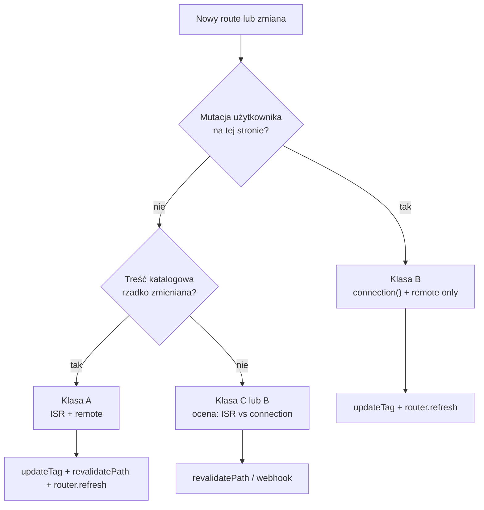

# Strategia cache — remote only → remote + ISR

Dokument opisuje **jak budować i utrzymywać aplikację** przy dwóch etapach wdrożenia cache w środowisku wieloinstancyjnym (wiele podów, jeden artefakt `.next`, load balancer, wspólny Redis).

Nie opisuje schematu kluczy w Redis ani formatu tagów — to jest w [CACHING.md](./CACHING.md) i `lib/cache-tags.ts`.

**Powiązane:** [ADR-0001](./adr/0001-zdalny-cache-redis.md) (dlaczego remote handler), dokumentacja ISR handlera w `packages/cache-handler/docsV2/07-isr-cache-handler.md`.

---

## Założenia produkcyjne

- Wiele instancji Next.js za load balancerem (brak sticky sessions).
- Jeden build / jeden obraz Docker.
- Redis jako współdzielona warstwa cache między instancjami.
- `cacheComponents: true` w `next.config.ts`.
- Dane per locale (`country`, `lang`) przekazywane jako **argumenty** funkcji i komponentów cache’owanych — nie przez `cookies()` / `headers()` wewnątrz `use cache`.

---

## Dwie warstwy (kontekst)

| Warstwa | Konfiguracja | Co cache’uje |
|---------|--------------|--------------|
| **Remote** | `cacheHandlers.remote` | Wyniki `"use cache: remote"` — funkcje DATA, komponenty UI |
| **ISR (full route)** | `cacheHandler` + `cacheMaxMemorySize: 0` | Złożony snapshot strony (HTML + RSC), fetch cache, obrazy |

Strategia aplikacji polega na tym, **które route’y korzystają z której warstwy** i **jak invalidujesz** po zmianie danych.

---

## Faza 1 — tylko remote handler

### Konfiguracja

```ts
// next.config.ts — faza 1
cacheComponents: true,
cacheHandlers: {
  remote: require.resolve("@tme/cache-handler"),
},
// brak cacheHandler (ISR)
```

### Kiedy ta faza ma sens

- Środowisko jednoinstancyjne lub niski ruch.
- Prototyp / wczesny staging, zanim dojdzie pełny stack wieloinstancyjny.
- Świadoma akceptacja: **każda instancja może krótko serwować inny snapshot powłoki strony** (domyślny route cache Next.js jest lokalny per pod).

Przy **wielu instancjach bez ISR** traktuj to jako fazę przejściową, nie docelową produkcję.

### Strategia w aplikacji

#### 1. Klasyfikacja route’ów — wszystkie „żywe” strony są dynamiczne

Każda strona, której treść może się zmienić (użytkownik, CMS, webhook), **musi** używać `await connection()` w komponencie renderującym treść (najlepiej wewnątrz `Suspense`).

```tsx
async function PageContent({ params }: { params: Promise<{ country: string; lang: string }> }) {
  await connection();
  const { country, lang } = await params;
  return <CachedResource country={country} lang={lang} />;
}
```

**Efekt:** Next.js nie buforuje statycznej powłoki route’a. Spójność między instancjami opiera się wyłącznie na remote cache w Redis.

Strony czysto informacyjne, które **nigdy** nie wymagają natychmiastowej świeżości po mutacji, mogą zostać bez `connection()` — ale przy wielu instancjach użytkownik po odświeżeniu nadal może trafić na pod ze starym snapshotem powłoki.

#### 2. Podział DATA / UI

- **DATA** — funkcja z `"use cache: remote"` + `cacheLife` dopasowany do częstotliwości zmian (np. `hours` dla katalogów, `minutes` dla labów).
- **UI** — osobny komponent z `"use cache: remote"`, który woła DATA wewnątrz.

Przy invalidacji po mutacji **zawsze invaliduj obie warstwy** (DATA i UI) w tym samym scope (zasób + locale).

#### 3. Invalidacja — jedna warstwa do ogarnięcia

| Zdarzenie | API | Gdzie |
|-----------|-----|-------|
| Mutacja użytkownika (formularz, Server Action) | `updateTag` na tagach DATA + UI | Server Action |
| Odświeżenie widoku po mutacji | `router.refresh()` | komponent kliencki |
| Webhook / cron / route handler | `revalidateTag(..., "max")` | route handler / job |

`revalidatePath` w tej fazie ma **ograniczoną wartość** — dotyczy lokalnego route cache per instancja, nie rozwiązuje problemu load balancera.

#### 4. Profile `cacheLife`

| Profil | Kiedy |
|--------|-------|
| `hours` / `days` | Katalogi, treści rzadko zmieniane; akceptujesz SWR do wygaśnięcia |
| `minutes` | Treści częściej odświeżane, demo, lab |
| Unikaj `max` | Dla treści edytowanych ręcznie — wpis praktycznie nie wygasa bez tagów |

#### 5. Checklist — nowa funkcja (faza 1)

- [ ] DATA: `"use cache: remote"` + `cacheLife` + tag aplikacyjny (helper z `lib/cache-tags.ts`).
- [ ] UI: osobny komponent cache’owany remote, woła DATA.
- [ ] Strona z mutacją: `connection()` w treści strony.
- [ ] Server Action po zapisie: `updateTag` (DATA + UI) → opcjonalnie ponowny odczyt DATA w akcji → `router.refresh()` na kliencie.
- [ ] Webhook: `revalidateTag` z profilem `"max"`, nie `updateTag`.

---

## Faza 2 — remote + ISR (produkcja wieloinstancyjna)

### Konfiguracja

```ts
// next.config.ts — faza 2 (docelowa przy wielu instancjach)
cacheComponents: true,
cacheHandlers: {
  remote: require.resolve("@tme/cache-handler"),
},
cacheHandler: require.resolve("@tme/cache-handler/isr"),
cacheMaxMemorySize: 0,
```

`cacheMaxMemorySize: 0` jest **wymagane** — bez tego każdy pod trzyma własną kopię ISR w pamięci i wracasz do rozjazdów między instancjami.

### Kiedy przejść na fazę 2

- Produkcja z **≥ 2 instancjami** za load balancerem.
- Potrzebujesz współdzielonego snapshotu strony (RSC/HTML) bez polegania wyłącznie na `connection()` wszędzie.
- Chcesz szybszych hitów na pełnej stronie przy zachowaniu spójności cluster-wide.

### Strategia w aplikacji — model hybrydowy

Nie cache’uj wszystkiego jednym mechanizmem. Dziel route’y na **trzy klasy**:

| Klasa | Przykłady | ISR (powłoka strony) | Remote (DATA/UI) | Po mutacji |
|-------|-----------|----------------------|------------------|------------|
| **A — katalog** | `/posts`, `/products`, `/users` | Tak (domyślnie) | Tak | `updateTag` + `revalidatePath` + `router.refresh()` |
| **B — interaktywna** | `/account`, formularze, checkout | Nie — `connection()` | Tak | `updateTag` + `router.refresh()` (bez `revalidatePath`) |
| **C — statyczna / marketing** | landing, FAQ | Tak | Opcjonalnie / rzadko | `revalidatePath` lub webhook |

#### Klasa A — katalog (ISR + remote)

- Strona **bez** `connection()` — Next może cache’ować powłokę w Redis (ISR).
- DATA i UI nadal w `"use cache: remote"`.
- Po zmianie treści (użytkownik lub CMS):

```ts
// Server Action
updateTag(/* tag DATA, scope = zasób + locale */);
updateTag(/* tag UI, scope = zasób + locale */);
revalidatePath(`/${country}/${lang}/posts`, "page");
```

```ts
// Klient
router.refresh();
```

`revalidatePath` musi wskazywać **konkretną, rozwiązaną ścieżkę** (z `country` i `lang`), nie szablon route’a — invalidujesz tylko ten locale i tę podstronę.

#### Klasa B — interaktywna (tylko remote, ISR omijany)

```tsx
async function AccountContent({ params }) {
  await connection();
  // ...
}
```

- ISR handler **nie dostaje** `set` dla tej strony — brak problemu „stary RSC na innym podzie”.
- Po mutacji wystarczy `updateTag` (DATA + UI) + `router.refresh()`.
- **Nie wołaj** `revalidatePath` — nie ma czego invalidować w warstwie ISR.

#### Klasa C — statyczna

- ISR włączony, remote opcjonalny.
- Invalidacja z CMS: `revalidatePath` na konkretne ścieżki; ewentualnie `revalidateTag` jeśli zmiana dotyczy tylko fragmentu remote.

### Invalidacja — dwie warstwy, jedna reguła

| Warstwa | Mutacja użytkownika | Webhook / cron |
|---------|---------------------|----------------|
| Remote (DATA/UI) | `updateTag` | `revalidateTag(..., "max")` |
| ISR (powłoka strony) | `revalidatePath` (tylko klasa A/C) | `revalidatePath` lub `revalidateTag` na tag ścieżki |

**Zasada:** jeśli strona ma ISR (klasa A/C), po zmianie danych invaliduj **remote i ISR**. Jeśli strona ma `connection()` (klasa B), invaliduj **tylko remote**.

### `revalidatePath` — zakres

| Argument | Znaczenie |
|----------|-----------|
| Ścieżka z locale, np. `` `/${country}/${lang}/posts` `` | Tylko ta podstrona w tym locale |
| `"page"` (drugi argument) | Tylko ten segment strony, nie całe poddrzewo layoutu |
| `"layout"` | Szerszy zakres — używaj świadomie, rzadko |

Nie invaliduj całego site’u jednym wywołaniem, jeśli zmiana dotyczy jednego zasobu i locale.

### API — szybka ściągawka (faza 2)

| API | Semantyka | Warstwa | Typowy kontekst |
|-----|-----------|---------|-----------------|
| `updateTag` | Natychmiast, ten sam request | Remote | Server Action po mutacji |
| `revalidateTag(..., "max")` | SWR, następne żądanie | Remote (+ ISR przy tagu ścieżki) | Webhook, cron |
| `revalidatePath` | Następne żądanie, cluster-wide w ISR | ISR | Po zmianie katalogu (klasa A) |
| `router.refresh()` | Odświeżenie RSC u bieżącego klienta | UI | Po każdej Server Action zmieniającej widok |

### Checklist — nowa funkcja (faza 2)

- [ ] Przypisz route do klasy A, B lub C (patrz tabela wyżej).
- [ ] Klasa A/C: brak `connection()` na stronie katalogowej; klasa B: `connection()` obowiązkowe.
- [ ] DATA + UI w remote z tagami i `cacheLife`.
- [ ] Server Action: invalidacja zgodna z klasą (tabela invalidacji).
- [ ] Klient: `router.refresh()` po mutacji wpływającej na widok.
- [ ] Webhook: `revalidateTag` + ewentualnie `revalidatePath` dla klasy A.

### Checklist — migracja z fazy 1 na 2

1. Dodać `cacheHandler` i `cacheMaxMemorySize: 0` w `next.config.ts`.
2. Wdrożyć na staging z wieloma instancjami + Redis.
3. Przejrzeć route’y: które mogą **zdjąć** `connection()` (klasa A) — zysk na ISR.
4. Route’y z mutacją użytkownika **zostawiają** `connection()` (klasa B).
5. Uzupełnić Server Actions o `revalidatePath` tam, gdzie jest klasa A.
6. Zweryfikować: mutacja na instancji 1 → odświeżenie przez LB → świeże dane na instancji N (nagłówek `X-Upstream` w nginx).

---

## Macierz decyzyjna



---

## Antywzorce (obie fazy)

| Antywzorzec | Skutek |
|-------------|--------|
| Tylko `updateTag` na stronie z ISR (klasa A) | Remote świeży, powłoka RSC stara do wygaśnięcia route |
| Tylko `revalidatePath` bez invalidacji remote | ISR świeży, komponenty remote mogą serwować stary snapshot UI |
| `revalidatePath` na szablon route’a zamiast ścieżki z locale | Zbyt szeroka lub nietrafiona invalidacja |
| `connection()` wszędzie przy włączonym ISR | ISR nie daje korzyści — płacisz za Redis bez sensu |
| Brak `connection()` na stronie z mutacją (wieloinstancyjność) | Ryzyko starego RSC na innym podzie (faza 1) lub zbędny ISR (faza 2) |
| `updateTag` w webhooku | API tylko dla Server Actions — użyj `revalidateTag` |
| `revalidateTag` w Server Action po mutacji użytkownika | SWR zamiast natychmiastowej świeżości — użyj `updateTag` |

---

## Podsumowanie

| | Faza 1 — remote only | Faza 2 — remote + ISR |
|--|----------------------|------------------------|
| **Produkcja multi-instance** | Faza przejściowa | **Docelowa** |
| **Spójność między podami** | Wymaga `connection()` na „żywych” stronach | ISR w Redis + hybryda route’ów |
| **Invalidacja po mutacji** | `updateTag` + `router.refresh()` | + `revalidatePath` na katalogach (klasa A) |
| **Gdzie definiujesz politykę** | `connection()` per route | Klasa route (A/B/C) + `connection()` lub ISR |

**Reguła produkcyjna:** przy wielu instancjach używaj **remote + ISR** z modelem hybrydowym — katalogi na ISR, strony po mutacji na `connection()` z samym remote. Handlerów nie konfigurujesz per ścieżka; politykę wyrażasz w kodzie route’a i w Server Actions.
