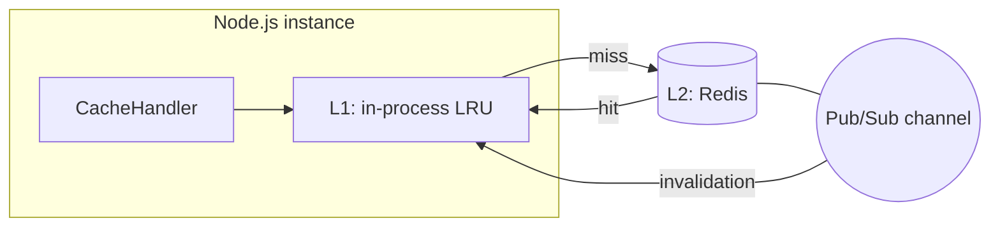
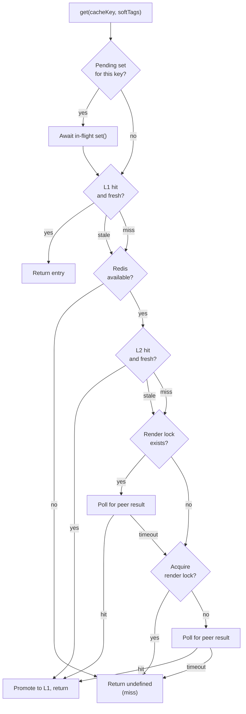

# Architecture

This document describes the internal design of `@tme/cache-handler`: how cache reads and writes flow through L1 (in-process LRU) and L2 (Redis), how multiple instances coordinate, and how the handler behaves when Redis is unavailable.

## Overview

| Layer | Location | Role | Survives process restart |
|-------|----------|------|--------------------------|
| L1 | Process memory | Avoid Redis round-trips for hot keys | No |
| L2 | Redis server | Share entries across instances | Yes |
| Pub/Sub | Redis channel | Clear L1 on peer instances immediately | N/A (stateless) |
| Tag timestamps | Redis string keys | Reject stale entries when Pub/Sub is missed | Yes (TTL-bound) |

## Module layout

| Module | Responsibility |
|--------|----------------|
| `src/handler/create-handler.ts` | Implements `CacheHandler`: orchestrates get/set and delegates tag methods |
| `src/handler/l1-cache.ts` | LRU set/delete and tag-based L1 invalidation |
| `src/handler/redis-client.ts` | Lazy Redis connect, 30 s cooldown after outage |
| `src/handler/single-flight.ts` | Render lock acquisition, polling, safe release |
| `src/handler/tag-operations.ts` | `refreshTags`, `updateTags`, `getExpiration` |
| `src/handler/pubsub.ts` | Subscribe to invalidation channel, clear L1 |
| `src/handler/stale.ts` | Freshness checks: revalidate window + tag timestamps |
| `src/handler/entry.ts` | v8 serialize/deserialize, stream ↔ buffer conversion |
| `src/handler/redis-keys.ts` | Key encoding and prefix helpers |
| `src/handler/config.ts` | Constants and env-driven defaults |
| `src/handler/state.ts` | Process-global LRU, Redis clients, tag map |
| `src/cache-debug.ts` | Optional write-only telemetry |

## `get()` flow

Every `get()` call ensures the Pub/Sub subscriber is set up, then resolves the entry through the layers below.

### Freshness

An entry is **fresh** when all of the following hold (`src/handler/stale.ts`):

1. **Not expired** — `Date.now() <= timestamp + revalidate * 1000`
2. **Hard tags valid** — no entry tag has an invalidation timestamp newer than `entry.timestamp`
3. **Soft tags valid** — same check for tags passed as `softTags` to `get()`

Stale entries are not returned; the handler continues to L2 or returns a miss.

## `set()` flow

1. Register a pending promise so concurrent `get()` calls for the same key wait for this write.
2. Await the `pendingEntry` promise from the framework (rendered payload).
3. Buffer the `ReadableStream` value and store in L1.
4. If Redis is available, `SET` the serialized entry with TTL `max(expire, 60)` seconds.
5. For each tag on the entry, add the entry key to a Redis set index (`index:{tag}`) with matching TTL (using `EXPIRE NX` and `EXPIRE GT` so shorter entries do not shrink index lifetime).
6. Release the single-flight render lock (compare-and-delete via Lua script).
7. Resolve the pending promise.

If Redis is unavailable, the entry is stored in L1 only.

## Single-flight (cache miss coordination)

When no fresh entry exists and Redis is reachable:

1. The first instance to `SET NX` on `lock:{encodedKey}` with its `instanceId` wins and returns `undefined` (miss) so the framework renders.
2. Other instances detect the lock and **poll** Redis every `SINGLE_FLIGHT_POLLING_MS` (default 100 ms), up to `SINGLE_FLIGHT_ATTEMPTS` (default 50, ~5 s).
3. When the winning instance completes `set()`, peers read the new entry from Redis.
4. Lock release uses a Lua script so only the lock owner deletes it; expired locks are harmless.

Lock TTL defaults to `SINGLE_FLIGHT_LOCK_TTL` (30 s).

## Pub/Sub invalidation

Channel: `pubsub:invalidate` (see `src/handler/config.ts`).

On `updateTags`, the handler publishes a v8-serialized, base64-encoded payload `{ tags?, keys? }`. Subscribers on other instances:

- Remove L1 entries whose tags intersect the payload tags
- Delete specific L1 keys listed in `keys`

Subscriber setup is lazy: first cached request on an instance triggers subscribe on a dedicated Redis connection.

## Tag timestamp backstop

Pub/Sub is fire-and-forget. If an instance misses a message (disconnected subscriber, Redis restart), L1 might still hold stale data until LRU TTL expires.

**Backstop:** `updateTags` writes `meta:revalidated-at:{tag}` = invalidation time (ms). `refreshTags` syncs these into an in-memory map before requests. Any entry with `entry.timestamp < tagInvalidationTime` is rejected as stale on both L1 and L2 reads.

Tag metadata TTL defaults to 7 days (`TAG_META_TTL_SECONDS`). Expired metadata is pruned from `meta:revalidated-tags` on refresh.

## Redis unavailable / build phase

| Condition | Behavior |
|-----------|----------|
| `REDIS_HOST` not set | Redis disabled; L1 only |
| `NEXT_PHASE=phase-production-build` | Redis disabled during production build |
| Connection error | 30 s cooldown (`REDIS_COOLDOWN_MS`); L1 only until reconnect |
| Pub/Sub failure | L1 not cleared remotely; tag timestamps still protect L2 reads after `refreshTags` |

Each instance has a unique `instanceId` (`pid-{pid}-{random}`) used for lock ownership.

## Serialization

Entries in Redis use Node.js `v8.serialize` with a buffered payload and optional `_meta` block for inspection tools. Cache keys containing `:` are encoded as `;` in Redis key names (see [REDIS-SCHEMA.md](REDIS-SCHEMA.md)).

## Related documents

- [API.md](API.md) — handler method contracts
- [INVALIDATION.md](INVALIDATION.md) — tag operations in depth
- [REDIS-SCHEMA.md](REDIS-SCHEMA.md) — key naming
- [CONFIGURATION.md](CONFIGURATION.md) — tunables
