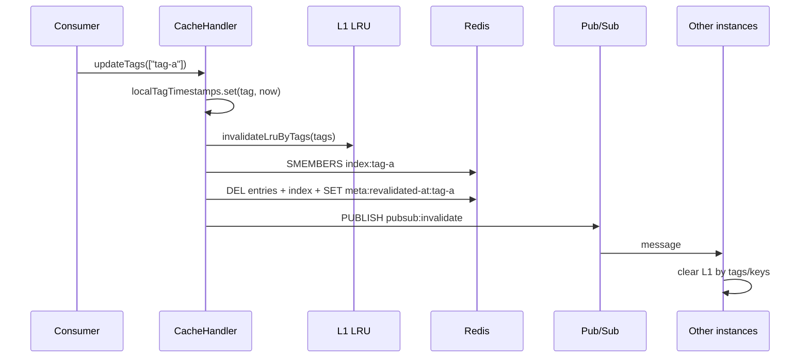

# Invalidation

Tag-based invalidation removes stale cache entries across L1 (all instances via Pub/Sub) and L2 (Redis entry keys). Tag **timestamps** provide a durable backstop when Pub/Sub messages are missed.

For read-path staleness checks and L1/L2 flow, see [ARCHITECTURE.md](ARCHITECTURE.md). This document focuses on write-path invalidation (`updateTags`, `refreshTags`).

## Concepts

| Term | Meaning |
|------|---------|
| **Hard tag** | Tag stored on the entry (`entry.tags`); indexed in Redis `index:{tag}` |
| **Soft tag** | Tag passed to `get(cacheKey, softTags)`; checked for staleness but not indexed on write |
| **Invalidation timestamp** | Milliseconds stored at `meta:revalidated-at:{tag}` when `updateTags` runs |
| **Local tag map** | In-memory `Map<tag, timestamp>` synced by `refreshTags()` |

An entry is **rejected** if any of the following is true (`src/handler/stale.ts`):

1. **Expired** — `Date.now() > entry.timestamp + entry.expire * 1000`
2. **Hard tag invalidated** — any `entry.tags` value has `localTagTimestamps.get(tag) > entry.timestamp`
3. **Soft tag invalidated** — any `softTags` value has `localTagTimestamps.get(tag) > entry.timestamp`

Rejected entries are never returned from L1 or L2.

Entries past `revalidate` but before `expire` **are** returned (stale-while-revalidate):
Next.js compares `timestamp + revalidate` itself and triggers a background refresh while
serving the stale entry.

## Invalidation flow



## `updateTags(tags)`

Called by application code or framework integration when data changes.

**Local (always):**

1. Set each tag's timestamp to `Date.now()` in the in-memory map
2. Remove L1 entries whose `entry.tags` intersect `tags`

**When Redis is available:**

1. For each tag, collect all entry keys from `index:{tag}`
2. Delete those keys from L1 on this instance (again, for keys found in index)
3. Pipeline:
   - `SET meta:revalidated-at:{tag}` with `EX TAG_META_TTL_SECONDS`
   - `SADD meta:revalidated-tags tag`
   - `DEL index:{tag}`
   - `DEL` each collected entry key
4. Publish `{ tags, keys }` on `pubsub:invalidate`

**When Redis is unavailable:**

- Local timestamps and L1 cleanup still run
- Pub/Sub publish is attempted but no-ops without Redis
- L2 entries remain until Redis is back (timestamp backstop rejects them after `refreshTags` once reconnected)

The optional `durations.expire` parameter is accepted for API compatibility but not used.

## `refreshTags()`

Called by the framework before requests (or can be invoked explicitly).

1. Load all tags from `meta:revalidated-tags`
2. `MGET meta:revalidated-at:{tag}` for each
3. Update local map with returned timestamps
4. Remove tags whose metadata key expired (`SREM` from set, delete from local map)

Ensures instances that missed Pub/Sub still learn invalidation times before serving cached content.

## `getExpiration(tags)`

Returns `Math.max(...timestamps, 0)` from the **local map only**. Does not hit Redis. Pair with `refreshTags()` for accurate values.

## Pub/Sub vs timestamps

| Mechanism | Clears L1 immediately | Clears L2 | Survives missed message |
|-----------|----------------------|-----------|-------------------------|
| Pub/Sub | Yes (subscribers) | No (explicit DEL in publisher) | No |
| Tag timestamps | No (stale on next read) | Stale entries rejected on read | Yes |

Both run on every `updateTags()` call. Timestamps protect correctness; Pub/Sub reduces latency of L1 eviction.

## Tag naming

The handler treats tags as opaque strings. Convention is left to consumers. Examples:

```
data:resource:42
ui:widget:en
cache-group:my-tag
```

Invalidation is exact string match on `entry.tags` and index sets.

## Calling invalidation from consumer code

```js
import remoteHandler from "@tme/cache-handler";

// Invalidate one tag
await remoteHandler.updateTags(["data:resource:42"]);

// Invalidate multiple tags
await remoteHandler.updateTags(["data:resource:42", "ui:widget:en"]);
```

After invalidation, the next `get()` for affected keys returns `undefined` (miss) unless a fresh entry is written.

## Related documents

- [API.md](API.md) — method signatures
- [REDIS-SCHEMA.md](REDIS-SCHEMA.md) — key patterns
- [ARCHITECTURE.md](ARCHITECTURE.md) — stale checks in `get()`
