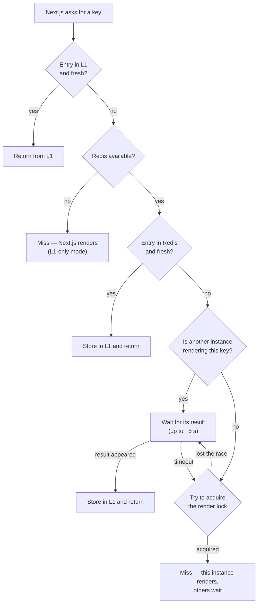
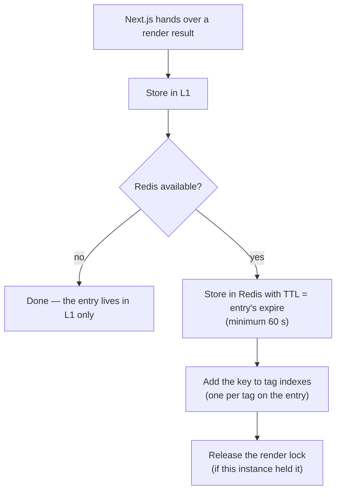
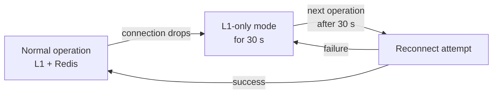

# 01 — Mechanisms

## Two cache levels

| Level | Where it lives | How long | Role |
|-------|----------------|----------|------|
| **L1** | Node process memory (LRU) | ~15 s | Absorbs hot keys — no Redis round-trip on every request |
| **L2** | Redis | until the entry's `expire` | Source of truth shared by all instances |

L1 is deliberately short-lived. It is not a "second cache to manage" — it is a
buffer that, under heavy traffic, keeps repeated reads of the same key off Redis.
After a few seconds the L1 entry expires and the next request refreshes it from
Redis.

## Read — `get`

Key decisions along the way:

- **Freshness** is checked on every read (see below).
- **Single-flight**: on a miss, only one instance in the cluster renders a given
  key. The others poll Redis every 100 ms (up to 50 attempts) and pick up the
  result as soon as it appears. This eliminates a **cache stampede** — the
  situation where, after a popular entry expires, every instance kicks off the
  same render at once.

## Write — `set`

Two details worth remembering:

- **Tag indexes** — for every tag on an entry, Redis keeps a set of keys carrying
  that tag. Tag invalidation uses these sets to know exactly which entries to
  delete (details in [03 — Invalidation](03-invalidation.md)).
- **Index TTL only grows** — a tag index gets a TTL slightly longer than its
  longest-lived entry. A short-lived entry never shortens the life of an index
  that also holds longer-lived entries.

## When an entry is fresh

An entry is rejected (treated as nonexistent) when **any** of these holds:

1. **`expire` has passed** — the hard end of the entry's life. Note that the
   handler does *not* reject entries past `revalidate` — this is intentional,
   see [02 — Next.js integration](02-nextjs-integration.md#stale-while-revalidate).
2. **A tag on the entry was invalidated** after the entry was created.
3. **A soft tag of the request was invalidated** after the entry was created
   (soft tags are tags passed by Next.js at read time, not stored on the entry —
   e.g. path tags).

## Redis outage — degradation, not disaster

While Redis is unavailable:

- `get`/`set` keep working on L1 alone — the application **does not stop**;
  only cache effectiveness drops (each instance renders for itself).
- The handler does not retry the connection on every request — it waits out a
  30 s cooldown so it doesn't hammer a recovering Redis.
- Once the connection is back, the Pub/Sub subscription is restored on the first
  request, and tag timestamps (chapter 03) close the gap left by any invalidation
  messages missed during the outage.

## Build phase

During `next build` (production build) the handler never touches Redis — it runs
in L1-only mode. A build should not depend on the network or write entries into
the shared cache.
