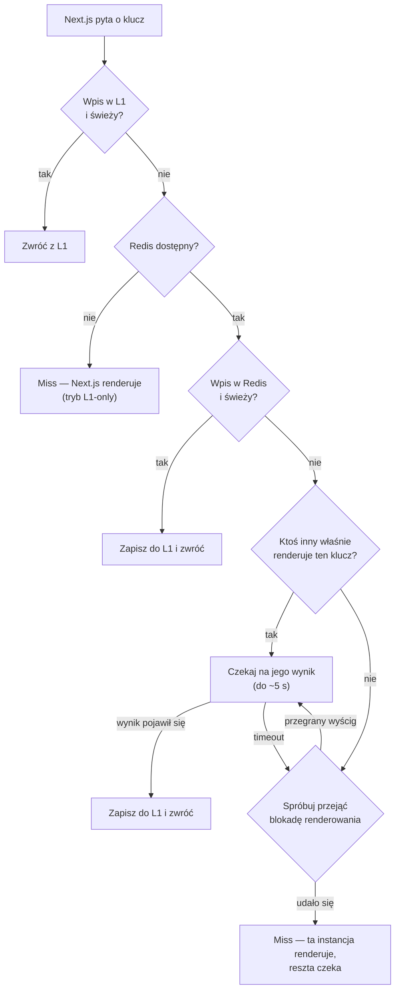
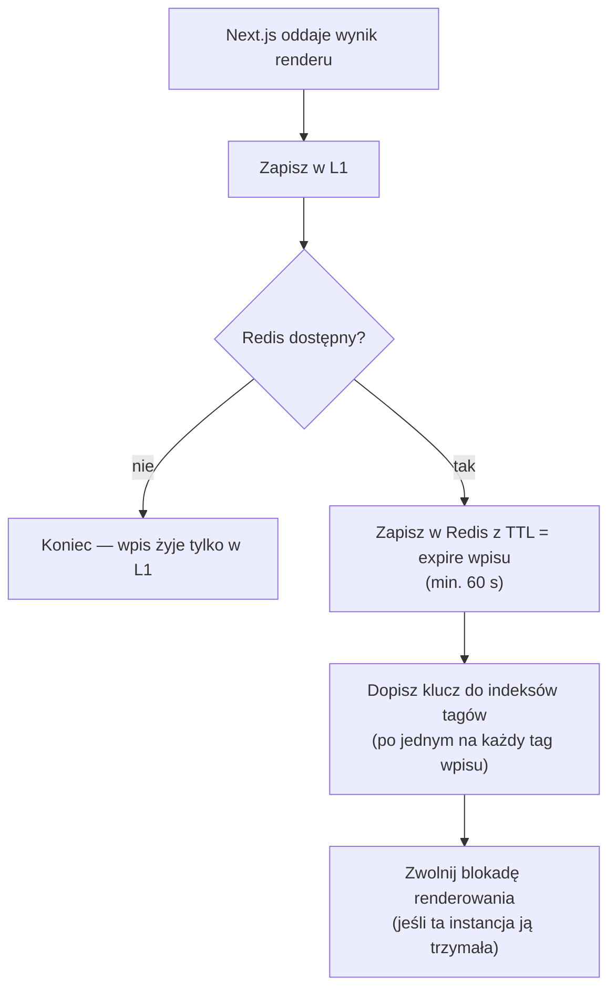
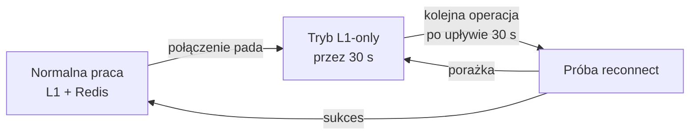

# 01 — Mechanizmy

Ten rozdział opisuje, co dzieje się „pod maską", gdy Next.js prosi handler o wpis
albo oddaje mu świeżo wyrenderowany wynik. Celowo pomijamy szczegóły kodu —
liczy się zrozumienie przepływu.

## Dwa poziomy cache

| Poziom | Gdzie żyje | Jak długo | Rola |
|--------|-----------|-----------|------|
| **L1** | Pamięć procesu Node (LRU) | ~15 s | Amortyzuje gorące klucze — brak round-tripu do Redis przy każdym żądaniu |
| **L2** | Redis | do `expire` wpisu | Źródło prawdy współdzielone przez wszystkie instancje |

L1 jest świadomie krótkotrwały. To nie jest „drugi cache do zarządzania" — to bufor,
który przy dużym ruchu zdejmuje z Redisa powtarzalne odczyty tego samego klucza.
Po kilkunastu sekundach wpis w L1 wygasa i kolejne żądanie odświeży go z Redis.

## Odczyt — `get`

Kluczowe decyzje po drodze:

- **Świeżość** sprawdzana jest przy każdym odczycie (patrz niżej).
- **Single-flight**: przy chybieniu tylko jedna instancja w klastrze renderuje dany
  klucz. Pozostałe odpytują Redis co 100 ms (maks. 50 prób) i przejmują wynik,
  gdy tylko się pojawi. To eliminuje „cache stampede" — sytuację, w której po
  wygaśnięciu popularnego wpisu wszystkie instancje naraz odpalają ten sam render.

## Zapis — `set`

Dwa detale warte zapamiętania:

- **Indeksy tagów** — dla każdego taga wpisu Redis trzyma zbiór kluczy z tym tagiem.
  Dzięki temu unieważnienie taga wie dokładnie, które wpisy skasować
  (szczegóły w [03 — Inwalidacja](03-inwalidacja.md)).
- **TTL indeksu tylko rośnie** — indeks taga dostaje TTL nieco dłuższy niż najdłużej
  żyjący wpis. Krótki wpis nie skróci życia indeksu, w którym siedzą też dłuższe wpisy.

## Kiedy wpis jest „świeży"

Wpis zostaje odrzucony (traktowany jak nieistniejący), gdy zachodzi **którykolwiek**
z warunków:

1. **Minął `expire`** — twardy koniec życia wpisu. Uwaga: handler *nie* odrzuca wpisu
   po `revalidate` — to celowe, patrz [02 — Integracja z Next.js](02-integracja-z-nextjs.md#stale-while-revalidate).
2. **Tag wpisu został unieważniony** po tym, jak wpis powstał.
3. **Soft tag żądania został unieważniony** po powstaniu wpisu (soft tagi to tagi
   przekazywane przez Next.js przy odczycie, nie zapisane we wpisie — np. tagi ścieżki).

## Awaria Redis — degradacja, nie katastrofa

Gdy Redis jest niedostępny:

- `get`/`set` działają dalej na samym L1 — aplikacja **nie przestaje działać**,
  spada tylko skuteczność cache (każda instancja renderuje dla siebie).
- Handler nie ponawia połączenia przy każdym żądaniu — odczekuje 30 s (cooldown),
  żeby nie dobijać wstającego Redisa.
- Po odzyskaniu połączenia subskrypcja Pub/Sub odtwarza się przy pierwszym żądaniu,
  a znaczniki czasu tagów (rozdział 03) domykają lukę po ewentualnie zgubionych
  komunikatach unieważnień.

## Faza builda

Podczas `next build` (produkcyjny build) handler w ogóle nie dotyka Redisa —
działa w trybie L1-only. Build nie powinien zależeć od sieci ani zapisywać
wpisów do współdzielonego cache.
