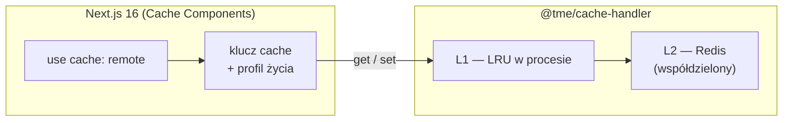
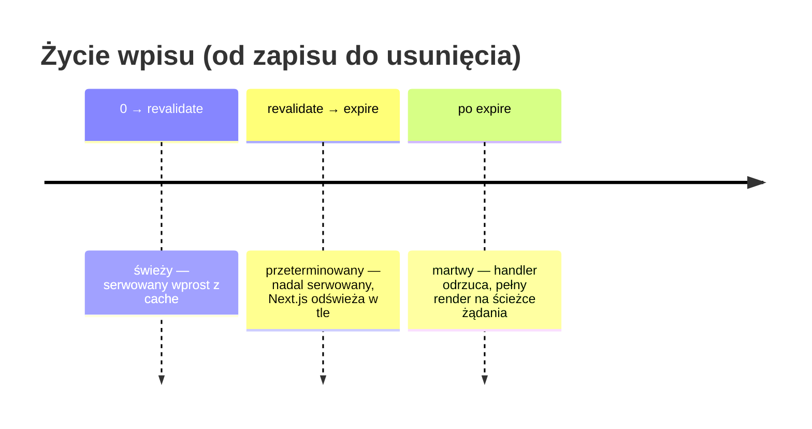

# 02 — Integracja z Next.js 16

Ten rozdział wyjaśnia, jak paczka wpina się w Cache Components w Next.js 16
i jak współgra z `cacheTag`, `cacheLife` oraz mechanizmem stale-while-revalidate.

## Custom cache handlers — gdzie jest miejsce na tę paczkę

Next.js 16 z włączonym `cacheComponents` pozwala zarejestrować **własne handlery
cache** pod nazwanymi profilami (pole `cacheHandlers` w konfiguracji Next.js).
Ta paczka rejestruje się pod nazwą `remote`, a funkcje i komponenty wybierają ją
dyrektywą `use cache: remote`.

Podział odpowiedzialności jest prosty:

- **Next.js decyduje** *co* cachować (dyrektywa), *jak długo* (profil `cacheLife`)
  i *pod jakim kluczem* (klucz budowany z funkcji i jej argumentów).
- **Handler decyduje** *gdzie* wpis żyje (L1 + Redis), *jak* jest współdzielony
  między instancjami i *jak* unieważniany klastrowo.

Zwykłe `use cache` (bez `: remote`) dalej używa wbudowanego, in-process handlera
Next.js — obie warstwy mogą współistnieć w jednej aplikacji.

## `cacheLife` — trzy zegary jednego wpisu

Profil `cacheLife` (np. `"minutes"`, `"hours"`, albo własny) nadaje wpisowi trzy
czasy. Wszystkie trafiają do handlera razem z wpisem:

| Czas | Kto go egzekwuje | Znaczenie |
|------|------------------|-----------|
| `stale` | Klient (przeglądarka/router) | Jak długo klient nie pyta serwera o nowszą wersję |
| `revalidate` | **Next.js** (serwer) | Po tym czasie wpis jest „przeterminowany, ale używalny" — serwowany, ale w tle startuje odświeżenie |
| `expire` | **Handler** | Twardy koniec: po tym czasie handler odrzuca wpis i wymusza pełny render |

Handler zapisuje wpis w Redis z TTL równym `expire` (nie mniej niż 60 s) —
Redis sam sprząta martwe wpisy.

## Stale-while-revalidate

To najważniejsze miejsce styku paczki z Next.js — i częsta pułapka w zrozumieniu.

Kolejność zdarzeń między `revalidate` a `expire`:

1. Handler zwraca wpis **bez oglądania się na `revalidate`** — dla niego liczy się
   tylko `expire`.
2. Next.js sam porównuje wiek wpisu z `revalidate`. Widzi, że okno minęło,
   więc **serwuje starszą wersję** użytkownikowi (zero czekania)
   i **w tle uruchamia ponowny render**.
3. Świeży wynik trafia do handlera przez `set` i podmienia wpis w L1 + Redis.

Efekt: użytkownik nigdy nie czeka na odświeżenie „lekko przeterminowanej" treści.
Blokujący render na ścieżce żądania zdarza się tylko po `expire` (albo po
unieważnieniu taga) — i nawet wtedy single-flight ogranicza go do jednej instancji.

## `cacheTag` — etykiety do celowanego unieważniania

`cacheTag(...)` wewnątrz cachowanej funkcji przypina wpisowi etykiety.
Handler dostaje je razem z wpisem i buduje z nich indeksy w Redis.

Unieważnienie (`revalidateTag(...)` po stronie aplikacji) trafia do handlera jako
`updateTags` i kasuje **wszystkie wpisy z danym tagiem we wszystkich instancjach** —
szczegóły przepływu w [03 — Inwalidacja](03-inwalidacja.md).

Ważna właściwość: unieważnienie tagów działa **niezależnie** od `cacheLife`.
Wpis może mieć przed sobą godziny życia, ale unieważnienie taga uśmierca go
natychmiast.

## Zasady, o których trzeba pamiętać w kodzie aplikacji

- Wewnątrz `use cache` nie wolno czytać `cookies()`, `headers()` ani `searchParams` —
  wynik ma być deterministyczny dla klucza. Personalizację robi się poza
  cachowaną funkcją.
- Wszystko, co wpływa na wynik, musi być **argumentem** cachowanej funkcji —
  argumenty budują klucz cache.
- `refreshTags` — Next.js woła tę metodę handlera przed obsługą żądania; handler
  synchronizuje wtedy lokalną wiedzę o unieważnionych tagach z Redis. Dzieje się
  to automatycznie, aplikacja nic nie musi robić.
