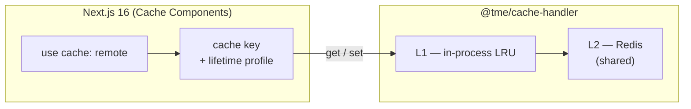
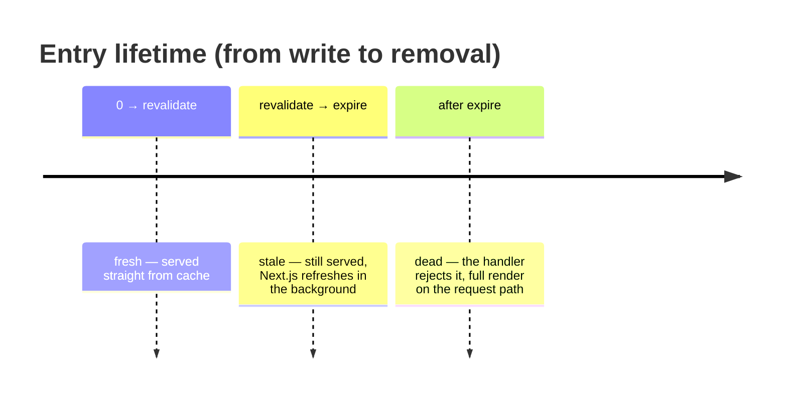

# 02 — Next.js 16 integration

## Custom cache handlers — where this package fits

Next.js 16 with `cacheComponents` enabled lets you register **custom cache
handlers** under named profiles (the `cacheHandlers` field in the Next.js
configuration). This package registers under the name `remote`, and functions or
components opt in with the `use cache: remote` directive.

The split of responsibilities:

- **Next.js decides** *what* to cache (the directive), *for how long* (the
  `cacheLife` profile) and *under which key* (the key is built from the function
  and its arguments).
- **The handler decides** *where* the entry lives (L1 + Redis), *how* it is
  shared between instances and *how* it is invalidated cluster-wide.

Plain `use cache` (without `: remote`) still uses the built-in in-process
Next.js handler — both layers can coexist in one application.

## `cacheLife` — three clocks on one entry

A `cacheLife` profile (e.g. `"minutes"`, `"hours"`, or a custom one) attaches
three durations to an entry. All three reach the handler together with the entry:

| Duration | Enforced by | Meaning |
|----------|-------------|---------|
| `stale` | The client (browser/router) | How long the client avoids asking the server for a newer version |
| `revalidate` | **Next.js** (server) | Past this point the entry is "stale but usable" — still served, while a background refresh starts |
| `expire` | **The handler** | The hard end: past this point the handler rejects the entry and forces a full render |

The handler stores the entry in Redis with a TTL equal to `expire` (never less
than 60 s) — Redis cleans up dead entries on its own.

## Stale-while-revalidate

This is the most important touchpoint between the package and Next.js — and a
common source of confusion.

The sequence of events between `revalidate` and `expire`:

1. The handler returns the entry **without looking at `revalidate`** — the only
   duration it enforces is `expire`.
2. Next.js compares the entry's age with `revalidate` itself. Seeing the window
   has passed, it **serves the stale version** to the user (zero waiting) and
   **starts a re-render in the background**.
3. The fresh result reaches the handler via `set` and replaces the entry in
   L1 + Redis.

The result: users never wait for a refresh of "slightly stale" content. A
blocking render on the request path happens only after `expire` (or after a tag
invalidation) — and even then, single-flight limits it to a single instance.

## `cacheTag` — labels for targeted invalidation

`cacheTag(...)` inside a cached function attaches labels to the entry. The
handler receives them with the entry and builds Redis indexes from them.

An invalidation (`revalidateTag(...)` on the application side) reaches the
handler as `updateTags` and deletes **all entries carrying that tag, across all
instances** — the full flow is in [03 — Invalidation](03-invalidation.md).

An important property: tag invalidation works **independently** of `cacheLife`.
An entry may have hours of life ahead of it, but invalidating its tag kills it
immediately.

## Rules to follow in application code

- Inside `use cache` you must not read `cookies()`, `headers()` or
  `searchParams` — the result must be deterministic for the key.
  Personalization belongs outside the cached function.
- Everything that affects the result must be an **argument** of the cached
  function — arguments build the cache key.
- `refreshTags` — Next.js calls this handler method before serving a request;
  the handler then synchronizes its local knowledge of invalidated tags with
  Redis. This happens automatically; the application does nothing.
