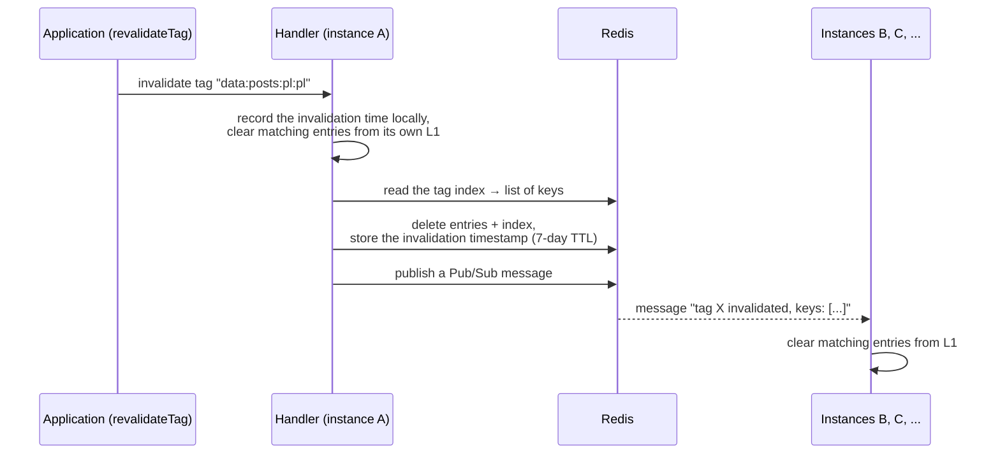
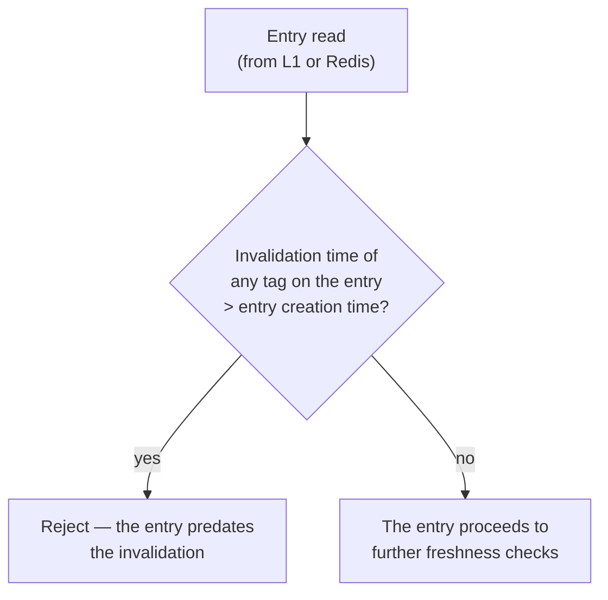

# 03 — Invalidation

Cache invalidation is the hardest problem in a multi-instance system: the message
"delete entries with tag X" must reach **every** instance, including one that was
briefly offline. This package solves it with two complementary mechanisms.

## Two mechanisms, one goal

| Mechanism | Speed | Reliability | Role |
|-----------|-------|-------------|------|
| **Pub/Sub** | immediate | fire-and-forget — a message can be lost | Fast L1 cleanup across all instances |
| **Tag timestamps** | on the next request | durable (Redis keys, 7-day TTL) | Safety net when Pub/Sub fails |

## Invalidation flow — `updateTags`

When the application calls `revalidateTag(...)`, Next.js forwards it to the
handler:

After this sequence:

- Redis no longer holds entries with that tag (nor the tag's index),
- every live instance has cleared its L1,
- Redis keeps a **timestamp**: "tag X was invalidated at time T".

When Redis is unavailable, the invalidation still clears the local L1 and local
timestamps — the instance that performed it sees fresh data immediately.

## The safety net — tag timestamps

What if an instance **missed** the Pub/Sub message (restart, brief connection
loss, a Redis restart)? An entry in its L1, or one freshly read from Redis,
could be a "zombie" — logically deleted but still being served.

This is where the second mechanism comes in:

1. Every invalidation stores a durable marker in Redis: *tag → invalidation
   time* (it lives for 7 days, then Redis cleans it up).
2. Before serving a request, Next.js calls `refreshTags` — the handler pulls all
   markers into a local in-memory map.
3. On **every** read the handler compares: does any tag on the entry have a
   marker newer than the entry's creation time? If so, the entry is rejected —
   regardless of whether it came from L1 or Redis.

Even an instance that slept through the Pub/Sub message rejects the outdated
entry at the latest on its first request after regaining connectivity.

## Soft tags

Besides the tags stored on an entry, Next.js can pass **soft tags** at read
time — request-context tags (e.g. a path tag) that are not on the entry itself.
The handler checks them with the same timestamp mechanism: invalidating a soft
tag after the entry was created also rejects the entry.

## Why two mechanisms instead of one

- Pub/Sub alone is fast but unreliable — Redis does not guarantee delivery to
  subscribers that were offline.
- Timestamps alone are reliable but lazily enforced — they clear an entry only
  at read time, so L1 could serve stale content for several seconds.
- Together they provide **immediacy** (Pub/Sub clears L1 right away) and a
  **guarantee** (the timestamp closes every gap).
