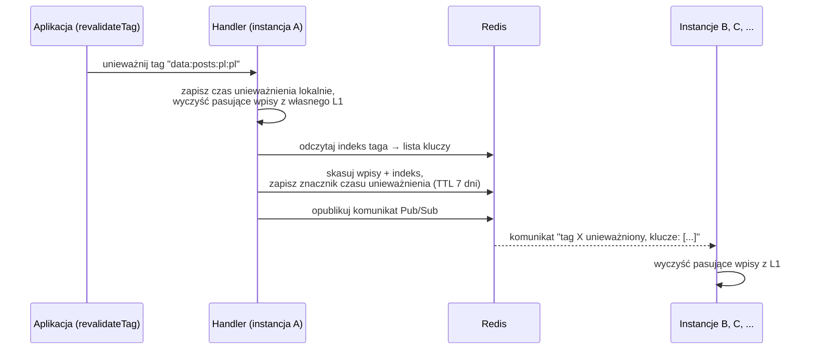
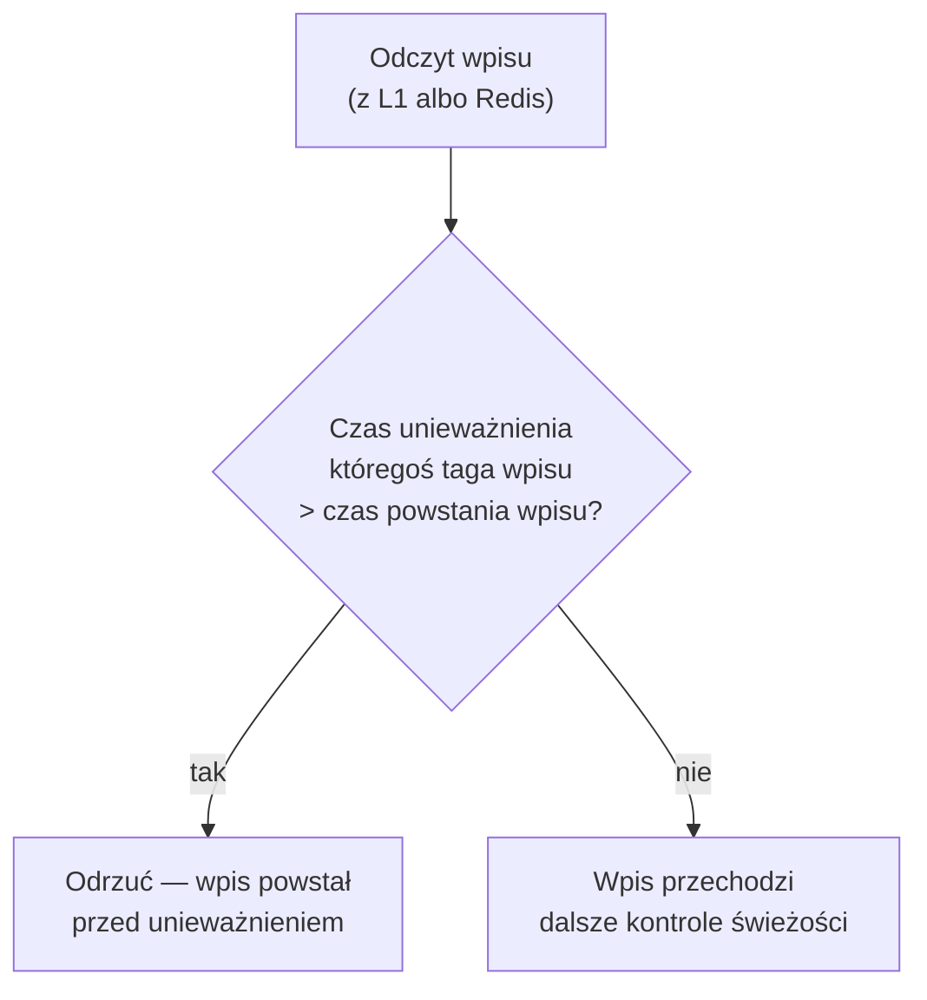

# 03 — Inwalidacja

Unieważnianie cache to najtrudniejszy problem w systemie wieloinstancyjnym:
komunikat „skasuj wpisy z tagiem X" musi dotrzeć do **każdej** instancji, także
takiej, która akurat traciła połączenie. Ta paczka rozwiązuje to dwoma
uzupełniającymi się mechanizmami.

## Dwa mechanizmy, jeden cel

| Mechanizm | Szybkość | Niezawodność | Rola |
|-----------|----------|--------------|------|
| **Pub/Sub** | natychmiast | „fire and forget" — komunikat może przepaść | Szybkie czyszczenie L1 we wszystkich instancjach |
| **Znaczniki czasu tagów** | przy najbliższym żądaniu | trwałe (klucze w Redis, TTL 7 dni) | Siatka bezpieczeństwa, gdy Pub/Sub zawiedzie |

## Przepływ unieważnienia — `updateTags`

Gdy aplikacja woła `revalidateTag(...)`, Next.js przekazuje to do handlera:

Po tej sekwencji:

- w Redis nie ma już wpisów z tym tagiem (ani jego indeksu),
- każda żywa instancja wyczyściła swoje L1,
- w Redis został **znacznik czasu**: „tag X unieważniono o godzinie T".

Gdy Redis jest niedostępny, unieważnienie i tak czyści lokalne L1 i lokalne
znaczniki — instancja, która je wykonała, natychmiast widzi świeże dane.

## Siatka bezpieczeństwa — znaczniki czasu tagów

Co jeśli instancja **nie dostała** komunikatu Pub/Sub (restart, chwilowy brak
połączenia, restart samego Redisa)? Wpis w jej L1 albo świeżo odczytany z Redis
mógłby być „zombie" — skasowany logicznie, ale wciąż serwowany.

Tu wchodzi drugi mechanizm:

1. Każde unieważnienie zapisuje w Redis trwały znacznik: *tag → czas unieważnienia*
   (żyje 7 dni, potem Redis go sprząta).
2. Przed obsługą żądania Next.js woła `refreshTags` — handler zaciąga wtedy
   wszystkie znaczniki do lokalnej mapy w pamięci.
3. Przy **każdym** odczycie handler porównuje: czy któryś tag wpisu ma znacznik
   nowszy niż czas powstania wpisu? Jeśli tak — wpis jest odrzucany, niezależnie
   od tego, skąd przyszedł (L1 czy Redis).

Dzięki temu nawet instancja, która przespała komunikat Pub/Sub, odrzuci
nieaktualny wpis najpóźniej przy pierwszym żądaniu po odzyskaniu łączności.

## Soft tagi

Oprócz tagów zapisanych we wpisie, Next.js może przy odczycie przekazać
**soft tagi** — tagi kontekstu żądania (np. tag ścieżki), których nie ma we wpisie.
Handler sprawdza je tym samym mechanizmem znaczników czasu: unieważnienie soft
taga po powstaniu wpisu również go odrzuca.

## Dlaczego dwa mechanizmy, a nie jeden

- Sam Pub/Sub jest szybki, ale zawodny — Redis nie gwarantuje dostarczenia
  komunikatu subskrybentom, którzy byli offline.
- Same znaczniki czasu są niezawodne, ale leniwie egzekwowane — czyszczą wpis
  dopiero przy odczycie, więc L1 mogłoby przez kilkanaście sekund serwować
  starą treść.
- Razem dają: **natychmiastowość** (Pub/Sub czyści L1 od razu) i **gwarancję**
  (znacznik czasu domyka każdą lukę).
