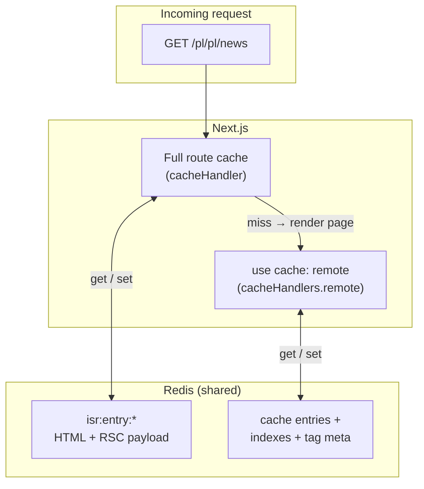
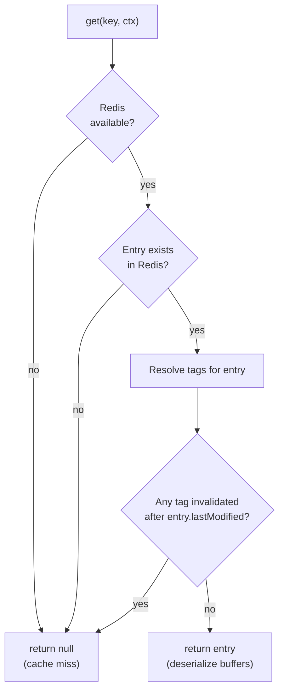
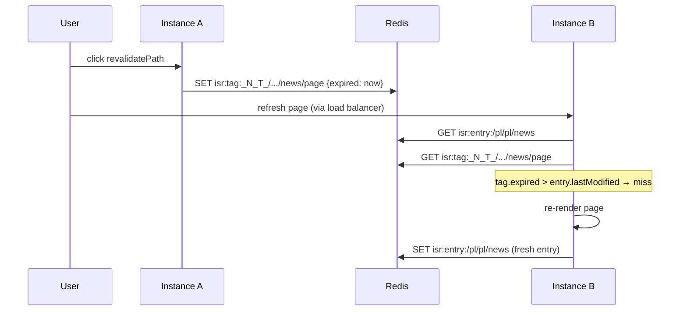

# 07 — ISR cache handler (shared full route cache)

## Two cache layers in Next.js 16

With `cacheComponents` enabled, Next.js uses **two separate handler APIs**:

| Config field | Handler | What it caches |
|--------------|---------|----------------|
| `cacheHandlers.remote` | `@tme/cache-handler` | Entries from `use cache: remote` — function and component render results |
| `cacheHandler` | `@tme/cache-handler/isr` | **Incremental cache** — full route HTML/RSC, route handlers, fetch cache, optimized images |

The remote handler is documented in chapters [01](01-mechanisms.md)–[04](04-application-benefits.md).
This chapter covers the ISR handler.

Without a custom `cacheHandler`, Next.js stores incremental cache entries on the
**local disk of each instance**. In a multi-instance deployment behind a load
balancer, each pod keeps its own snapshot of a page. A user hitting instance A
sees a different `page rendered at` timestamp than a user on instance B — even
when the underlying `use cache` data in Redis is identical.

The ISR handler moves that layer to Redis so every instance reads and writes the
same route cache entries.



## What gets stored

The handler implements the Next.js `cacheHandler` API (`get`, `set`,
`revalidateTag`, `resetRequestCache`). Each entry is a JSON document in Redis:

```
{ lastModified: <timestamp>, value: <IncrementalCacheValue> }
```

Supported entry kinds:

| Kind | Content |
|------|---------|
| `APP_PAGE` | HTML shell, RSC payload, PPR segment data, response headers |
| `APP_ROUTE` | Route handler response body |
| `PAGES` | Pages-router HTML + page data |
| `FETCH` | Cached `fetch()` results |
| `IMAGE` | Optimized image buffers |

Binary data (RSC payloads, image buffers, route bodies) is stored as base64 inside
the JSON document. Redis keys use the prefix `isr:entry:`.

## The `get` flow



Tag resolution depends on the entry kind:

- **Page / route entries** — tags are read from the `x-next-cache-tags` header
  stored inside the entry (Next.js attaches them at write time).
- **Fetch entries** — tags come from the `tags` and `softTags` arguments Next.js
  passes in the `get` context. Tags revalidated earlier in the same request are
  also checked.

The freshness rule mirrors Next.js's built-in `FileSystemCache`: a tag record
with `expired > entry.lastModified` hides the entry. The entry itself is **not**
deleted — it becomes invisible until it naturally expires from Redis TTL.

## The `set` flow

On a cache miss, Next.js renders the page and calls `set` with the result:

1. The handler serializes buffers to base64.
2. It wraps the value in `{ lastModified: Date.now(), value }`.
3. It writes to Redis with TTL = `cacheControl.expire` from the route (or
   `ISR_ENTRY_TTL_SECONDS`, default 24 h).

Fetch entries also store their `tags` array inside the serialized value so
subsequent reads can validate them.

When Redis is unavailable, `set` is a no-op — the page still renders, but the
entry is not shared. The next request on any instance will miss again.

## Invalidation (`revalidateTag` / `revalidatePath`)

`revalidatePath` is a convenience wrapper: Next.js translates it into a
`revalidateTag` call with a path-specific tag (e.g.
`_N_T_/[country]/[lang]/news/page`).

The ISR handler does **not** delete entries on invalidation. Instead it writes a
tag record to Redis:

```
isr:tag:<tag> → { expired: <timestamp> }
```

Every instance checks these records on `get`. Because the check reads from Redis,
invalidation is **cluster-wide without Pub/Sub** — any instance that calls
`revalidateTag` makes the entry invisible to all others on their next read.

Tag records use the same `TAG_META_TTL_SECONDS` (7 days) as the remote handler's
tag timestamps.



## Interaction with the remote handler

Both handlers share the same Redis connection (`getRedis`) but use **separate
key namespaces**:

| Namespace | Handler | Example key |
|-----------|---------|-------------|
| `isr:entry:*` / `isr:tag:*` | ISR (this handler) | `isr:entry:/pl/pl/news` |
| Cache entry keys + `index:*` + `meta:revalidated-at:*` | Remote (`use cache`) | `index:ui:news:pl:pl` |

A typical `/news` page uses both layers:

1. **ISR handler** caches the assembled page shell (the `page rendered at`
   timestamp, layout, static HTML).
2. **Remote handler** caches individual `use cache: remote` components inside the
   page (e.g. `CachedProducts`, `NewsPageShell`).

`updateTag('ui:news:pl:pl')` invalidates only the remote handler's component
entry. The ISR shell may still serve the old HTML until its own tag is
invalidated or its `revalidate` window passes.

`revalidatePath('/news')` invalidates the ISR shell via the path tag. The remote
component entries are unaffected unless their tags are invalidated separately.

For consistent cross-instance behavior, both layers must be on Redis in a
multi-instance setup.

## Configuration

Register in `next.config`:

```ts
cacheHandler: require.resolve("@tme/cache-handler/isr"),
cacheMaxMemorySize: 0,
```

`cacheMaxMemorySize: 0` disables Next.js's default in-memory incremental cache so
Redis is the single source of truth. Without this, each instance still keeps a
local memory copy that can diverge.

| Variable | Default | Description |
|----------|---------|-------------|
| `ISR_ENTRY_TTL_SECONDS` | `86400` (24 h) | Redis TTL for ISR entries when the route provides no `expire` |
| `TAG_META_TTL_SECONDS` | `604800` (7 days) | TTL of ISR tag invalidation records (shared with remote handler) |
| `ISR_MAX_ENTRY_BYTES` | `4194304` (4 MB) | Oversized route payloads are not written to Redis |

Redis connection variables are the same as for the remote handler — see
[06 — Configuration](06-configuration.md).

### Production checklist

- Set `cacheMaxMemorySize: 0` so Redis is the single ISR source of truth.
- Use `REDIS_TLS=true` and a strong password on managed Redis.
- Set `REMOTE_CACHE_DEBUG_ENABLED=false` and `CACHE_HANDLER_LOG_LEVEL=warn`.
- Optionally set `REDIS_CACHE_PREFIX` when sharing Redis with other apps.
- For Docker: `docker compose -f docker-compose.yml -f docker-compose.prod.yml up`.

## Degraded operation

When Redis is unavailable:

- `get` returns `null` (every request is a cache miss → full render).
- `set` and `revalidateTag` are no-ops.
- The application still works; it just loses route-cache sharing and serves
  fresh renders on every request per instance.

This matches the remote handler's L1-only degradation pattern, but the ISR
handler has no local fallback store — miss means render.
