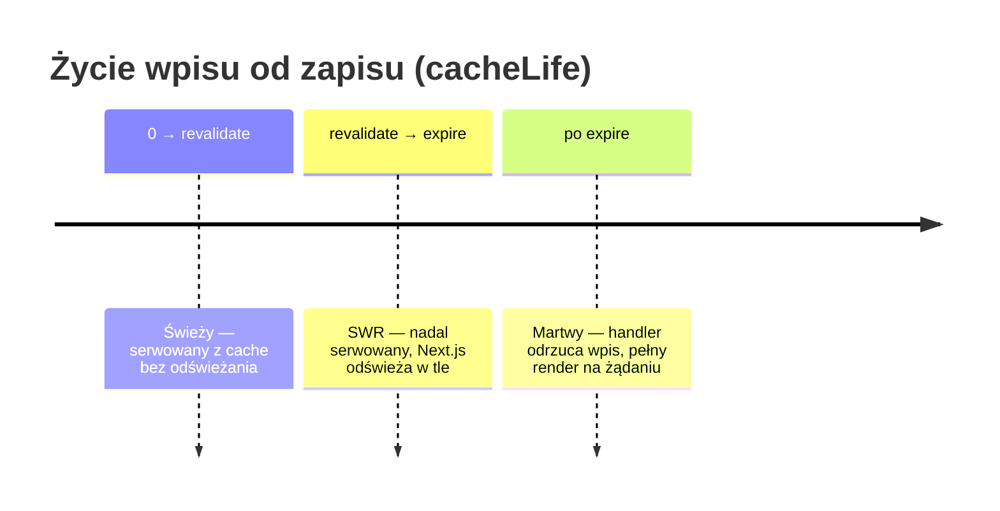
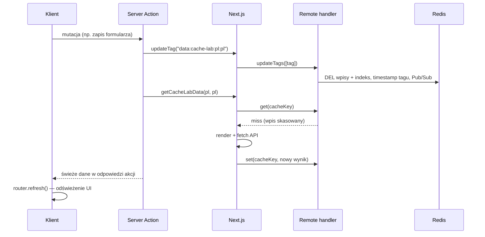

# 08 — Użycie remote cache handlera (bez ISR)

Ten rozdział opisuje **wyłącznie** warstwę `use cache: remote` podpiętą pod
`cacheHandlers.remote`. Nie obejmuje `cacheHandler` (ISR / full route cache) —
patrz [07 — ISR cache handler](07-isr-cache-handler.md) tylko jeśli potrzebujesz
współdzielonego cache całych stron HTML.

Skupiamy się na dwóch scenariuszach:

1. **Dane, które wygasają przez `cacheLife`** — wpis żyje sam, bez ręcznej
   invalidacji.
2. **Kontent po `await connection()` z read-your-own-writes** — mutacja użytkownika
   i natychmiastowe odświeżenie danych w tym samym cyklu żądania.

Powiązane rozdziały: [02 — integracja z Next.js](02-nextjs-integration.md),
[03 — invalidacja](03-invalidation.md), [06 — konfiguracja](06-configuration.md).
Przykłady w aplikacji: `apps/tmeNext/lib/data/`, `apps/tmeNext/components/cached-*`,
strona `/{country}/{lang}/cache-lab`.

---

## Konfiguracja — tylko remote handler

W `next.config.ts` wystarczy remote handler i Cache Components:

```ts
import type { NextConfig } from "next";

const nextConfig: NextConfig = {
  cacheComponents: true,
  cacheHandlers: {
    remote: require.resolve("@tme/cache-handler"),
  },
};

export default nextConfig;
```

Zmienne Redis (`REDIS_HOST`, `REDIS_PORT`, opcjonalnie `REDIS_PASSWORD`, `REDIS_DB`)
— patrz [06 — konfiguracja](06-configuration.md).

**Czego tu nie ma:** pola `cacheHandler` (ISR). Bez niego Next.js trzyma full route
cache lokalnie na każdej instancji. Dla wzorców opisanych poniżej to zwykle akceptowalne:
odświeżenie strony po mutacji opiera się na remote cache wpisów DATA/UI, a nie na
współdzielonym snapshotcie HTML.

---

## Recepta — warstwa DATA i UI

Dwa niezależne wpisy cache, każdy z **jednym tagiem 1:1**:

```ts
// lib/data/posts.ts — wynik fetcha
export async function getPosts(country: string, lang: string) {
  "use cache: remote";
  cacheLife("hours");
  cacheTag(dataTag("posts", country, lang));
  const res = await fetch("https://api.example.com/posts");
  return res.json();
}

// components/cached-posts-list.tsx — wyrenderowany komponent
export async function CachedPostsList({ country, lang }: Props) {
  "use cache: remote";
  cacheLife("hours");
  cacheTag(uiTag("posts", country, lang));
  const data = await getPosts(country, lang);
  return <ul>{/* … */}</ul>;
}
```

Konwencja tagów (`lib/cache-tags.ts`): `{warstwa}:{zasób}[:{scope…}]`, np.
`data:posts:pl:pl`, `ui:posts:pl:pl`.

Zasady:

- Wewnątrz `use cache` / `use cache: remote` **nie** wołaj `cookies()`, `headers()`,
  `searchParams` — przekaż dynamiczne wartości jako **argumenty** (budują cache key).
- Przy trafieniu w cache UI funkcja DATA **nie jest wywoływana** — dane są „zamrożone”
  w wpisie UI. Przy invalidacji zwykle czyścisz **oba** tagi.

---

## Scenariusz 1 — wygaśnięcie wpisu przez `cacheLife`

### Trzy zegary na jednym wpisie

Profil `cacheLife` (wbudowany lub własny w `next.config.ts`) ustawia trzy czasy
w sekundach:

| Czas | Kto egzekwuje | Znaczenie |
|------|---------------|-----------|
| `stale` | Klient (przeglądarka / router) | Jak długo klient nie pyta serwera o nowszą wersję |
| `revalidate` | **Next.js** (serwer) | Po tym czasie wpis jest „przeterminowany, ale użyteczny” — serwowany od razu, odświeżenie w tle |
| `expire` | **Handler** (`@tme/cache-handler`) | Twardy koniec życia — handler odrzuca wpis, wymuszony render na ścieżce żądania |

Wbudowane profile (skrót):

| Profil | `stale` | `revalidate` | `expire` | Typowy przypadek |
|--------|---------|--------------|----------|------------------|
| `seconds` | 30 s | 1 s | 1 min | Dane quasi real-time |
| `minutes` | 5 min | 1 min | 1 h | Częste aktualizacje (np. cache-lab) |
| `hours` | 5 min | 1 h | 1 dzień | Listy katalogowe (posts, users) |
| `days` | 5 min | 1 dzień | 1 tydzień | Artykuły, blog |
| `weeks` | 5 min | 1 tydzień | 30 dni | Treści tygodniowe |
| `max` | 5 min | 30 dni | 1 rok | Prawie statyczne (uwaga: bardzo długi TTL w Redis) |
| `default` | 5 min | 15 min | ~1 rok | Domyślny |

Własny profil inline:

```ts
cacheLife({
  stale: 300,       // 5 min — klient
  revalidate: 3600, // 1 h — SWR na serwerze
  expire: 86400,    // 24 h — koniec życia w handlerze (musi być > revalidate)
});
```

Handler zapisuje wpis w Redis z TTL = `max(expire, 60)` sekund — Redis sam usuwa
martwe klucze.

### Oś czasu życia wpisu



**Ważne rozdzielenie odpowiedzialności:**

- Handler przy `get()` **nie** odrzuca wpisu tylko dlatego, że minął `revalidate`.
  To celowe — umożliwia stale-while-revalidate (rozdział 02).
- Handler odrzuca wpis, gdy minął **`expire`** albo gdy tag został unieważniony po
  utworzeniu wpisu (rozdział 03).

### Co widzi użytkownik przy samym `cacheLife` (bez mutacji)

| Faza | Zachowanie |
|------|------------|
| 0 … `revalidate` | Każde żądanie dostaje ten sam wynik z Redis (przez L1 → L2). Brak renderu. |
| `revalidate` … `expire` | Użytkownik dostaje stary wynik **natychmiast**; Next.js w tle renderuje nowy i woła `set()`. Kolejne żądania widzą już odświeżoną wersję. |
| Po `expire` | Handler zwraca miss. Jedna instancja renderuje (single-flight), reszta czeka na wynik w Redis. |

Invalidacja tagiem (`updateTag` / `revalidateTag`) działa **niezależnie** od
`cacheLife` — możesz skasować wpis z godziną życia przed końcem profilu (scenariusz 2).

### Kiedy wystarczy sam `cacheLife`

- Dane z zewnętrznego API/CMS, które mogą być lekko nieaktualne (katalog, statystyki).
- Brak ścieżki „użytkownik właśnie coś zmienił i musi to od razu zobaczyć”.
- Akceptujesz SWR między `revalidate` a `expire` zamiast natychmiastowej świeżości.

**Antywzorzec:** `cacheLife("max")` dla treści, którą często edytujesz ręcznie —
wpis praktycznie nie wygasa; polegaj wtedy na tagach i `updateTag` / `revalidateTag`.

---

## Scenariusz 2 — `await connection()` i read-your-own-writes

### Po co `connection()`

`await connection()` z `next/server` **odkłada render na czas żądania** — kontekst
staje się dynamiczny (poza statyczną powłoką PPR). Typowe powody:

- Chcesz, żeby fragment strony **zawsze** wykonywał się per-request, ale nadal cache’ował
  drogie operacje przez `use cache: remote`.
- Po mutacji użytkownika (Server Action) musisz **w tym samym cyklu** zobaczyć świeże
  dane — wzorzec read-your-own-writes.

W kontekście dynamicznym:

| Dyrektywa | Czy cache’uje? |
|-----------|----------------|
| `use cache` | **Nie** — w dynamicznym kontekście nic nie zapisuje |
| `use cache: remote` | **Tak** — zapis w handlerze (L1 + Redis) |
| `use cache: private` | Cache per-użytkownik (poza zakresem tego rozdziału) |

`connection()` same w sobie **nie wchodzi** do cache key — to sygnał dla Next.js,
nie dane do cache’owania.

### Wzorzec strony z `connection()`

```tsx
import { Suspense } from "react";
import { connection } from "next/server";
import { cacheLife, cacheTag } from "next/cache";
import { getPosts } from "@/lib/data/posts";
import { dataTag } from "@/lib/cache-tags";

export default function PostsPage({ params }: { params: Promise<{ country: string; lang: string }> }) {
  return (
    <Suspense fallback={<p>Ładowanie…</p>}>
      <PostsContent params={params} />
    </Suspense>
  );
}

async function PostsContent({ params }: { params: Promise<{ country: string; lang: string }> }) {
  await connection(); // kontekst dynamiczny — render per-request

  const { country, lang } = await params;
  const data = await getPosts(country, lang); // use cache: remote wewnątrz

  return <PostList posts={data.posts} />;
}
```

Funkcja `getPosts` nadal używa `"use cache: remote"` — cache działa w runtime,
współdzielony między instancjami przez Redis. Bez `connection()` ten sam kod mógłby
trafić do statycznej powłoki; z `connection()` świadomie zostajesz na ścieżce
dynamicznej.

### Read-your-own-writes — `updateTag()` w Server Action

Gdy użytkownik **właśnie zmienił** dane, `cacheLife` nie pomoże — potrzebujesz
natychmiastowej invalidacji. W Server Actions użyj `updateTag()` (nie `revalidateTag`):

| API | Kiedy świeże dane | Gdzie |
|-----|-------------------|-------|
| `updateTag(tag)` | **Natychmiast** — to samo żądanie po invalidacji | Tylko Server Actions |
| `revalidateTag(tag, profile)` | Następne żądanie (SWR) | Server Actions, route handlers, webhooki |

Przykład z demo `cache-lab` (`app/actions/cache-lab.ts`):

```ts
"use server";

import { updateTag } from "next/cache";
import { dataTag } from "@/lib/cache-tags";
import { getCacheLabData } from "@/lib/data/cache-lab";

export async function cacheLabUpdateTagData(country: string, lang: string) {
  const tag = dataTag("cache-lab", country, lang);
  updateTag(tag); // wpis znika z Redis + L1 (wszystkie instancje)

  const fresh = await getCacheLabData(country, lang); // ten sam request — nowy fetch

  return { message: `Invalidacja ${tag}`, freshData: fresh };
}
```

Sekwencja:



Po stronie klienta (`cache-lab-controls.tsx`) po akcji wołane jest `router.refresh()`,
żeby RSC ponownie wyrenderował komponenty z już odświeżonym remote cache.

### Invalidacja obu warstw

Jeśli masz osobno DATA i UI:

```ts
updateTag(dataTag("posts", country, lang));
updateTag(uiTag("posts", country, lang));
```

Tylko `data:*` — przy następnym renderze UI nadal może serwować stary snapshot
(zamrożone dane wewnątrz wpisu UI).

### Dlaczego to działa bez ISR

Bez `cacheHandler` (ISR) nie ma współdzielonej warstwy **całego HTML strony** w Redis.
Po `updateTag` + `router.refresh()`:

1. Remote wpisy DATA/UI są już świeże (albo miss → nowy render → `set`).
2. Strona renderuje się ponownie, wołając cached funkcje/komponenty.
3. Nie czekasz na zbieżność snapshotów HTML między instancjami (problem opisany w
   `apps/tmeNext/docs/CACHING.md` §4 dla pełnego route cache).

To jest główny powód, by przy wzorcu read-your-own-writes **nie wymagać** ISR handlera:
wystarczy remote cache na poziomie funkcji i komponentów.

### Mechanizm w handlerze wspierający spójność

Poza `updateTags` handler zapewnia:

- **`pendingSets`** — podczas `set()` in-flight render w tym samym procesie; kolejne
  `get()` w tym procesie czeka na zakończenie zapisu (read-your-own-writes w obrębie
  instancji).
- **Single-flight w Redis** — przy miss tylko jedna instancja renderuje, reszta czeka
  na wynik (do ~5 s).
- **Timestampy tagów** — backstop, gdy Pub/Sub nie dotarł (rozdział 03).

---

## Porównanie obu scenariuszy

| | Wygaśnięcie `cacheLife` | `connection()` + `updateTag` |
|--|-------------------------|------------------------------|
| **Trigger odświeżenia** | Czas (`revalidate` / `expire`) | Mutacja użytkownika |
| **API invalidacji** | Brak (opcjonalnie `revalidateTag` z zewnątrz) | `updateTag` w Server Action |
| **Świeżość w tym samym request** | N/A | Tak — po `updateTag` + ponownym wywołaniu cached fn |
| **SWR** | Tak, między `revalidate` a `expire` | Nie przy `updateTag` — wpis znika od razu |
| **`connection()`** | Opcjonalne | Zalecane, gdy fragment ma być dynamiczny per-request |
| **ISR handler** | Nie wymagany | Nie wymagany |

---

## Checklist wdrożenia

1. `cacheComponents: true` + `cacheHandlers.remote` → `@tme/cache-handler`.
2. Funkcja DATA: `"use cache: remote"` + `cacheLife(...)` + `cacheTag(dataTag(...))`.
3. Komponent UI (opcjonalnie): to samo z `uiTag(...)`.
4. **Tylko wygaśnięcie czasowe** — wybierz profil (`minutes`, `hours`, …); nie wołaj
   `updateTag` bez potrzeby.
5. **Read-your-own-writes** — owiń fragment w `await connection()`, po mutacji
   `updateTag` na obu tagach, ponów odczyt cached funkcji w Server Action, na kliencie
   `router.refresh()`.
6. Zewnętrzna invalidacja (CMS, cron) — `revalidateTag(tag, "max")` w route handlerze
   (SWR, nie ten sam request).

---

## Ograniczenia (bez ISR)

- **Full route cache** pozostaje lokalny per instancja — przy wielu instancjach bez
  wspólnego ISR HTML może krótko różnić się między serwerami, dopóki remote wpisy
  DATA/UI są spójne. Dla read-your-own-writes po `router.refresh()` zwykle wystarczy.
- **Redis niedostępny** — handler przechodzi w tryb L1-only; invalidacje w trakcie
  awarii są lokalne (rozdział 01).
- **Wewnątrz `use cache: remote`** nadal nie wolno `cookies()` / `headers()` — dla
  danych per-user użyj `use cache: private` albo przekaż scope jako argumenty cache key.

---

## Gdzie ćwiczyć w repozytorium

| Miejsce | Co pokazuje |
|---------|-------------|
| `apps/tmeNext/lib/data/cache-lab.ts` | DATA + `cacheLife("minutes")` |
| `apps/tmeNext/components/cache-lab-ui-panel.tsx` | UI + zagnieżdżone DATA |
| `apps/tmeNext/app/actions/cache-lab.ts` | `updateTag` vs `revalidateTag` |
| `apps/tmeNext/app/[country]/[lang]/cache-lab/page.tsx` | Panel demo + kontrolki |
| `apps/tmeNext/lib/data/posts.ts` | Produkcja: `cacheLife("hours")` |

Uruchomienie stacku: `docker compose up` lub `npx nx dev tmeNext` z Redis — patrz
`HOW_TO_RUN.md`.
